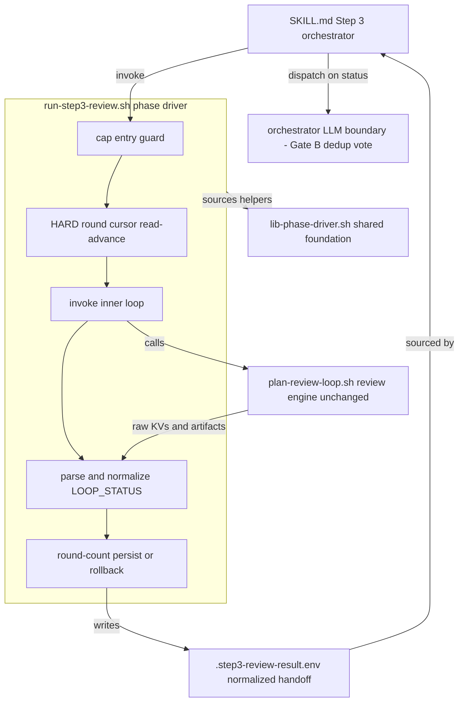

## Architecture Diagram

```mermaid
graph TD
  SKILL[SKILL.md Step 3 orchestrator]
  subgraph DRV [run-step3-review.sh phase driver]
    CAP[cap entry guard]
    CURSOR[HARD round cursor read-advance]
    CALL[invoke inner loop]
    NORM[parse and normalize LOOP_STATUS]
    PERSIST[round-count persist or rollback]
  end
  LIB[lib-phase-driver.sh shared foundation]
  LOOP[plan-review-loop.sh review engine unchanged]
  RESULT[.step3-review-result.env normalized handoff]
  GATES[orchestrator LLM boundary - Gate B dedup vote]

  SKILL -->|invoke| CAP
  CAP --> CURSOR --> CALL --> NORM --> PERSIST
  CALL -->|calls| LOOP
  LOOP -->|raw KVs and artifacts| NORM
  DRV -->|sources helpers| LIB
  PERSIST -->|writes| RESULT
  RESULT -->|sourced by| SKILL
  SKILL -->|dispatch on status| GATES
```
