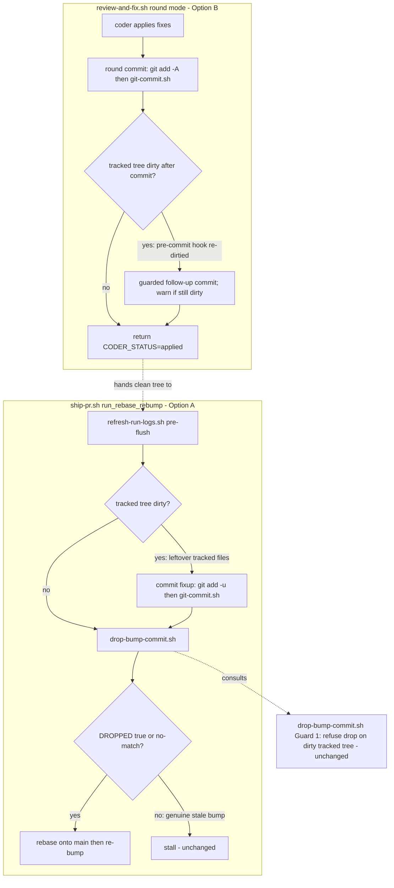

## Architecture Diagram

```mermaid
flowchart TD
    subgraph RF["review-and-fix.sh round mode - Option B"]
        RF1["coder applies fixes"] --> RF2["round commit: git add -A then git-commit.sh"]
        RF2 --> RF3{"tracked tree dirty after commit?"}
        RF3 -->|"yes: pre-commit hook re-dirtied"| RF4["guarded follow-up commit; warn if still dirty"]
        RF3 -->|no| RF5["return CODER_STATUS=applied"]
        RF4 --> RF5
    end

    subgraph SP["ship-pr.sh run_rebase_rebump - Option A"]
        SP1["refresh-run-logs.sh pre-flush"] --> SP2{"tracked tree dirty?"}
        SP2 -->|"yes: leftover tracked files"| SP3["commit fixup: git add -u then git-commit.sh"]
        SP2 -->|no| SP4["drop-bump-commit.sh"]
        SP3 --> SP4
        SP4 --> SP5{"DROPPED true or no-match?"}
        SP5 -->|yes| SP6["rebase onto main then re-bump"]
        SP5 -->|"no: genuine stale bump"| SP7["stall - unchanged"]
    end

    G1["drop-bump-commit.sh Guard 1: refuse drop on dirty tracked tree - unchanged"]

    RF5 -.->|"hands clean tree to"| SP1
    SP4 -.->|consults| G1
```
