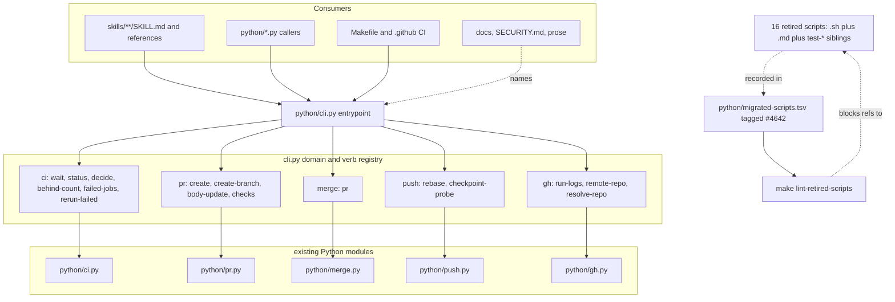

## Architecture Diagram

```mermaid
graph TD
    subgraph Consumers
        SK["skills/**/SKILL.md and references"]
        PYC["python/*.py callers"]
        MK["Makefile and .github CI"]
        DOC["docs, SECURITY.md, prose"]
    end

    CLI["python/cli.py entrypoint"]

    subgraph Domains["cli.py domain and verb registry"]
        CIV["ci: wait, status, decide, behind-count, failed-jobs, rerun-failed"]
        PRV["pr: create, create-branch, body-update, checks"]
        MGV["merge: pr"]
        PUV["push: rebase, checkpoint-probe"]
        GHV["gh: run-logs, remote-repo, resolve-repo"]
    end

    subgraph Modules["existing Python modules"]
        MCI["python/ci.py"]
        MPR["python/pr.py"]
        MMG["python/merge.py"]
        MPU["python/push.py"]
        MGH["python/gh.py"]
    end

    RET["16 retired scripts: .sh plus .md plus test-* siblings"]
    MAN["python/migrated-scripts.tsv tagged #4642"]
    LNT["make lint-retired-scripts"]

    SK --> CLI
    PYC --> CLI
    MK --> CLI
    DOC -. names .-> CLI

    CLI --> CIV
    CLI --> PRV
    CLI --> MGV
    CLI --> PUV
    CLI --> GHV

    CIV --> MCI
    PRV --> MPR
    MGV --> MMG
    PUV --> MPU
    GHV --> MGH

    RET -. recorded in .-> MAN
    MAN --> LNT
    LNT -. blocks refs to .-> RET
```
