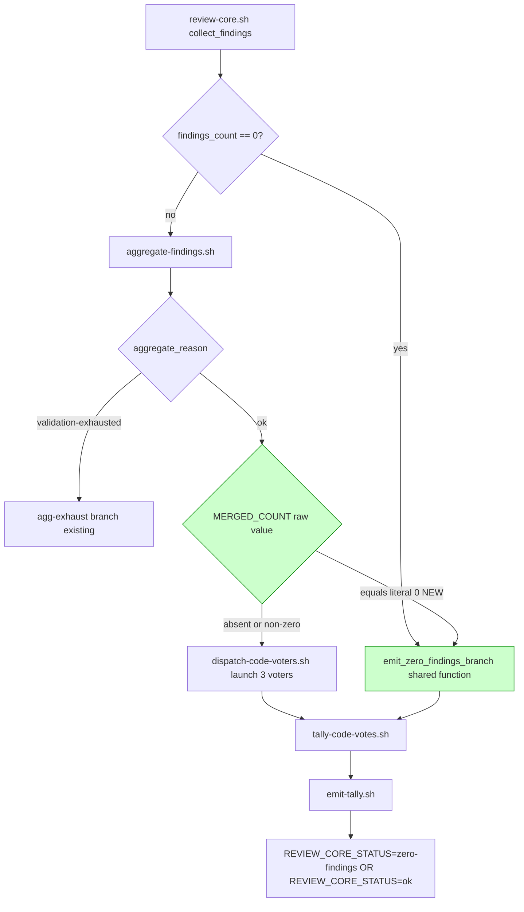

## Architecture Diagram

The shared `emit_zero_findings_branch` function is the structural change: it is extracted from the existing inlined zero-findings body (lines 453-514) and called from both the pre-aggregator zero-findings site and the new post-aggregator empty-merge site. Both call sites emit `REVIEW_CORE_STATUS=zero-findings` so downstream wrappers (review-and-fix, /implement Step 5) see a single terminal status for both no-findings cases.
