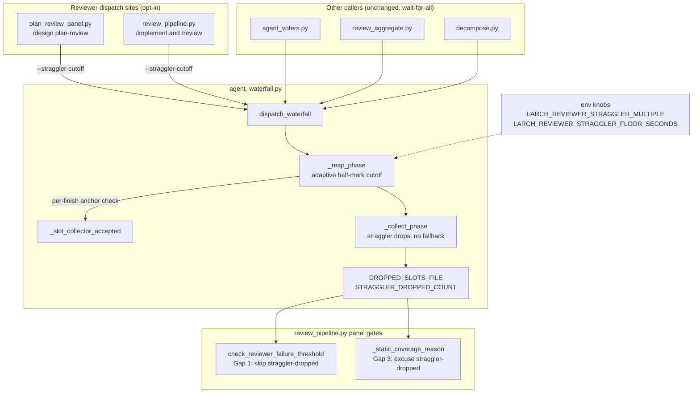

## Architecture Diagram

```mermaid
graph TD
    subgraph optin["Reviewer dispatch sites (opt-in)"]
        PRP["plan_review_panel.py<br/>/design plan-review"]
        RP["review_pipeline.py<br/>/implement and /review"]
    end
    subgraph noopt["Other callers (unchanged, wait-for-all)"]
        AV["agent_voters.py"]
        RA["review_aggregate.py"]
        DC["decompose.py"]
    end

    PRP -->|"--straggler-cutoff"| WF
    RP -->|"--straggler-cutoff"| WF
    AV --> WF
    RA --> WF
    DC --> WF

    subgraph wf["agent_waterfall.py"]
        WF["dispatch_waterfall"] --> REAP["_reap_phase<br/>adaptive half-mark cutoff"]
        REAP -->|"per-finish anchor check"| ACC["_slot_collector_accepted"]
        REAP --> COL["_collect_phase<br/>straggler drops, no fallback"]
        COL --> DROPS["DROPPED_SLOTS_FILE<br/>STRAGGLER_DROPPED_COUNT"]
    end

    ENV["env knobs<br/>LARCH_REVIEWER_STRAGGLER_MULTIPLE<br/>LARCH_REVIEWER_STRAGGLER_FLOOR_SECONDS"] -.-> REAP

    subgraph gates["review_pipeline.py panel gates"]
        THRESH["check_reviewer_failure_threshold<br/>Gap 1: skip straggler-dropped"]
        COV["_static_coverage_reason<br/>Gap 3: excuse straggler-dropped"]
    end

    DROPS --> THRESH
    DROPS --> COV
```
