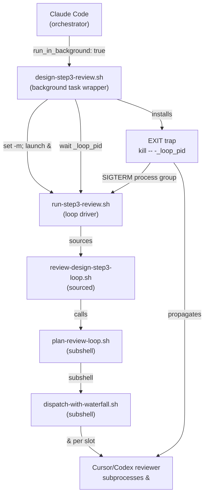

## Architecture Diagram

```mermaid
graph TD
    CC["Claude Code\n(orchestrator)"]
    DSR["design-step3-review.sh\n(background task wrapper)"]
    RSR["run-step3-review.sh\n(loop driver)"]
    RDL["review-design-step3-loop.sh\n(sourced)"]
    PRL["plan-review-loop.sh\n(subshell)"]
    DWW["dispatch-with-waterfall.sh\n(subshell)"]
    REVS["Cursor/Codex reviewer\nsubprocesses &"]
    TRAP["EXIT trap\nkill -- -_loop_pid"]

    CC -->|"run_in_background: true"| DSR
    DSR -->|"set -m; launch &"| RSR
    DSR -->|"installs"| TRAP
    DSR -->|"wait _loop_pid"| RSR
    RSR -->|"sources"| RDL
    RDL -->|"calls"| PRL
    PRL -->|"subshell"| DWW
    DWW -->|"& per slot"| REVS
    TRAP -->|"SIGTERM process group"| RSR
    TRAP -->|"propagates"| REVS
```
