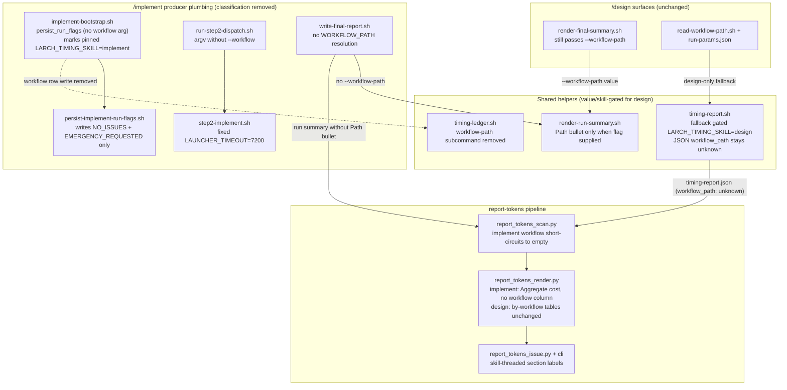

## Architecture Diagram

```mermaid
graph TD
    subgraph IMPL["/implement producer plumbing (classification removed)"]
        BOOT["implement-bootstrap.sh<br/>persist_run_flags (no workflow arg)<br/>marks pinned LARCH_TIMING_SKILL=implement"]
        PERSIST["persist-implement-run-flags.sh<br/>writes NO_ISSUES + EMERGENCY_REQUESTED only"]
        DISPATCH["run-step2-dispatch.sh<br/>argv without --workflow"]
        STEP2["step2-implement.sh<br/>fixed LAUNCHER_TIMEOUT=7200"]
        WFR["write-final-report.sh<br/>no WORKFLOW_PATH resolution"]
        BOOT --> PERSIST
        DISPATCH --> STEP2
    end

    subgraph SHARED["Shared helpers (value/skill-gated for design)"]
        RRS["render-run-summary.sh<br/>Path bullet only when flag supplied"]
        TL["timing-ledger.sh<br/>workflow-path subcommand removed"]
        TR["timing-report.sh<br/>fallback gated LARCH_TIMING_SKILL=design<br/>JSON workflow_path stays unknown"]
    end

    subgraph DESIGN["/design surfaces (unchanged)"]
        RFS["render-final-summary.sh<br/>still passes --workflow-path"]
        RWP["read-workflow-path.sh + run-params.json"]
    end

    subgraph RT["report-tokens pipeline"]
        SCAN["report_tokens_scan.py<br/>implement workflow short-circuits to empty"]
        RENDER["report_tokens_render.py<br/>implement: Aggregate cost, no workflow column<br/>design: by-workflow tables unchanged"]
        ISSUE["report_tokens_issue.py + cli<br/>skill-threaded section labels"]
        SCAN --> RENDER --> ISSUE
    end

    WFR -->|"no --workflow-path"| RRS
    RFS -->|"--workflow-path value"| RRS
    BOOT -.->|"workflow row write removed"| TL
    RWP -->|"design-only fallback"| TR
    TR -->|"timing-report.json (workflow_path: unknown)"| SCAN
    WFR -->|"run summary without Path bullet"| SCAN
```
