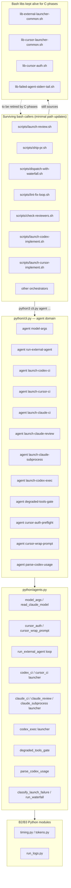

## Architecture Diagram

```mermaid
graph TD
    subgraph CLI["python/cli.py — agent domain"]
        A1[agent model-args]
        A2[agent run-external-agent]
        A3[agent launch-codex-ci]
        A4[agent launch-cursor-ci]
        A5[agent launch-claude-ci]
        A6[agent launch-claude-review]
        A7[agent launch-claude-subprocess]
        A8[agent launch-codex-exec]
        A9[agent degraded-tools-gate]
        A10[agent cursor-auth-preflight]
        A11[agent cursor-wrap-prompt]
        A12[agent parse-codex-usage]
    end

    subgraph Lib["python/agents.py"]
        L1[model_args / read_claude_model]
        L2[cursor_auth / cursor_wrap_prompt]
        L3[run_external_agent loop]
        L4[codex_ci / cursor_ci launcher]
        L5[claude_ci / claude_review / claude_subprocess launcher]
        L6[codex_exec launcher]
        L7[degraded_tools_gate]
        L8[parse_codex_usage]
        L9[classify_launch_failure / run_waterfall]
    end

    subgraph B2B3["B2/B3 Python modules"]
        B2[timing.py / tokens.py]
        B3[run_logs.py]
    end

    subgraph BashConsumers["Surviving bash callers (minimal path updates)"]
        C1[scripts/launch-review.sh]
        C2[scripts/ship-pr.sh]
        C3[scripts/dispatch-with-waterfall.sh]
        C4[scripts/lint-fix-loop.sh]
        C5[scripts/check-reviewers.sh]
        C6[scripts/launch-codex-implement.sh]
        C7[scripts/launch-cursor-implement.sh]
        C8[other orchestrators]
    end

    subgraph BashLibs["Bash libs kept alive for C-phases"]
        BL1[lib-external-launcher-common.sh]
        BL2[lib-cursor-launcher-common.sh]
        BL3[lib-cursor-auth.sh]
        BL4[lib-failed-agent-stderr-tail.sh]
    end

    CLI --> Lib
    Lib --> B2B3
    BashConsumers -->|python3 cli.py agent ...| CLI
    BashConsumers -->|still sources| BashLibs
    BashLibs -.->|to be retired by C-phases| BashConsumers
```
