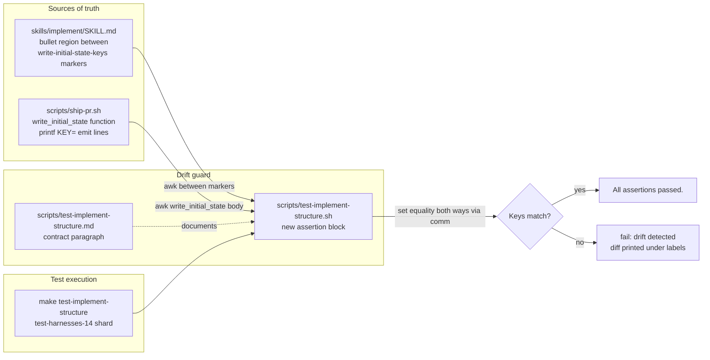

## Architecture Diagram

```mermaid
flowchart LR
    subgraph Sources of truth
        SKILL[skills/implement/SKILL.md<br/>bullet region between<br/>write-initial-state-keys markers]
        SHIP[scripts/ship-pr.sh<br/>write_initial_state function<br/>printf KEY= emit lines]
    end

    subgraph Drift guard
        TEST[scripts/test-implement-structure.sh<br/>new assertion block]
        DOC[scripts/test-implement-structure.md<br/>contract paragraph]
    end

    subgraph Test execution
        MAKE[make test-implement-structure<br/>test-harnesses-14 shard]
    end

    SKILL -- awk between markers --> TEST
    SHIP -- awk write_initial_state body --> TEST
    TEST -- set equality both ways via comm --> RESULT{Keys match?}
    RESULT -- yes --> PASS[All assertions passed.]
    RESULT -- no --> FAIL[fail: drift detected<br/>diff printed under labels]
    DOC -. documents .-> TEST
    MAKE --> TEST
```
