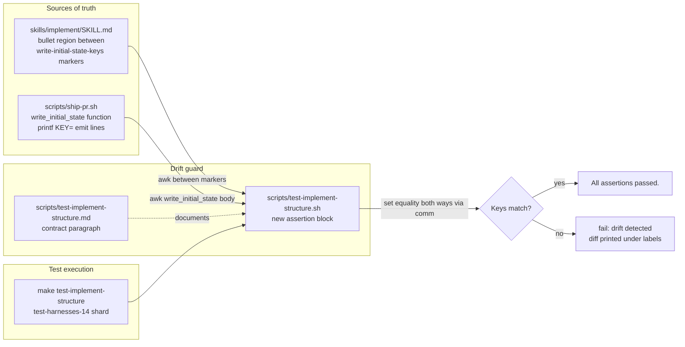

## Plan

# Implementation Plan — Drift guard between SKILL.md key bullets and ship-pr.sh emitted keys

## Files to modify/create

### UPDATED: `skills/implement/SKILL.md`

Wrap the existing "Required keys:" bullet list (the seven bullets describing the durable state-file keys that `ship-pr.sh` populates) with two HTML comment markers — `<!-- write-initial-state-keys:begin -->` immediately before the first bullet and `<!-- write-initial-state-keys:end -->` immediately after the last bullet. Do NOT modify the bullet contents or surrounding prose. The markers are the parsing anchor for the new drift-guard assertion.

### UPDATED: `scripts/ship-pr.sh`

No code change. The drift guard reads `write_initial_state()` as-is. This entry is listed for completeness because the drift guard treats this function as one of two pinned sources of truth.

### UPDATED: `scripts/test-implement-structure.sh`

Append a new structural assertion block before the final `echo "All assertions passed."` line. The block:

1. Extracts the SKILL.md key set from the region strictly between the two `<!-- write-initial-state-keys:* -->` markers. Parser strips Markdown bullet syntax (`^- `), keeps only content inside backtick code spans, then extracts the leading `[A-Z_][A-Z0-9_]*` identifier from each `KEY` or `KEY=...` token (one or more tokens per bullet, comma-separated).
2. Extracts the ship-pr.sh key set from the body of `write_initial_state()` — anchored on `^write_initial_state\(\) \{$` and the matching closing `^\} > "\$tmp"` line. Parser extracts the `KEY` identifier from every `printf 'KEY=...` line (single-quoted printf format strings).
3. Asserts set equality in both directions using sorted-list comparison (`comm -23` and `comm -13`). On any mismatch, prints the diff under labeled headings and calls `fail` with a clear message naming both directions.
4. Sanity check: rejects empty key sets (both sides must extract at least 20 keys — pins detection of accidental parser regression).
5. Sanity check: rejects missing markers — if either marker is absent from SKILL.md, `fail` with a "missing marker" message naming the marker token.

### UPDATED: `scripts/test-implement-structure.md`

Append a single paragraph describing the new drift-guard assertion, the two pinned sources of truth (`skills/implement/SKILL.md` bullet list between `<!-- write-initial-state-keys:begin/end -->` markers and `scripts/ship-pr.sh` `write_initial_state()`), and the equality direction (set equality both ways, order-insensitive).

## Approach

The implementation has three discrete edits, all small:

1. **SKILL.md markers (additive, +2 lines)**: insert one comment line above the existing first bullet (`- \`PHASE=checks\`, \`BRANCH_NAME\`, ...`) and one comment line below the existing last bullet (`- \`NO_LOGS_COMMIT=...\`, \`IMPLEMENT_TMPDIR=...\``). The bullet block stays byte-identical; markers are pure anchors.

2. **Drift-guard block in `scripts/test-implement-structure.sh` (~35-45 lines)**: a single self-contained block that:
   - Reads `$SKILL_MD` via `awk` ranged on `/<!-- write-initial-state-keys:begin -->/,/<!-- write-initial-state-keys:end -->/`, drops the marker lines themselves, then for each remaining line:
     - Strips the leading `- ` bullet
     - Uses `grep -oE '\`[A-Z_][A-Z0-9_]*' | tr -d '\`'` to extract the keys (each backtick span starts with a backtick + uppercase identifier — works for both `\`KEY\`` and `\`KEY=value\`` forms)
   - Reads `$SHIP_PR_SH` via `awk` ranged on `/^write_initial_state\(\) \{$/,/^\} > "\$tmp"/`, then for each `printf 'KEY=` line uses `grep -oE "^[[:space:]]*printf '[A-Z_][A-Z0-9_]*=" | sed -E "s/.*printf '//; s/=//"` to extract the keys.
   - Sorts both lists, deduplicates via `sort -u`, and uses `comm -23` / `comm -13` to compute set differences.
   - On a non-empty difference in either direction, prints the diff with clear labels (`Keys in SKILL.md missing from ship-pr.sh:` and `Keys in ship-pr.sh missing from SKILL.md:`) and calls `fail` with a one-line message naming the drift direction(s).
   - Includes the missing-marker guard (a `grep -Fq '<!-- write-initial-state-keys:begin -->' "$SKILL_MD"` + matching end-marker grep before the awk extraction).
   - Includes the minimum-keys sanity check (`[[ "$(printf '%s\n' "$skill_keys" | wc -l)" -ge 20 ]]` and the same for `ship_keys`).

3. **Sibling-doc update (~6 lines)**: append a short paragraph to `scripts/test-implement-structure.md` documenting the new assertion. No edits to the existing prose.

The drift guard is order-insensitive and value-insensitive (only key identifiers are compared). This intentionally tolerates harmless cosmetic edits to SKILL.md bullet ordering and to `printf` format-string default values, while still catching the failure mode the issue describes (keys added to one source but not the other).

## Edge cases

- **Marker missing on either side**: missing-marker guard fires before awk extraction; the test fails with a clear "missing `<!-- write-initial-state-keys:begin -->` marker" message rather than silently passing with an empty key set.
- **Empty key set extraction**: minimum-keys sanity check (`>= 20` on each side) fires when the parser silently breaks (e.g., function rename, `printf` replaced with `cat <<EOF`, markers moved to a different file). Distinguishes "parser broken" from "drift detected."
- **Bullet contains both bare key and KEY=value forms**: `grep -oE '\`[A-Z_][A-Z0-9_]*'` matches the leading identifier in both cases; the trailing `=value` (if any) is stripped before comparison.
- **Variable-reference defaults in SKILL.md** (e.g., `\`NO_LOGS_COMMIT=$no_logs_commit\``): regex matches up to the first non-identifier character, so `$no_logs_commit` is ignored — only the `NO_LOGS_COMMIT` key matters.
- **ship-pr.sh conditional emit branches**: `write_initial_state()` has `if/else` blocks that emit the same key from two branches (e.g., `BRANCH_NAME` from argv-init vs `git rev-parse`). `sort -u` collapses duplicates so each key appears once in the comparison set.
- **Closing-brace anchor**: the function ends with `} > "$tmp" && mv "$tmp" "$STATE_FILE"`. Anchoring on `^\} > "\$tmp"` is more robust than a bare `^\}$` (other top-level `}` lines exist in the file).
- **Future drift in the SKILL.md `MANIFEST_PATH` blockquote that follows the bullet list**: the blockquote sits outside the marker pair, so it is not parsed and not asserted. This is intentional — only the bullet list is the parsing surface.

## Failure modes

- **F1 — Markers accidentally renamed/removed in a future SKILL.md edit**: the missing-marker grep guard fires; test fails with the marker token in the error message. Mitigation: marker tokens are also documented in `scripts/test-implement-structure.md` so future editors see why they exist.
- **F2 — `write_initial_state()` renamed or restructured**: function-anchor regex no longer matches; minimum-keys sanity check fires (`>= 20` keys required); test fails with "extracted 0 ship-pr.sh keys — function structure may have changed." Mitigation: explicit lower-bound sanity check + clear failure message.
- **F3 — A new key added to ship-pr.sh but not to SKILL.md (or vice versa) — the exact drift case this guard exists to catch**: set-difference detection fires; test fails with the diff under both labeled directions. Mitigation: this is the primary success path of the test; no further mitigation needed.

## Testing strategy

- Run `bash scripts/test-implement-structure.sh` manually after implementation; confirm `All assertions passed.`
- Synthetic drift verification (manual, not committed): temporarily add `printf 'ZZZ_TEST_KEY=\n'` to `write_initial_state()` and re-run the test; confirm it fails with `Keys in ship-pr.sh missing from SKILL.md: ZZZ_TEST_KEY`.
- Synthetic reverse drift (manual): temporarily add `` `ZZZ_TEST_KEY` `` to the SKILL.md bullet list and re-run; confirm it fails with `Keys in SKILL.md missing from ship-pr.sh: ZZZ_TEST_KEY`.
- No new test target; the new assertion runs as part of the existing `make test-implement-structure` Makefile target (already in `test-harnesses-14` shard).

## Architecture Diagram

## Acceptance

- `bash scripts/test-implement-structure.sh` exits 0 with `All assertions passed.` after the SKILL.md markers and the new drift-guard block are in place.
- A synthetic drift (adding a fake `printf 'ZZZ_TEST_KEY=\n'` line to `write_initial_state()`) causes the test to fail with `Keys in ship-pr.sh missing from SKILL.md: ZZZ_TEST_KEY`; reverting restores success.
- A symmetric synthetic drift (adding `` `ZZZ_TEST_KEY` `` to the SKILL.md bullet region between the two markers) causes the test to fail with `Keys in SKILL.md missing from ship-pr.sh: ZZZ_TEST_KEY`; reverting restores success.
- Removing either `<!-- write-initial-state-keys:begin -->` or `<!-- write-initial-state-keys:end -->` from `skills/implement/SKILL.md` causes the test to fail with a clear "missing marker" message naming the absent token.
- `make test-implement-structure` passes (the assertion runs inside the existing target; no Makefile changes).
- `bash scripts/relevant-checks.sh` passes on the implementing branch.

diff_lines: 60
