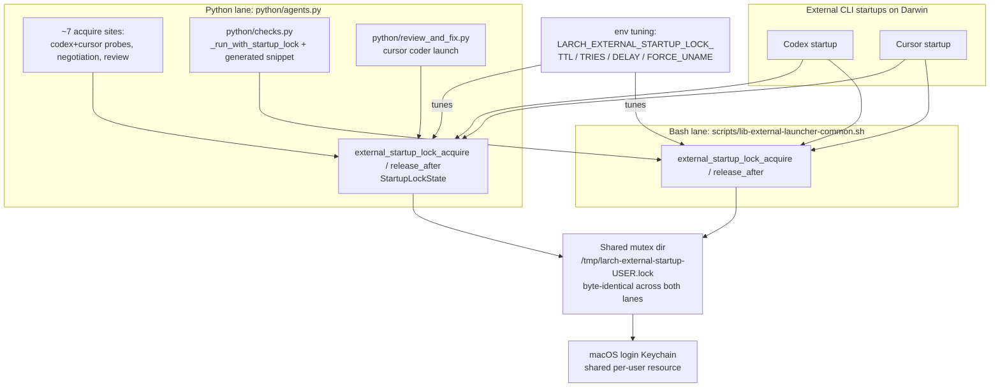

## Architecture Diagram

```mermaid
graph TD
    subgraph Tools["External CLI startups on Darwin"]
        CODEX["Codex startup"]
        CURSOR["Cursor startup"]
    end

    subgraph PyLane["Python lane: python/agents.py"]
        PYACQ["external_startup_lock_acquire / release_after<br/>StartupLockState"]
        PYCALLERS["~7 acquire sites:<br/>codex+cursor probes, negotiation, review"]
        CHECKS["python/checks.py<br/>_run_with_startup_lock + generated snippet"]
        RAF["python/review_and_fix.py<br/>cursor coder launch"]
    end

    subgraph ShLane["Bash lane: scripts/lib-external-launcher-common.sh"]
        SHACQ["external_startup_lock_acquire / release_after"]
    end

    LOCK["Shared mutex dir<br/>/tmp/larch-external-startup-USER.lock<br/>byte-identical across both lanes"]
    ENV["env tuning:<br/>LARCH_EXTERNAL_STARTUP_LOCK_<br/>TTL / TRIES / DELAY / FORCE_UNAME"]
    KEYCHAIN["macOS login Keychain<br/>shared per-user resource"]

    CODEX --> PYACQ
    CURSOR --> PYACQ
    CODEX --> SHACQ
    CURSOR --> SHACQ
    PYCALLERS --> PYACQ
    RAF --> PYACQ
    CHECKS --> SHACQ
    PYACQ --> LOCK
    SHACQ --> LOCK
    ENV -->|tunes| PYACQ
    ENV -->|tunes| SHACQ
    LOCK --> KEYCHAIN
```
