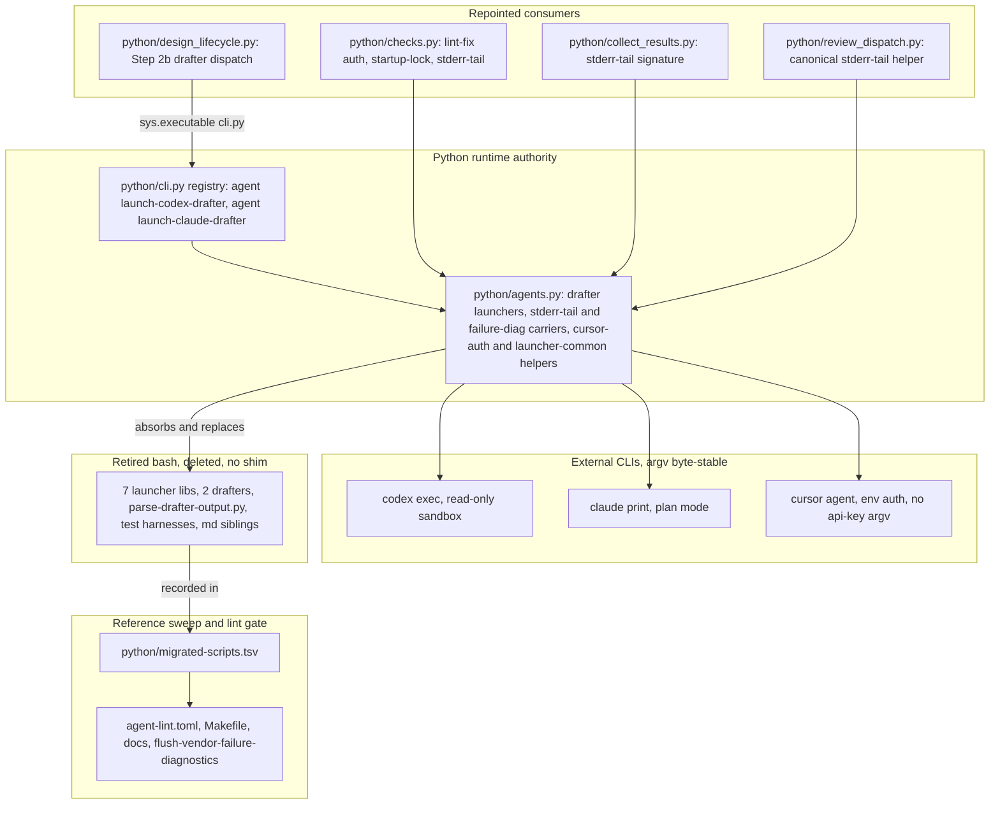

## Architecture Diagram

```mermaid
graph TD
    subgraph runtime["Python runtime authority"]
        AG["python/agents.py: drafter launchers, stderr-tail and failure-diag carriers, cursor-auth and launcher-common helpers"]
        CLI["python/cli.py registry: agent launch-codex-drafter, agent launch-claude-drafter"]
    end

    subgraph consumers["Repointed consumers"]
        DL["python/design_lifecycle.py: Step 2b drafter dispatch"]
        CK["python/checks.py: lint-fix auth, startup-lock, stderr-tail"]
        CR["python/collect_results.py: stderr-tail signature"]
        RD["python/review_dispatch.py: canonical stderr-tail helper"]
    end

    subgraph vendors["External CLIs, argv byte-stable"]
        CODEX["codex exec, read-only sandbox"]
        CLAUDE["claude print, plan mode"]
        CURSOR["cursor agent, env auth, no api-key argv"]
    end

    subgraph retired["Retired bash, deleted, no shim"]
        LIBS["7 launcher libs, 2 drafters, parse-drafter-output.py, test harnesses, md siblings"]
    end

    subgraph sweep["Reference sweep and lint gate"]
        MAN["python/migrated-scripts.tsv"]
        LINT["agent-lint.toml, Makefile, docs, flush-vendor-failure-diagnostics"]
    end

    DL -->|sys.executable cli.py| CLI
    CLI --> AG
    CK --> AG
    CR --> AG
    RD --> AG
    AG --> CODEX
    AG --> CLAUDE
    AG --> CURSOR
    AG -->|absorbs and replaces| LIBS
    LIBS -->|recorded in| MAN
    MAN --> LINT
```
