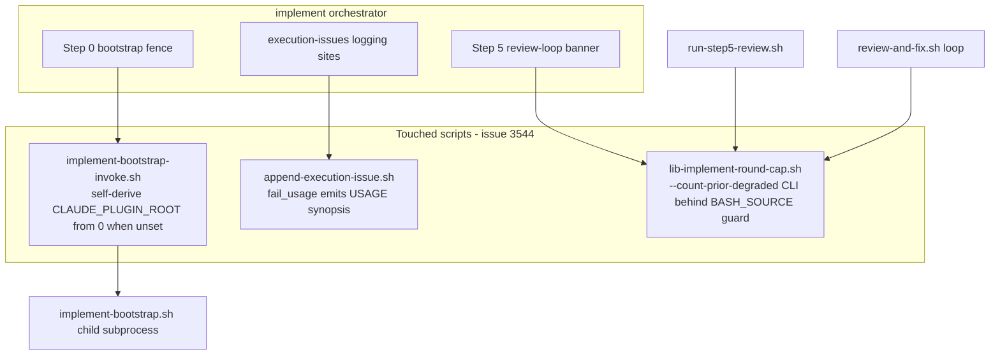

## Architecture Diagram

```mermaid
graph TD
    subgraph implement["implement orchestrator"]
        S0["Step 0 bootstrap fence"]
        S5["Step 5 review-loop banner"]
        LOG["execution-issues logging sites"]
    end

    subgraph touched["Touched scripts - issue 3544"]
        IBI["implement-bootstrap-invoke.sh<br/>self-derive CLAUDE_PLUGIN_ROOT from 0 when unset"]
        AEI["append-execution-issue.sh<br/>fail_usage emits USAGE synopsis"]
        LIRC["lib-implement-round-cap.sh<br/>--count-prior-degraded CLI behind BASH_SOURCE guard"]
    end

    S0 --> IBI
    IBI --> BOOT["implement-bootstrap.sh child subprocess"]
    LOG --> AEI
    S5 --> LIRC
    R5R["run-step5-review.sh"] --> LIRC
    RAF["review-and-fix.sh loop"] --> LIRC
```
