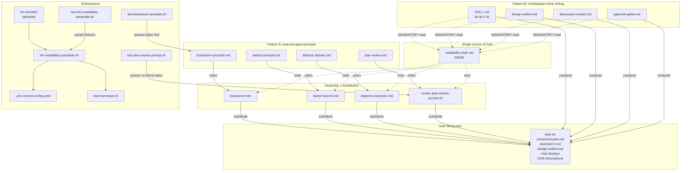

## Architecture Diagram

```mermaid
graph TB
    subgraph Preamble["Single source of truth"]
        Style["readability-style.md<br/>(NEW)"]
    end

    subgraph PatternA["Pattern A: external-agent prompts"]
        BrainPrompts["brainstorm-prompts.md"]
        SketchPrompts["sketch-prompts.md"]
        DialecticDebate["dialectic-debate.md"]
        PlanReviewRef["plan-review.md"]
    end

    subgraph Assembly["Assembly + substitution"]
        BrainAssembly["brainstorm.md"]
        SketchLaunch["sketch-launch.md"]
        DialecticExec["dialectic-execution.md"]
        Renderer["render-plan-review-prompt.sh"]
    end

    subgraph PatternB["Pattern B: orchestrator-inline writing"]
        Skill["SKILL.md<br/>2b 3b 4 5c"]
        Outline["design-outline.md"]
        Discussion["discussion-rounds.md"]
        Gates["approval-gates.md"]
    end

    subgraph Output["User-facing text"]
        UserText["plan.txt<br/>composed-plan.md<br/>brainstorm.md<br/>design-outline.md<br/>chat displays<br/>OOS Descriptions"]
    end

    subgraph Enforcement["Enforcement"]
        Manifest["lint manifest<br/>(allowlist)"]
        Lint["lint-readability-preamble.sh"]
        PreCommit[".pre-commit-config.yaml"]
        Harnesses["test-harnesses-N"]
        TestLint["test-lint-readability-preamble.sh"]
        TestPR["test-plan-review-prompt.sh"]
        TestBrain["test-brainstorm-prompts.sh"]
    end

    BrainPrompts -->|"token"| BrainAssembly
    SketchPrompts -->|"token"| SketchLaunch
    DialecticDebate -->|"token"| DialecticExec
    PlanReviewRef -->|"token"| Renderer

    BrainAssembly -->|"substitute"| UserText
    SketchLaunch -->|"substitute"| UserText
    DialecticExec -->|"substitute"| UserText
    Renderer -->|"substitute"| UserText

    Style -.->|"read"| BrainAssembly
    Style -.->|"read"| SketchLaunch
    Style -.->|"read"| DialecticExec
    Style -.->|"read"| Renderer

    Skill -.->|"MANDATORY read"| Style
    Outline -.->|"MANDATORY read"| Style
    Discussion -.->|"MANDATORY read"| Style
    Gates -.->|"MANDATORY read"| Style

    Skill -->|"compose"| UserText
    Outline -->|"compose"| UserText
    Discussion -->|"compose"| UserText
    Gates -->|"compose"| UserText

    Manifest --> Lint
    Lint --> PreCommit
    Lint --> Harnesses
    TestLint -->|"variant fixtures"| Lint
    TestPR -->|"asserts no literal token"| Renderer
    TestBrain -->|"asserts token line"| BrainPrompts
```
