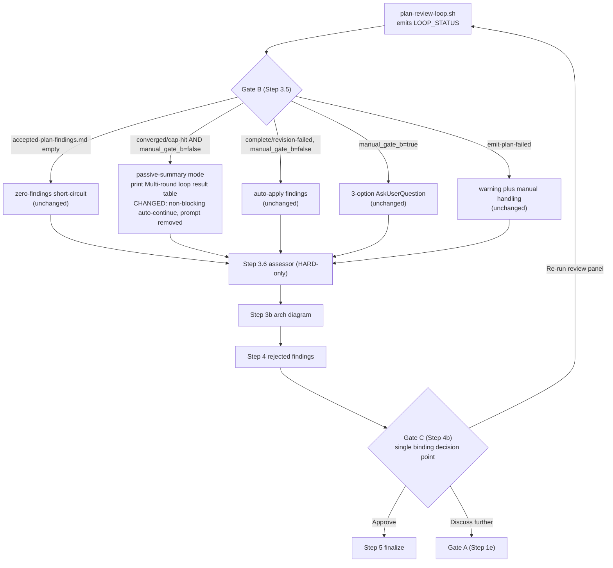

## Architecture Diagram

```mermaid
flowchart TD
    Loop["plan-review-loop.sh<br/>emits LOOP_STATUS"] --> GateB{"Gate B (Step 3.5)"}
    GateB -->|"accepted-plan-findings.md empty"| Zero["zero-findings short-circuit<br/>(unchanged)"]
    GateB -->|"converged/cap-hit AND manual_gate_b=false"| Passive["passive-summary mode<br/>print Multi-round loop result table<br/>CHANGED: non-blocking auto-continue, prompt removed"]
    GateB -->|"complete/revision-failed, manual_gate_b=false"| AutoApply["auto-apply findings<br/>(unchanged)"]
    GateB -->|"manual_gate_b=true"| Manual["3-option AskUserQuestion<br/>(unchanged)"]
    GateB -->|"emit-plan-failed"| Warn["warning plus manual handling<br/>(unchanged)"]
    Zero --> S36["Step 3.6 assessor (HARD-only)"]
    Passive --> S36
    AutoApply --> S36
    Manual --> S36
    Warn --> S36
    S36 --> S3b["Step 3b arch diagram"]
    S3b --> S4["Step 4 rejected findings"]
    S4 --> GateC{"Gate C (Step 4b)<br/>single binding decision point"}
    GateC -->|"Approve"| Finalize["Step 5 finalize"]
    GateC -->|"Discuss further"| GateA["Gate A (Step 1e)"]
    GateC -->|"Re-run review panel"| Loop
```
