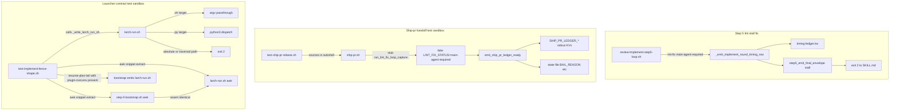

## Architecture Diagram

```mermaid
graph TD
    A[review-implement-step5-loop.sh] -->|lint-fix main-agent-required| B[_emit_implement_round_timing_row]
    B --> C[timing-ledger.tsv]
    B --> D[step5_emit_final_envelope stall]
    D --> E[exit 2 to SKILL.md]

    subgraph "Step 5 lint stall fix"
        A
        B
        C
        D
        E
    end

    subgraph "Ship-pr handoff test sandbox"
        F[test-ship-pr-rebase.sh] -->|sources in subshell| G[ship-pr.sh]
        G -->|stub run_lint_fix_loop_capture| H[fake LINT_FIX_STATUS=main-agent-required]
        H --> I[emit_ship_pr_ledger_ready]
        I --> J[SHIP_PR_LEDGER_* stdout KVs]
        I --> K[state file BAIL_REASON etc]
    end

    subgraph "Launcher contract test sandbox"
        L[test-implement-fence-shape.sh] -->|calls _write_larch_run_sh| M[larch-run.sh]
        M -->|.sh target| N[argv passthrough]
        M -->|.py target| O[python3 dispatch]
        M -->|absolute or traversal path| P[exit 2]
        L -->|awk snippet extract| Q[step-0-bootstrap.sh awk]
        L -->|awk snippet extract| R[larch-run.sh awk]
        Q -->|assert identical| R
        L -->|resume-plan-tail with plugin-root.env present| S[bootstrap emits larch-run.sh]
    end
```
