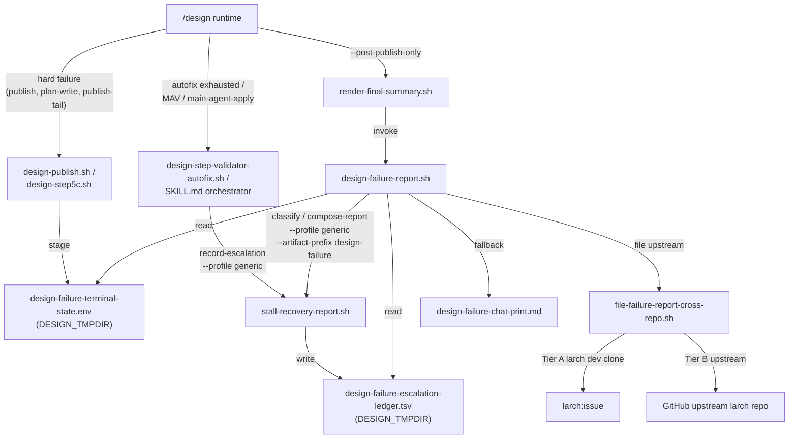

## Architecture Diagram

```mermaid
flowchart TD
    A["/design runtime"] -->|"hard failure\n(publish, plan-write, publish-tail)"| B["design-publish.sh /\ndesign-step5c.sh"]
    A -->|"autofix exhausted /\nMAV / main-agent-apply"| C["design-step-validator-autofix.sh /\nSKILL.md orchestrator"]
    B -->|"stage"| D["design-failure-terminal-state.env\n(DESIGN_TMPDIR)"]
    C -->|"record-escalation\n--profile generic"| E["stall-recovery-report.sh"]
    E -->|"write"| F["design-failure-escalation-ledger.tsv\n(DESIGN_TMPDIR)"]
    A -->|"--post-publish-only"| G["render-final-summary.sh"]
    G -->|"invoke"| H["design-failure-report.sh"]
    H -->|"read"| D
    H -->|"read"| F
    H -->|"classify / compose-report\n--profile generic\n--artifact-prefix design-failure"| E
    H -->|"file upstream"| I["file-failure-report-cross-repo.sh"]
    I -->|"Tier A larch dev clone"| J["larch:issue"]
    I -->|"Tier B upstream"| K["GitHub upstream larch repo"]
    H -->|"fallback"| L["design-failure-chat-print.md"]
```
