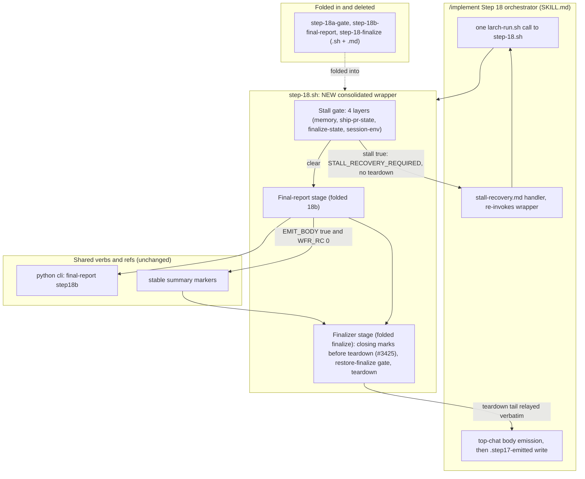

## Architecture Diagram

```mermaid
flowchart TD
    subgraph ORCH["/implement Step 18 orchestrator (SKILL.md)"]
        CALL["one larch-run.sh call to step-18.sh"]
        RECOVER["stall-recovery.md handler, re-invokes wrapper"]
        EMIT["top-chat body emission, then .step17-emitted write"]
    end

    subgraph WRAP["step-18.sh: NEW consolidated wrapper"]
        GATE["Stall gate: 4 layers (memory, ship-pr-state, finalize-state, session-env)"]
        FR["Final-report stage (folded 18b)"]
        FIN["Finalizer stage (folded finalize): closing marks before teardown (#3425), restore-finalize gate, teardown"]
    end

    subgraph DEPS["Shared verbs and refs (unchanged)"]
        PY["python cli: final-report step18b"]
        MARK["stable summary markers"]
    end

    subgraph GONE["Folded in and deleted"]
        OLD["step-18a-gate, step-18b-final-report, step-18-finalize (.sh + .md)"]
    end

    CALL --> WRAP
    GATE -->|stall true: STALL_RECOVERY_REQUIRED, no teardown| RECOVER
    RECOVER --> CALL
    GATE -->|clear| FR
    FR --> PY
    FR -->|EMIT_BODY true and WFR_RC 0| MARK
    MARK --> FIN
    FR --> FIN
    FIN -->|teardown tail relayed verbatim| EMIT
    OLD -. folded into .-> WRAP
```
