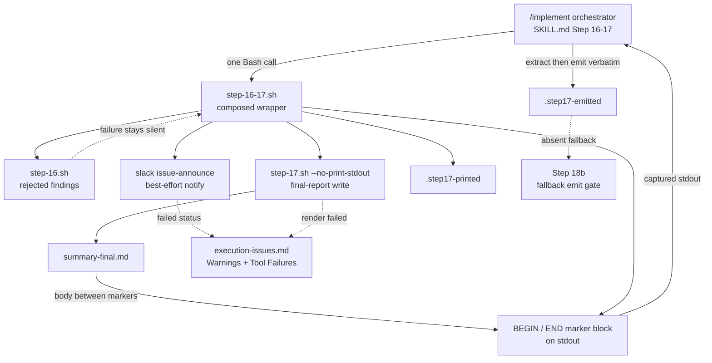

## Architecture Diagram

```mermaid
graph TD
    ORCH["/implement orchestrator<br/>SKILL.md Step 16-17"]
    WRAP["step-16-17.sh<br/>composed wrapper"]
    S16["step-16.sh<br/>rejected findings"]
    SLACK["slack issue-announce<br/>best-effort notify"]
    S17["step-17.sh --no-print-stdout<br/>final-report write"]
    SUMMARY["summary-final.md"]
    MARK["BEGIN / END marker block<br/>on stdout"]
    PRINTED[".step17-printed"]
    EMITTED[".step17-emitted"]
    LOG["execution-issues.md<br/>Warnings + Tool Failures"]
    S18B["Step 18b<br/>fallback emit gate"]

    ORCH -->|one Bash call| WRAP
    WRAP --> S16
    WRAP --> SLACK
    WRAP --> S17
    S16 -.->|failure stays silent| WRAP
    SLACK -.->|failed status| LOG
    S17 -.->|render failed| LOG
    S17 --> SUMMARY
    SUMMARY -->|body between markers| MARK
    WRAP --> MARK
    WRAP --> PRINTED
    MARK -->|captured stdout| ORCH
    ORCH -->|extract then emit verbatim| EMITTED
    EMITTED -.->|absent fallback| S18B
```
