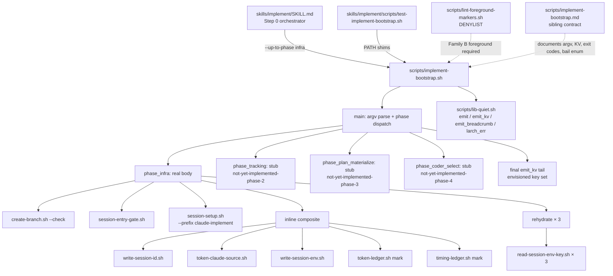

## Architecture Diagram

```mermaid
graph TD
    SKILL[skills/implement/SKILL.md<br/>Step 0 orchestrator]
    SKILL -->|"--up-to-phase infra"| BOOT[scripts/implement-bootstrap.sh]

    BOOT --> MAIN[main: argv parse + phase dispatch]
    BOOT --> LIB[scripts/lib-quiet.sh<br/>emit / emit_kv / emit_breadcrumb / larch_err]

    MAIN --> P1[phase_infra: real body]
    MAIN --> P2[phase_tracking: stub<br/>not-yet-implemented-phase-2]
    MAIN --> P3[phase_plan_materialize: stub<br/>not-yet-implemented-phase-3]
    MAIN --> P4[phase_coder_select: stub<br/>not-yet-implemented-phase-4]

    MAIN --> TAIL[final emit_kv tail<br/>envisioned key set]

    P1 --> H1[create-branch.sh --check]
    P1 --> H2[session-entry-gate.sh]
    P1 --> H3[session-setup.sh<br/>--prefix claude-implement]
    P1 --> H4[inline composite]
    P1 --> H5[rehydrate × 3]

    H4 --> S1[write-session-id.sh]
    H4 --> S2[token-claude-source.sh]
    H4 --> S3[write-session-env.sh]
    H4 --> S4[token-ledger.sh mark]
    H4 --> S5[timing-ledger.sh mark]

    H5 --> R1[read-session-env-key.sh × 3]

    HARNESS[skills/implement/scripts/test-implement-bootstrap.sh]
    HARNESS -->|"PATH shims"| BOOT

    LINT[scripts/lint-foreground-markers.sh<br/>DENYLIST]
    LINT -.->|"Family B foreground required"| BOOT

    MD[scripts/implement-bootstrap.md<br/>sibling contract]
    MD -.->|"documents argv, KV, exit codes, bail enum"| BOOT
```
