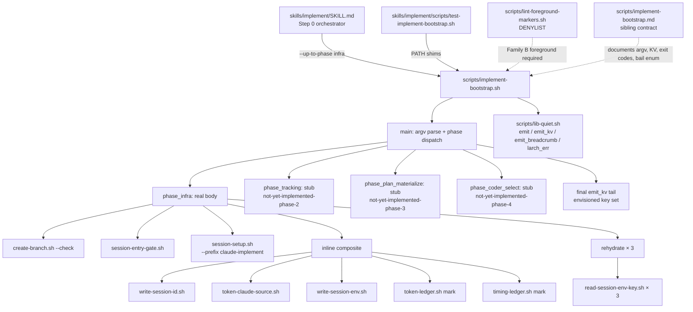

## Plan

This plan establishes the `scripts/implement-bootstrap.sh` script skeleton, fills in `phase_infra` (which absorbs `/implement` Step 0 calls #1–#5), stubs the remaining phase functions, edits `skills/implement/SKILL.md` to invoke the new script in place of the prior fenced blocks, adds the script to the Family B foreground denylist, and ships an offline harness plus Makefile/docs registration. Phases 2–4 (tracking adoption, plan materialization, implementer waterfall) remain as today and are absorbed by sibling issues #2736 / #2737 / #2738.

## Files to modify/create

### NEW: `scripts/implement-bootstrap.sh`

Bash 3.2-portable mega-script absorbing `/implement` Step 0 calls #1–#5. Sources `scripts/lib-quiet.sh` and `scripts/lib-execution-issues.sh`, calls `larch_quiet_init` after strict-mode setup (`set -uo pipefail`; errexit OFF file-wide, same idiom as `implement-finalize.sh` L4–L11). Argv parser supports `--up-to-phase <infra|tracking|plan|coder|all>`, `--caller-env PATH` (optional, for forked_target paths), and `--issue-number N` (optional, propagated to later phases). Four phase functions defined: `phase_infra` (real body), `phase_tracking`, `phase_plan_materialize`, `phase_coder_select` (placeholders emitting `IMPLEMENT_BAIL_REASON=not-yet-implemented-phase-{2,3,4}` and `return 0`). `main()` dispatches phases in order up to `--up-to-phase`, then emits the final KV tail. Reviewer-presence warnings go through `emit` (FD-3). Final `emit_kv` tail emits the umbrella #2732 envisioned key set (Phase-1 keys populated, phase-2/3/4 keys empty).

### NEW: `scripts/implement-bootstrap.md`

Sibling contract documenting argv table (all flags including future-phase placeholders), input file expectations (none in Phase 1; later phases read `$IMPLEMENT_TMPDIR/session-env.sh` and design plan files), full output KV grammar with phase-by-phase population table, breadcrumb list (`→ step0: infra ready (...)` plus future tracking/plan/coder breadcrumbs), exit codes (`0` success, `2` infrastructure failure), and the full bail-reason enum including transitional `not-yet-implemented-phase-{2,3,4}` placeholders. Includes behavior mapping (which SKILL.md calls each phase absorbs), primary callers (`skills/implement/SKILL.md`), test harness pointer, and edit-in-sync list.

### NEW: `skills/implement/scripts/test-implement-bootstrap.sh`

Offline harness using `PATH`-shimmed helper stubs (mirroring the pattern in `scripts/test-implement-finalize.sh`). Stubs replace `create-branch.sh`, `session-entry-gate.sh`, `session-setup.sh`, `write-session-id.sh`, `token-claude-source.sh`, `write-session-env.sh`, `token-ledger.sh`, `timing-ledger.sh`, `read-session-env-key.sh`, and `append-tool-failure.sh` with pre-canned-output stubs. Six cases: GP1-infra (clean-main happy path), GP4 (`repo_unavailable=true`), B-preflight (`session-setup.sh` non-zero exit with `PREFLIGHT_ERROR=...`), B-gate (`session-entry-gate.sh` non-zero exit with `GATE_ERROR=...`), Edge-NEVER14 (static source-grep for forbidden direct `session-env.sh` writes), Edge-breadcrumb-count (asserts exactly one `→ step0: infra ready` breadcrumb under `LARCH_QUIET_BREADCRUMBS=1`).

### NEW: `skills/implement/scripts/test-implement-bootstrap.md`

Sibling harness contract documenting stub conventions, fixture file layout, per-case input/output mappings, expected exit codes, and the static source-check policy for the NEVER #14 invariant.

### UPDATED: `skills/implement/SKILL.md`

Replace the five fenced bash blocks at Step 0 calls #1–#5 (approximately L288–L451: `create-branch.sh --check`, `session-entry-gate.sh`, `session-setup.sh`, the inline composite block at L365+, and the rehydration block at L440–L442 if it's part of that range) with a single foreground-mode invocation block calling `${CLAUDE_PLUGIN_ROOT}/scripts/implement-bootstrap.sh --up-to-phase infra [--caller-env "$CALLER_ENV_PATH"] [--issue-number "$ISSUE_NUMBER"]`. The block parses KV lines from stdout into orchestrator variables using the existing `while IFS= read -r ...` pattern. Block is preceded by the BASH_AUTHORING.md §4 foreground banner and per-anchor `# Foreground required: see BASH_AUTHORING.md §4` comment. The Step 0 prose for calls #6+ and the implementer waterfall stay byte-identical for this PR.

### UPDATED: `scripts/lint-foreground-markers.sh`

Append `implement-bootstrap.sh` as one line at the end of the `DENYLIST` heredoc (matching the existing entries: `ship-pr.sh`, `ci-wait.sh`, `run-step5-review.sh`, `review-and-fix.sh`, `run-step2-dispatch.sh`, `step2-implement.sh`, `collect-agent-results.sh`, `dispatch-with-waterfall.sh`, `dispatch-plan-voters.sh`). Order is not strictly alphabetized today; append at the bottom.

### UPDATED: `Makefile`

Add `test-implement-bootstrap` to the `.PHONY` list, register it inside an existing `test-harnesses-N` shard (preferably `test-harnesses-7` which already groups `test-implement-finalize`, or whichever shard has spare capacity per the `test-harness-shards-coverage` rule), and add the rule body: `test-implement-bootstrap:` followed by `bash scripts/harness-timer.sh $@ bash skills/implement/scripts/test-implement-bootstrap.sh`.

### UPDATED: `docs/linting.md`

Add one row in the test-harness target table for `test-implement-bootstrap` with a brief description (e.g., `implement-bootstrap.sh phase_infra paths + NEVER#14 invariant + breadcrumb count`).

## Approach

`scripts/implement-bootstrap.sh` is structured as a Bash 3.2-portable mega-script with one usage form (no subcommands; argv flags only). It sources `scripts/lib-quiet.sh`, calls `larch_quiet_init` after strict-mode setup, then executes four phase functions in order. Only `phase_infra` has a real body in this PR; `phase_tracking`, `phase_plan_materialize`, and `phase_coder_select` are placeholder shells that emit `IMPLEMENT_BAIL_REASON=not-yet-implemented-phase-{2,3,4}` and `return 0` — these are forward-prepped for #2736 / #2737 / #2738 and are dead code on a normal Phase-1 run because the script returns after `phase_infra` (controlled by `--up-to-phase infra` argv on the SKILL.md call site).

`phase_infra` mirrors the five existing prompt-side blocks one-for-one:

1. Invokes `scripts/create-branch.sh --check` and captures `CURRENT_BRANCH`, `IS_MAIN`, `IS_USER_BRANCH`, `USER_PREFIX` from its stdout.
2. Invokes `scripts/session-entry-gate.sh` and captures `ENTRY_GATE`, `SKIP_BRANCH_CHECK`. On internal contract violation, emits `GATE_ERROR=<text>` and `STEP_FAILED=session-entry-gate` then exits **2**.
3. Invokes `scripts/session-setup.sh --prefix claude-implement [--skip-branch-check] --check-reviewers [--caller-env "$caller_env_path"]` (the `--skip-branch-check` flag is appended when `SKIP_BRANCH_CHECK=true`). On non-zero exit, forwards captured `PREFLIGHT_ERROR=...` to stdout, emits `STEP_FAILED=session-setup`, and exits **2**. Parses `SESSION_TMPDIR`, `SESSION_ID`, `REPO`, `REPO_UNAVAILABLE`, plus reviewer-availability KV (`CODEX_PRESENT`, `CURSOR_PRESENT`, `CODEX_BINARY_FOUND`, `CURSOR_BINARY_FOUND`) from its output. Sets local `IMPLEMENT_TMPDIR="$SESSION_TMPDIR"`.
4. Inline composite (`write-session-id.sh` + `token-claude-source.sh` + `write-session-env.sh` + `token-ledger.sh mark` + `timing-ledger.sh mark`) is re-implemented inside the script as a single helper. `write-session-id.sh --output "$IMPLEMENT_TMPDIR/session-id"` always runs (idempotent). `token-claude-source.sh` runs best-effort; failure appends a `Warnings` entry via `append-tool-failure.sh` and leaves `LARCH_CLAUDE_SOURCE_FILE` unset. `write-session-env.sh` is invoked with the assembled `session_env_args` (repo, repo-unavailable, present/binary-found flags, timing-ledger path, token-session-id, prev-implement-tmpdir, optional claude-source-file, optional dynamic-archetypes from `--caller-env`). `token-ledger.sh mark "Step 0 — preflight"` and `timing-ledger.sh mark "Step 0 — preflight"` follow, best-effort. Emits `CLAUDE_SOURCE_OK=true|false` and `LARCH_TOKEN_SESSION_ID=<value>` for the orchestrator.
5. Rehydrate block (read-session-env-key × 3 → `LARCH_TOKEN_SESSION_ID`, `LARCH_CLAUDE_SOURCE_FILE`, `LARCH_TIMING_LEDGER`) is now redundant inside this script because the values were just written, but the issue requires "Rehydrate block ... moved entirely inside script", so the bootstrap re-reads via `read-session-env-key.sh` and re-emits the three keys for downstream rehydration parity with the legacy SKILL.md block.

Reviewer-presence warnings (`**⚠ Codex not available...`, `**⚠ Cursor not healthy...`, `**⚠ Could not determine repository name...`) are emitted via `emit` (FD-3 contract stream, still operator-visible per lib-quiet semantics). The mental flags `codex_available` / `cursor_available` are computed inside the script and emitted as additional KV lines so the orchestrator can read them without re-deriving from binary/present pairs.

When `--caller-env <path>` is passed under `forked_target=true`, the script reads `LARCH_DYNAMIC_ARCHETYPES_MAX` from that path via `read-session-env-key.sh` and forwards it to `write-session-env.sh` (mirroring the SKILL.md block at L396–L405). All other forked-target semantics (skipping tracking adoption, fetching `get-issue-context.sh`) are owned by phases 2–4 and are out of scope for this PR.

At the end of `phase_infra` (or any successful phase), the script emits the breadcrumb `→ step0: infra ready (tmpdir=$IMPLEMENT_TMPDIR session=$SESSION_ID)` via `emit_breadcrumb` (gated by `LARCH_QUIET_BREADCRUMBS=1` per lib-quiet contract — exactly one occurrence per Phase-1 run).

The **final emit_kv tail** runs once at the end of `main()` and emits the full envisioned key set from umbrella #2732: `IMPLEMENT_TMPDIR`, `SESSION_ID`, `ISSUE_NUMBER` (empty in Phase 1), `RUN_ID` (empty), `BRANCH_NAME` (empty), `PLAN_FILE` (empty), `coder` (empty), `coder_fallback` (empty), plus `IMPLEMENT_BAIL_REASON` (empty on success; non-empty only when a phase emitted it before return). Phase 1 keys (`IMPLEMENT_TMPDIR`, `SESSION_ID`, `CODEX_PRESENT`, `CURSOR_PRESENT`, `CODEX_BINARY_FOUND`, `CURSOR_BINARY_FOUND`, `REPO`, `REPO_UNAVAILABLE`, `CURRENT_BRANCH`, `IS_MAIN`, `IS_USER_BRANCH`, `USER_PREFIX`, `ENTRY_GATE`, `SKIP_BRANCH_CHECK`, `CLAUDE_SOURCE_OK`, `LARCH_TOKEN_SESSION_ID`) carry real values; phase-2/3/4 keys emit empty. This forward-compatible shape lets the orchestrator parse the full key set in Phase 1 and in all subsequent phases without restructuring its parser.

`scripts/implement-bootstrap.md` documents the full envisioned contract: argv table (`--up-to-phase <infra|tracking|plan|coder|all>`, `--caller-env PATH`, `--issue-number N`, optional flags for later phases), input file expectations (none in Phase 1; later phases read `$IMPLEMENT_TMPDIR/session-env.sh` and `$DESIGN_TMPDIR/composed-plan.md`), the full output KV grammar with phase-by-phase population (Phase 1: infra keys populated, others empty), breadcrumb list (`→ step0: infra ready (...)` plus future `→ step0: tracking adopted ...`, `→ step0: branch + plan logged`, `→ step0: larch:plan posted`, `→ step0: coder=...`), exit codes (`0` success, `2` infrastructure failure with `STEP_FAILED=<name>` + diagnostic KV), and the full bail-reason enum (Phase 1: `not-yet-implemented-phase-2`, `not-yet-implemented-phase-3`, `not-yet-implemented-phase-4` — Phase 2/3/4 will replace each with real bail reasons like `adopted-issue-closed`, `adopted-issue-is-pr`, etc.).

The offline harness `skills/implement/scripts/test-implement-bootstrap.sh` follows the existing skill-scoped harness convention (parallel to `skills/research/scripts/test-*.sh`, `skills/design/scripts/test-*.sh`, etc.). Note this is the FIRST `test-*.sh` under `skills/implement/scripts/` — earlier `test-implement-*.sh` harnesses live at `scripts/test-implement-*.sh`. The new location was chosen by umbrella #2732 to scope implement-specific tests under the implement skill directory; future implement-scoped harnesses should follow.

The SKILL.md edit replaces the five existing fenced bash blocks (Step 0 calls #1–#5, roughly L288–L451) with a single foreground-mode invocation block: `${CLAUDE_PLUGIN_ROOT}/scripts/implement-bootstrap.sh --up-to-phase infra [--caller-env "$CALLER_ENV_PATH"] [--issue-number "$ISSUE_NUMBER"]`. The block parses KV lines from stdout into orchestrator variables (same `while IFS= read -r ...` pattern used by other KV consumers in SKILL.md). The block is preceded by the BASH_AUTHORING.md §4 foreground banner and the per-anchor `# Foreground required: see BASH_AUTHORING.md §4` comment. The remaining Step 0 prose (calls #6+) and the implementer waterfall stay byte-identical for this PR — only the #1–#5 region collapses.

`scripts/lint-foreground-markers.sh` gains one DENYLIST entry: `implement-bootstrap.sh`. Order matches existing entries (no strict sort; appended at the end of the heredoc).

`Makefile` gains a new test target `test-implement-bootstrap` invoking the new harness, registered in an existing test-harnesses-N shard (preferably `test-harnesses-7`, which already groups `test-implement-finalize`).

`docs/linting.md` gains a one-row entry for `test-implement-bootstrap`.

## Edge cases

- **Strict-mode discipline**: `phase_infra` uses `set -uo pipefail` file-wide with errexit OFF (same idiom as `implement-finalize.sh` lines 4–11). Each helper invocation captures its own rc explicitly via `rc=$?` after the call; failures surface as `STEP_FAILED=<name>` + exit **2** rather than implicit set -e propagation.
- **`SKIP_BRANCH_CHECK` argv assembly**: only append `--skip-branch-check` when literal `true`. Empty / unset / `false` → omit the flag. Mirrors current SKILL.md L345/L355 behavior.
- **Forked-target carve-out for Phase 1**: when `--caller-env` is passed, the script reads `LARCH_DYNAMIC_ARCHETYPES_MAX` and forwards to `write-session-env.sh`. All other forked-target work (skip tracking adoption, fetch design context) is owned by Phase 2 and is out of scope.
- **`repo_unavailable=true`**: emit the `**⚠ Could not determine repository name...**` warning via `emit` and continue. `phase_infra` does not bail on this; bail decisions are owned by later phases that actually attempt repo operations.
- **`token-claude-source.sh` failure**: best-effort. Append `Warnings` entry to `$IMPLEMENT_TMPDIR/execution-issues.md` via `append-tool-failure.sh --site "Step 0" --tool "token-claude-source.sh" --category Warnings --redact`; leave `LARCH_CLAUDE_SOURCE_FILE` unset; emit `CLAUDE_SOURCE_OK=false`.
- **Detached HEAD from `create-branch.sh --check`**: `CURRENT_BRANCH` may be empty. Do not special-case; the downstream `session-setup.sh` enforces the canonical preflight and fails closed if needed.
- **Empty `IMPLEMENT_TMPDIR` after session-setup failure**: never proceed to the inline composite block. The script must exit **2** before any `write-session-id.sh --output "$IMPLEMENT_TMPDIR/..."` invocation would expand to a corrupted `--output /session-id` form.
- **NEVER #14 (no prompt-side session-env.sh writes)**: the bootstrap script IS a sanctioned writer because it delegates to `write-session-env.sh`. The script body must never contain `printf '...' >> "$IMPLEMENT_TMPDIR/session-env.sh"` or `cat > "$IMPLEMENT_TMPDIR/session-env.sh" <<EOF`. This invariant is asserted by the harness (Edge-NEVER14 case).
- **Idempotent `write-session-id.sh`**: the call is preserved as a no-op when `session-setup.sh` already wrote the file. The wrapping logic does not condition on file presence; `write-session-id.sh` itself handles idempotency.
- **Stubbed-phase bail reason format**: each placeholder phase function emits `IMPLEMENT_BAIL_REASON=not-yet-implemented-phase-N` exactly (no leading whitespace, no trailing punctuation) so the orchestrator's literal-string parser matches.
- **Harness location is intentional**: `skills/implement/scripts/test-implement-bootstrap.sh` (not `scripts/test-implement-bootstrap.sh`). All current `test-implement-*.sh` files live at `scripts/`; this is the first one under `skills/implement/scripts/`. Future implement-scoped harnesses follow this new location.

## Failure modes

- **`session-setup.sh` returns non-zero with `PREFLIGHT_ERROR`**: bootstrap exits **2** after forwarding `PREFLIGHT_ERROR=<text>` to its own stdout. The orchestrator's failure copy ("Preflight failed for issue / clean main banner") stays in SKILL.md; only the underlying probe moves into the script. **Mitigation**: harness `B-preflight` case asserts `STEP_FAILED=session-setup`, exit code **2**, and `PREFLIGHT_ERROR=` line present.
- **`session-entry-gate.sh` internal contract violation**: bootstrap emits `GATE_ERROR=<text>`, `STEP_FAILED=session-entry-gate`, and exits **2**. **Mitigation**: harness `B-gate` case asserts exit code **2** and the `GATE_ERROR=` line present. Distinct from `PREFLIGHT_ERROR`: SKILL.md routes them to different operator-facing banners.
- **Prompt-side session-env.sh write regression**: if a future edit to `implement-bootstrap.sh` accidentally introduces direct `>> "$IMPLEMENT_TMPDIR/session-env.sh"` or `cat > … <<EOF` writes, NEVER #14 is silently violated. **Mitigation**: harness `Edge-NEVER14` case greps the script source for these forbidden tokens and fails the test if found. Same shape as existing protections in `test-implement-finalize.sh`.

## Testing strategy

Offline harness `skills/implement/scripts/test-implement-bootstrap.sh` runs the script under controlled `PATH` shims so each helper (`create-branch.sh`, `session-entry-gate.sh`, `session-setup.sh`, `write-session-id.sh`, `token-claude-source.sh`, `write-session-env.sh`, `token-ledger.sh`, `timing-ledger.sh`, `read-session-env-key.sh`, `append-tool-failure.sh`) is replaced by a stub printing pre-canned output. Cases (matching the issue body's enumeration):

- **GP1-infra**: clean-main entry path. Stubs return success with realistic KV outputs. Assert all Phase-1 infra KV keys populate, `IMPLEMENT_BAIL_REASON=` is empty in the final tail, the `→ step0: infra ready` breadcrumb fires exactly once when `LARCH_QUIET_BREADCRUMBS=1` is set, and exit code is **0**.
- **GP4 (`repo_unavailable=true`)**: `session-setup.sh` stub emits `REPO_UNAVAILABLE=true` (and `REPO=` empty). Assert the `**⚠ Could not determine repository name...**` warning is emitted via FD-3 and the script continues to a successful exit **0** with `REPO_UNAVAILABLE=true` in the tail KV.
- **B-preflight**: `session-setup.sh` stub exits **non-zero** with `PREFLIGHT_ERROR=Not on main branch`. Assert the bootstrap exits **2**, the tail contains `PREFLIGHT_ERROR=Not on main branch` and `STEP_FAILED=session-setup`, and `phase_infra` did not invoke the inline composite block (no `write-session-id.sh` stub log entry).
- **B-gate**: `session-entry-gate.sh` stub exits **non-zero** with `GATE_ERROR=internal contract violation`. Assert exit **2**, tail contains `GATE_ERROR=internal contract violation` and `STEP_FAILED=session-entry-gate`, and `session-setup.sh` was never invoked.
- **Edge-NEVER14**: grep the live `scripts/implement-bootstrap.sh` source for `>> "$IMPLEMENT_TMPDIR/session-env.sh"` and `cat > "$IMPLEMENT_TMPDIR/session-env.sh" <<` (in any quoting form). Assert zero matches. This is a static source-check, not a runtime case.
- **Edge-breadcrumb-count**: clean-main entry path with `LARCH_QUIET_BREADCRUMBS=1`. Assert exactly **1** occurrence of `→ step0: infra ready` in the breadcrumb stream (counted on FD-3 capture).

`skills/implement/scripts/test-implement-bootstrap.md` documents the harness contract: stub conventions, fixture file layout, per-case input/output mappings, expected exit codes, and the static source-check policy.

`make lint` invokes `lint-foreground-markers` (which validates the DENYLIST membership), `lint-bash32` (which validates Bash 3.2 portability of the new script), and the agent-lint script-md-siblings rule (which validates both `.sh` files have sibling `.md` files). All three should pass with no new violations.

A targeted manual smoke: run `/implement <closed-design-issue-N>` on a clean main branch in this clone after the PR lands. The Step 0 transcript should show exactly **1** Bash tool call for the implement-bootstrap invocation (replacing the prior 5), and the orchestrator should continue normally through the remaining Step 0 calls #6+ and Steps 1+. No regression in any existing `make test-implement-*` target.

## Architecture Diagram

## Acceptance

- `scripts/implement-bootstrap.sh` exists, source passes `make lint-bash32`.
- `scripts/implement-bootstrap.md` documents the full envisioned contract (argv table, output KV grammar with phase-by-phase population, breadcrumb list, exit codes, bail-reason enum including transitional `not-yet-implemented-phase-{2,3,4}` placeholders).
- `skills/implement/scripts/test-implement-bootstrap.sh` covers GP1-infra, GP4 (`repo_unavailable=true`), B-preflight, B-gate, Edge-NEVER14, and Edge-breadcrumb-count cases; `make test-implement-bootstrap` passes.
- `/implement <issue>` transcript on a clean main branch shows 1 Bash call replacing the prior 5 (calls #1–#5).
- All existing `/implement` smoke paths still work (calls #6–#16 + waterfall left as today).
- `make lint` passes, including the new DENYLIST entry in `scripts/lint-foreground-markers.sh`, `lint-bash32`, and the agent-lint `script-md-siblings` rule covering both new `.sh` files.
- `docs/linting.md` lists `test-implement-bootstrap` in its harness table.

diff_lines: 1100
