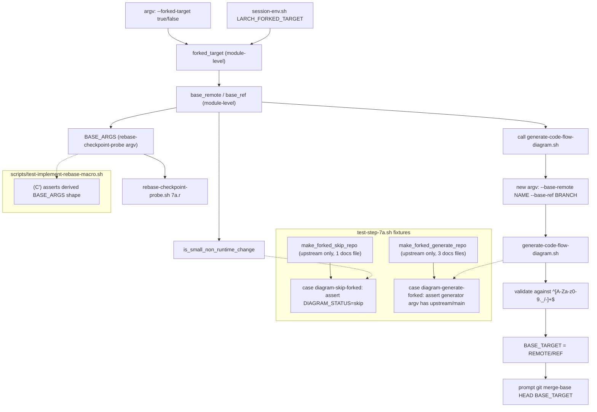

## Architecture Diagram

```mermaid
graph TD
    argv["argv: --forked-target true/false"]
    sessionEnv["session-env.sh LARCH_FORKED_TARGET"]
    forkedTarget["forked_target (module-level)"]
    baseVars["base_remote / base_ref (module-level)"]
    classifier["is_small_non_runtime_change"]
    genCall["call generate-code-flow-diagram.sh"]
    baseArgs["BASE_ARGS (rebase-checkpoint-probe argv)"]
    rebaseProbe["rebase-checkpoint-probe.sh 7a.r"]
    generator["generate-code-flow-diagram.sh"]
    genArgv["new argv: --base-remote NAME --base-ref BRANCH"]
    validate["validate against ^[A-Za-z0-9._/-]+$"]
    baseTarget["BASE_TARGET = REMOTE/REF"]
    prompt["prompt git merge-base HEAD BASE_TARGET"]

    argv --> forkedTarget
    sessionEnv --> forkedTarget
    forkedTarget --> baseVars
    baseVars --> classifier
    baseVars --> genCall
    baseVars --> baseArgs
    genCall --> genArgv
    baseArgs --> rebaseProbe
    genArgv --> generator
    generator --> validate
    validate --> baseTarget
    baseTarget --> prompt

    subgraph harness["test-step-7a.sh fixtures"]
        skipFork["make_forked_skip_repo (upstream only, 1 docs file)"]
        genFork["make_forked_generate_repo (upstream only, 3 docs files)"]
        skipFork --> caseSkipForked["case diagram-skip-forked: assert DIAGRAM_STATUS=skip"]
        genFork --> caseGenForked["case diagram-generate-forked: assert generator argv has upstream/main"]
    end

    subgraph macroHarness["scripts/test-implement-rebase-macro.sh"]
        macroAssert["(C') asserts derived BASE_ARGS shape"]
    end

    baseArgs -.-> macroAssert
    classifier -.-> caseSkipForked
    generator -.-> caseGenForked
```
