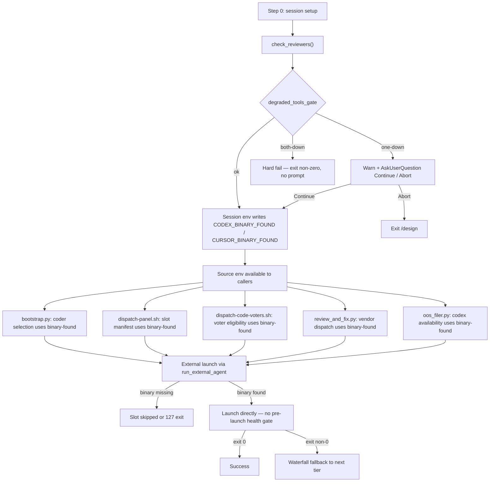

## Architecture Diagram

```mermaid
graph TD
    A["Step 0: session setup"] --> B["check_reviewers()"]
    B --> C{"degraded_tools_gate"}
    C -->|"ok"| D["Session env writes CODEX_BINARY_FOUND / CURSOR_BINARY_FOUND"]
    C -->|"one-down"| E["Warn + AskUserQuestion Continue / Abort"]
    C -->|"both-down"| F["Hard fail — exit non-zero, no prompt"]
    E -->|"Continue"| D
    E -->|"Abort"| G["Exit /design"]
    D --> H["Source env available to callers"]

    H --> I["bootstrap.py: coder selection uses binary-found"]
    H --> J["dispatch-panel.sh: slot manifest uses binary-found"]
    H --> K["dispatch-code-voters.sh: voter eligibility uses binary-found"]
    H --> L["review_and_fix.py: vendor dispatch uses binary-found"]
    H --> M["oos_filer.py: codex availability uses binary-found"]

    I --> N["External launch via run_external_agent"]
    J --> N
    K --> N
    L --> N
    M --> N

    N -->|"binary missing"| O["Slot skipped or 127 exit"]
    N -->|"binary found"| P["Launch directly — no pre-launch health gate"]
    P -->|"exit 0"| Q["Success"]
    P -->|"exit non-0"| R["Waterfall fallback to next tier"]
```
