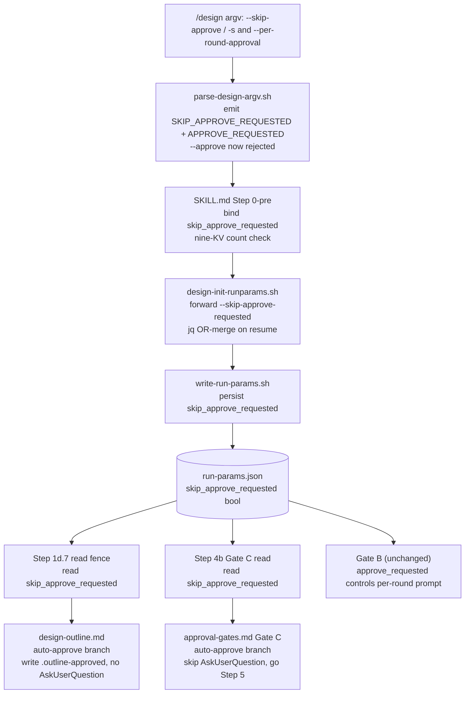

## Architecture Diagram

```mermaid
graph TD
    ARGV["/design argv: --skip-approve / -s and --per-round-approval"]
    PARSE["parse-design-argv.sh<br/>emit SKIP_APPROVE_REQUESTED + APPROVE_REQUESTED<br/>--approve now rejected"]
    PRE["SKILL.md Step 0-pre<br/>bind skip_approve_requested<br/>nine-KV count check"]
    INIT["design-init-runparams.sh<br/>forward --skip-approve-requested<br/>jq OR-merge on resume"]
    WRP["write-run-params.sh<br/>persist skip_approve_requested"]
    RP[("run-params.json<br/>skip_approve_requested bool")]
    G1["Step 1d.7 read fence<br/>read skip_approve_requested"]
    OUT["design-outline.md<br/>auto-approve branch<br/>write .outline-approved, no AskUserQuestion"]
    G2["Step 4b Gate C read<br/>read skip_approve_requested"]
    GC["approval-gates.md Gate C<br/>auto-approve branch<br/>skip AskUserQuestion, go Step 5"]
    GB["Gate B (unchanged)<br/>approve_requested controls per-round prompt"]

    ARGV --> PARSE --> PRE --> INIT --> WRP --> RP
    RP --> G1 --> OUT
    RP --> G2 --> GC
    RP --> GB
```
