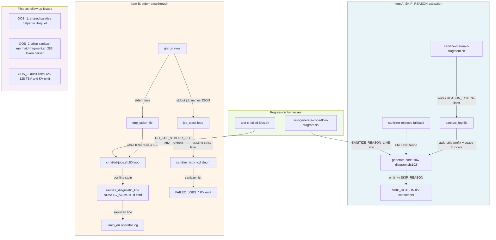

## Architecture Diagram

```mermaid
flowchart TD
    subgraph Item_A["Item A: SKIP_REASON extraction"]
        SMF["sanitize-mermaid-fragment.sh"] -->|"writes REASON_TOKEN= lines"| SLOG["sanitize_log file"]
        SLOG -->|"awk: strip prefix + space-truncate"| GCFD["generate-code-flow-diagram.sh:102"]
        GCFD -->|"emit_kv SKIP_REASON"| GCFD_OUT["SKIP_REASON KV consumers"]
        GCFD_FALLBACK["sanitizer-rejected fallback"] -.->|"END exit !found"| GCFD
    end

    subgraph Item_B["Item B: stderr passthrough"]
        GH["gh run view"] -->|"stderr lines"| TMP_STDERR["tmp_stderr file"]
        TMP_STDERR -->|"while IFS= read -r line"| LOOP["ci-failed-jobs.sh:80 loop"]
        LOOP -->|"per-line stdin"| SDL["sanitize_diagnostic_line NEW: LC_ALL=C tr -d cntrl"]
        SDL -->|"sanitized line"| LARCH_ERR["larch_err operator log"]

        GH -->|"stdout job names JSON"| JOB_NAMES["job_class loop"]
        JOB_NAMES -->|"unchanged: existing strict filter"| SLIST["sanitize_list tr -cd alnum"]
        SLIST -->|"sanitize_list"| FJ_KV["FAILED_JOBS_* KV emit"]
    end

    subgraph Tests["Regression harnesses"]
        T_GCFD["test-generate-code-flow-diagram.sh"] -->|"SANITIZE_REASON_LINE env"| GCFD
        T_CFJ["test-ci-failed-jobs.sh"] -->|"GH_FAIL_STDERR_FILE env, T8 block"| LOOP
    end

    subgraph OOS["Filed as follow-up issues"]
        OOS1["OOS_1: shared sanitize helper in lib-quiet"]
        OOS2["OOS_2: align sanitize-mermaid-fragment.sh:283 token parser"]
        OOS3["OOS_3: audit lines 125-128 TSV and KV emit"]
    end

    style Item_A fill:#e8f4f8
    style Item_B fill:#fff4e8
    style Tests fill:#f0f8e8
    style OOS fill:#f8f0f8
```
