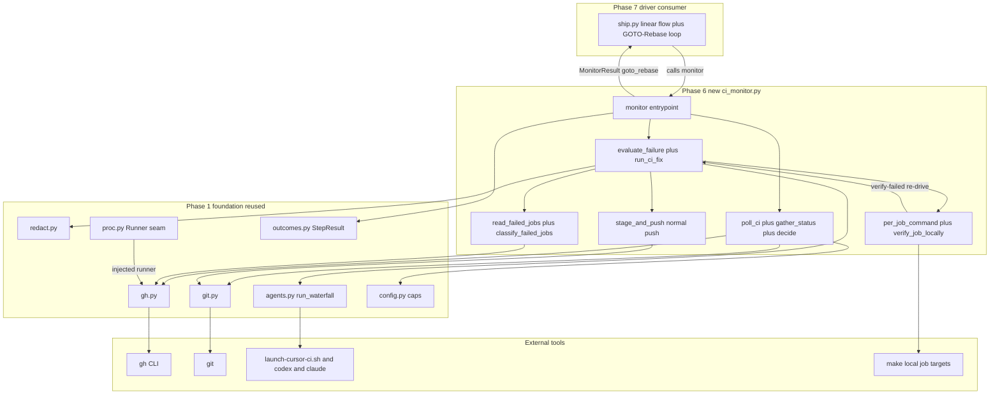

## Architecture Diagram

```mermaid
graph TD
    subgraph driver["Phase 7 driver consumer"]
        Ship["ship.py linear flow plus GOTO-Rebase loop"]
    end
    subgraph p6["Phase 6 new ci_monitor.py"]
        Monitor["monitor entrypoint"]
        Classify["poll_ci plus gather_status plus decide"]
        FailJobs["read_failed_jobs plus classify_failed_jobs"]
        FixLoop["evaluate_failure plus run_ci_fix"]
        Verify["per_job_command plus verify_job_locally"]
        StagePush["stage_and_push normal push"]
    end
    subgraph p1["Phase 1 foundation reused"]
        GH["gh.py"]
        Agents["agents.py run_waterfall"]
        Git["git.py"]
        Redact["redact.py"]
        Proc["proc.py Runner seam"]
        Config["config.py caps"]
        Outcomes["outcomes.py StepResult"]
    end
    subgraph ext["External tools"]
        GhCli["gh CLI"]
        GitCli["git"]
        Launchers["launch-cursor-ci.sh and codex and claude"]
        Make["make local job targets"]
    end
    Ship -->|calls monitor| Monitor
    Monitor --> Classify
    Monitor --> FixLoop
    Monitor --> Outcomes
    FixLoop --> FailJobs
    FixLoop --> Verify
    FixLoop --> StagePush
    FixLoop --> Agents
    FixLoop --> Redact
    Classify --> GH
    Classify --> Git
    Classify --> Config
    FailJobs --> GH
    StagePush --> Git
    Verify --> Make
    GH --> GhCli
    Git --> GitCli
    Agents --> Launchers
    Proc -->|injected runner| GH
    Verify -->|verify-failed re-drive| FixLoop
    Monitor -->|MonitorResult goto_rebase| Ship
```
