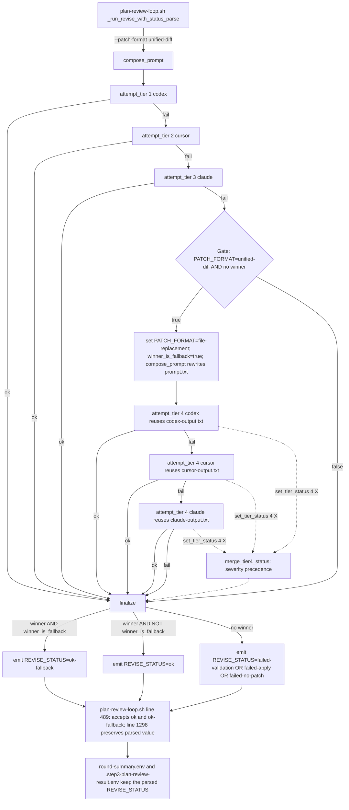

## Architecture Diagram

```mermaid
flowchart TD
    Caller[plan-review-loop.sh _run_revise_with_status_parse] -->|--patch-format unified-diff| Compose[compose_prompt]
    Compose --> T1[attempt_tier 1 codex]
    T1 -->|ok| Finalize[finalize]
    T1 -->|fail| T2[attempt_tier 2 cursor]
    T2 -->|ok| Finalize
    T2 -->|fail| T3[attempt_tier 3 claude]
    T3 -->|ok| Finalize
    T3 -->|fail| Gate4{Gate: PATCH_FORMAT=unified-diff AND no winner}
    Gate4 -->|true| Switch[set PATCH_FORMAT=file-replacement; winner_is_fallback=true; compose_prompt rewrites prompt.txt]
    Switch --> T4codex[attempt_tier 4 codex reuses codex-output.txt]
    T4codex -->|ok| Finalize
    T4codex -->|fail| T4cursor[attempt_tier 4 cursor reuses cursor-output.txt]
    T4cursor -->|ok| Finalize
    T4cursor -->|fail| T4claude[attempt_tier 4 claude reuses claude-output.txt]
    T4claude -->|ok| Finalize
    T4claude -->|fail| Finalize
    Gate4 -->|false| Finalize
    T4codex -.->|set_tier_status 4 X| Merge[merge_tier4_status: severity precedence]
    T4cursor -.->|set_tier_status 4 X| Merge
    T4claude -.->|set_tier_status 4 X| Merge
    Merge -.-> Finalize
    Finalize -->|winner AND winner_is_fallback| EmitFallback[emit REVISE_STATUS=ok-fallback]
    Finalize -->|winner AND NOT winner_is_fallback| EmitOk[emit REVISE_STATUS=ok]
    Finalize -->|no winner| EmitFail[emit REVISE_STATUS=failed-validation OR failed-apply OR failed-no-patch]
    EmitFallback --> Consumer[plan-review-loop.sh line 489: accepts ok and ok-fallback; line 1298 preserves parsed value]
    EmitOk --> Consumer
    EmitFail --> Consumer
    Consumer --> Round[round-summary.env and .step3-plan-review-result.env keep the parsed REVISE_STATUS]
```
