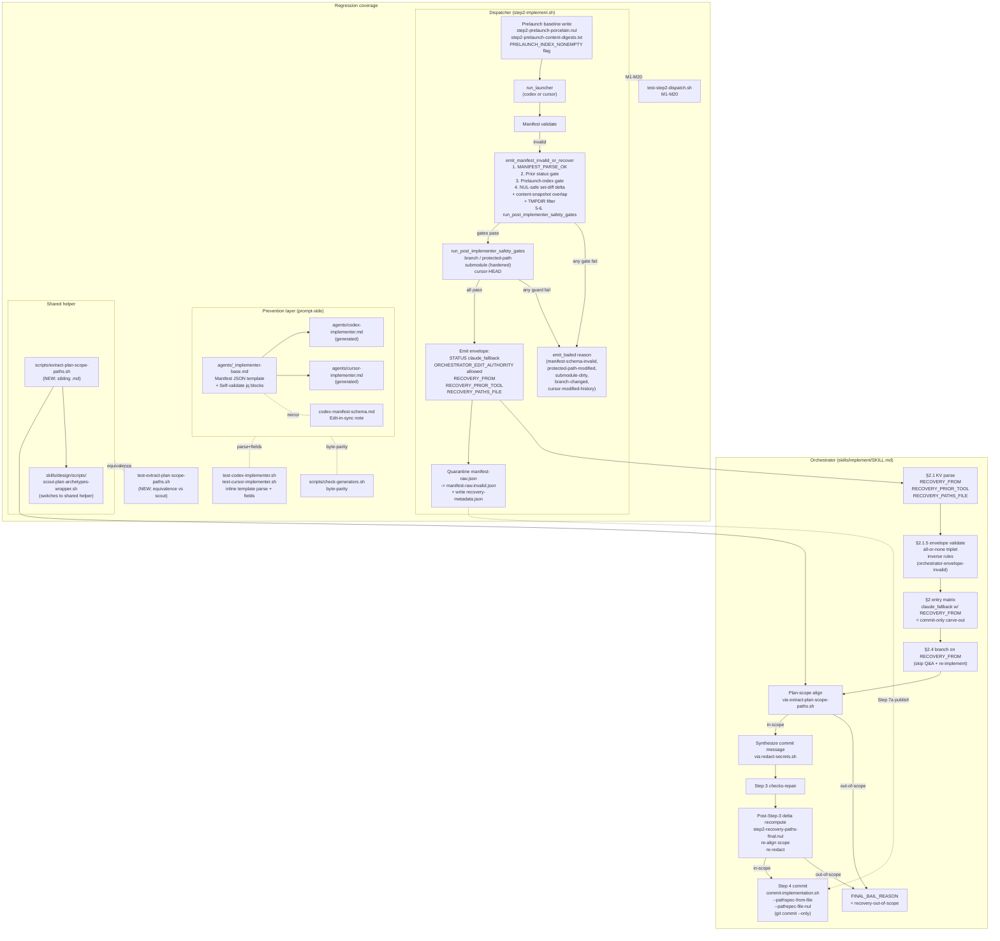

## Architecture Diagram

```mermaid
flowchart TD
    subgraph Prevention["Prevention layer (prompt-side)"]
        BASE["agents/_implementer-base.md<br/>Manifest JSON template<br/>+ Self-validate jq blocks"]
        CODEX_AGENT["agents/codex-implementer.md<br/>(generated)"]
        CURSOR_AGENT["agents/cursor-implementer.md<br/>(generated)"]
        BASE --> CODEX_AGENT
        BASE --> CURSOR_AGENT
        SCHEMA["codex-manifest-schema.md<br/>Edit-in-sync note"]
        BASE -. mirror .- SCHEMA
    end

    subgraph Dispatcher["Dispatcher (step2-implement.sh)"]
        PRELAUNCH["Prelaunch baseline write<br/>step2-prelaunch-porcelain.nul<br/>step2-prelaunch-content-digests.txt<br/>PRELAUNCH_INDEX_NONEMPTY flag"]
        LAUNCH["run_launcher<br/>(codex or cursor)"]
        VALIDATE["Manifest validate"]
        RECOVER["emit_manifest_invalid_or_recover<br/>1. MANIFEST_PARSE_OK<br/>2. Prior status gate<br/>3. Prelaunch-index gate<br/>4. NUL-safe set-diff delta<br/>+ content-snapshot overlap<br/>+ TMPDIR filter<br/>5-6. run_post_implementer_safety_gates"]
        GATES["run_post_implementer_safety_gates<br/>branch / protected-path<br/>submodule (hardened)<br/>cursor-HEAD"]
        EMIT["Emit envelope:<br/>STATUS claude_fallback<br/>ORCHESTRATOR_EDIT_AUTHORITY allowed<br/>RECOVERY_FROM<br/>RECOVERY_PRIOR_TOOL<br/>RECOVERY_PATHS_FILE"]
        QUARANTINE["Quarantine manifest-raw.json<br/>-> manifest-raw.invalid.json<br/>+ write recovery-metadata.json"]
        BAIL["emit_bailed reason<br/>(manifest-schema-invalid,<br/>protected-path-modified,<br/>submodule-dirty,<br/>branch-changed,<br/>cursor-modified-history)"]
        PRELAUNCH --> LAUNCH
        LAUNCH --> VALIDATE
        VALIDATE -->|invalid| RECOVER
        RECOVER -->|gates pass| GATES
        GATES -->|all pass| EMIT
        EMIT --> QUARANTINE
        RECOVER -->|any gate fail| BAIL
        GATES -->|any guard fail| BAIL
    end

    subgraph Orchestrator["Orchestrator (skills/implement/SKILL.md)"]
        PARSE["§2.1 KV parse<br/>RECOVERY_FROM<br/>RECOVERY_PRIOR_TOOL<br/>RECOVERY_PATHS_FILE"]
        VALIDATE_ENV["§2.1.5 envelope validate<br/>all-or-none triplet<br/>inverse rules<br/>(orchestrator-envelope-invalid)"]
        MATRIX["§2 entry matrix<br/>claude_fallback w/ RECOVERY_FROM<br/>= commit-only carve-out"]
        STEP24["§2.4 branch on RECOVERY_FROM<br/>(skip Q&A + re-implement)"]
        SCOPE["Plan-scope align<br/>via extract-plan-scope-paths.sh"]
        MSG["Synthesize commit message<br/>via redact-secrets.sh"]
        STEP3["Step 3 checks-repair"]
        RECOMPUTE["Post-Step-3 delta recompute<br/>step2-recovery-paths-final.nul<br/>re-align scope<br/>re-redact"]
        STEP4["Step 4 commit<br/>commit-implementation.sh<br/>--pathspec-from-file<br/>--pathspec-file-nul<br/>(git commit --only)"]
        OOS_OUT["FINAL_BAIL_REASON<br/>= recovery-out-of-scope"]
        PARSE --> VALIDATE_ENV
        VALIDATE_ENV --> MATRIX
        MATRIX --> STEP24
        STEP24 --> SCOPE
        SCOPE -->|in-scope| MSG
        SCOPE -->|out-of-scope| OOS_OUT
        MSG --> STEP3
        STEP3 --> RECOMPUTE
        RECOMPUTE -->|in-scope| STEP4
        RECOMPUTE -->|out-of-scope| OOS_OUT
    end

    subgraph Shared["Shared helper"]
        EXTRACT["scripts/extract-plan-scope-paths.sh<br/>(NEW; sibling .md)"]
        SCOUT["skills/design/scripts/<br/>scout-plan-archetypes-wrapper.sh<br/>(switches to shared helper)"]
        EXTRACT --> SCOPE
        EXTRACT --> SCOUT
    end

    EMIT --> PARSE
    QUARANTINE -. Step 7a publish .-> STEP4

    subgraph Tests["Regression coverage"]
        TM["test-step2-dispatch.sh<br/>M1-M20"]
        TIMP["test-codex-implementer.sh<br/>test-cursor-implementer.sh<br/>inline template parse + fields"]
        TCG["scripts/check-generators.sh<br/>byte-parity"]
        TEPSP["test-extract-plan-scope-paths.sh<br/>(NEW; equivalence vs scout)"]
        Dispatcher -. M1-M20 .- TM
        Prevention -. parse+fields .- TIMP
        Prevention -. byte-parity .- TCG
        Shared -. equivalence .- TEPSP
    end
```
