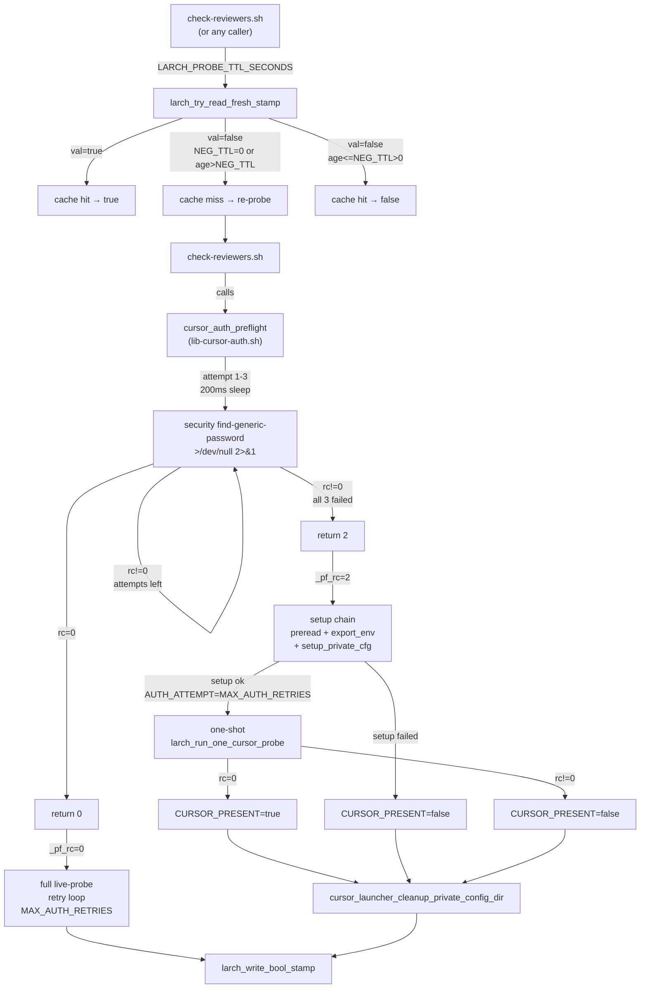

```mermaid
flowchart TD
    CR["check-reviewers.sh"] -->|"calls"| PF["cursor_auth_preflight\n(lib-cursor-auth.sh)"]
    PF -->|"attempt 1-3\n200ms sleep"| KC["security find-generic-password\n>/dev/null 2>&1"]
    KC -->|"rc=0"| PFOK["return 0"]
    KC -->|"rc!=0\nattempts left"| KC
    KC -->|"rc!=0\nall 3 failed"| PF2["return 2"]

    PFOK -->|"_pf_rc=0"| FULLLOOP["full live-probe\nretry loop\nMAX_AUTH_RETRIES"]
    PF2 -->|"_pf_rc=2"| SETUP["setup chain\npreread + export_env\n+ setup_private_cfg"]
    SETUP -->|"setup failed"| FALSE1["CURSOR_PRESENT=false"]
    SETUP -->|"setup ok\nAUTH_ATTEMPT=MAX_AUTH_RETRIES"| ONESHOT["one-shot\nlarch_run_one_cursor_probe"]
    ONESHOT -->|"rc=0"| TRUE1["CURSOR_PRESENT=true"]
    ONESHOT -->|"rc!=0"| FALSE2["CURSOR_PRESENT=false"]
    FULLLOOP --> STAMP
    TRUE1 --> CLEANUP["cursor_launcher_cleanup_private_config_dir"]
    FALSE1 --> CLEANUP
    FALSE2 --> CLEANUP
    CLEANUP --> STAMP["larch_write_bool_stamp"]

    CR2["check-reviewers.sh\n(or any caller)"] -->|"LARCH_PROBE_TTL_SECONDS"| TRYREAD["larch_try_read_fresh_stamp"]
    TRYREAD -->|"val=true"| HIT1["cache hit → true"]
    TRYREAD -->|"val=false\nNEG_TTL=0 or age>NEG_TTL"| MISS["cache miss → re-probe"]
    TRYREAD -->|"val=false\nage<=NEG_TTL>0"| HIT2["cache hit → false"]
    MISS --> CR
```
