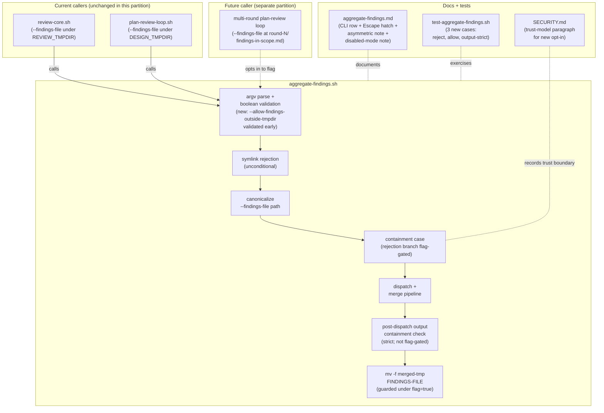

## Architecture Diagram

The diagram shows the asymmetric trust boundary inside `aggregate-findings.sh`: the **containment case** rejection branch is now flag-gated, but **symlink rejection** stays unconditional and the **post-dispatch output containment check** stays strict. Existing callers (`review-core.sh`, `plan-review-loop.sh`) are byte-equivalent because the flag defaults to `false`; only the future multi-round plan-review loop (out of scope here) will opt in. Docs and the regression harness sit adjacent to the script, documenting the new opt-in and locking the relaxation contract.
