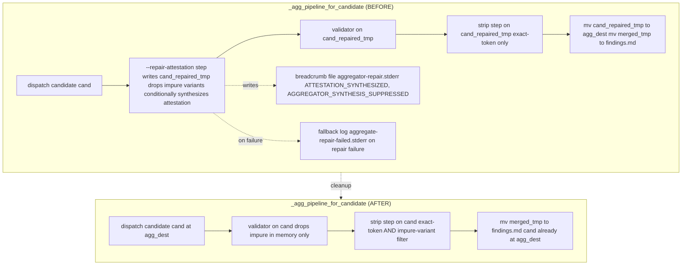

## Architecture Diagram

```mermaid
flowchart TD
  subgraph Before ["_agg_pipeline_for_candidate (BEFORE)"]
    A1[dispatch candidate cand]
    A2[--repair-attestation step writes cand_repaired_tmp drops impure variants conditionally synthesizes attestation]
    A3[validator on cand_repaired_tmp]
    A4[strip step on cand_repaired_tmp exact-token only]
    A5[mv cand_repaired_tmp to agg_dest mv merged_tmp to findings.md]
    A6[breadcrumb file aggregator-repair.stderr ATTESTATION_SYNTHESIZED, AGGREGATOR_SYNTHESIS_SUPPRESSED]
    A7[fallback log aggregate-repair-failed.stderr on repair failure]
    A1 --> A2
    A2 --> A3
    A2 -.writes.-> A6
    A2 -.on failure.-> A7
    A3 --> A4
    A4 --> A5
  end

  subgraph After ["_agg_pipeline_for_candidate (AFTER)"]
    B1[dispatch candidate cand at agg_dest]
    B3[validator on cand drops impure in memory only]
    B4[strip step on cand exact-token AND impure-variant filter]
    B5[mv merged_tmp to findings.md cand already at agg_dest]
    B1 --> B3
    B3 --> B4
    B4 --> B5
  end

  Before -.cleanup-.-> After
```
