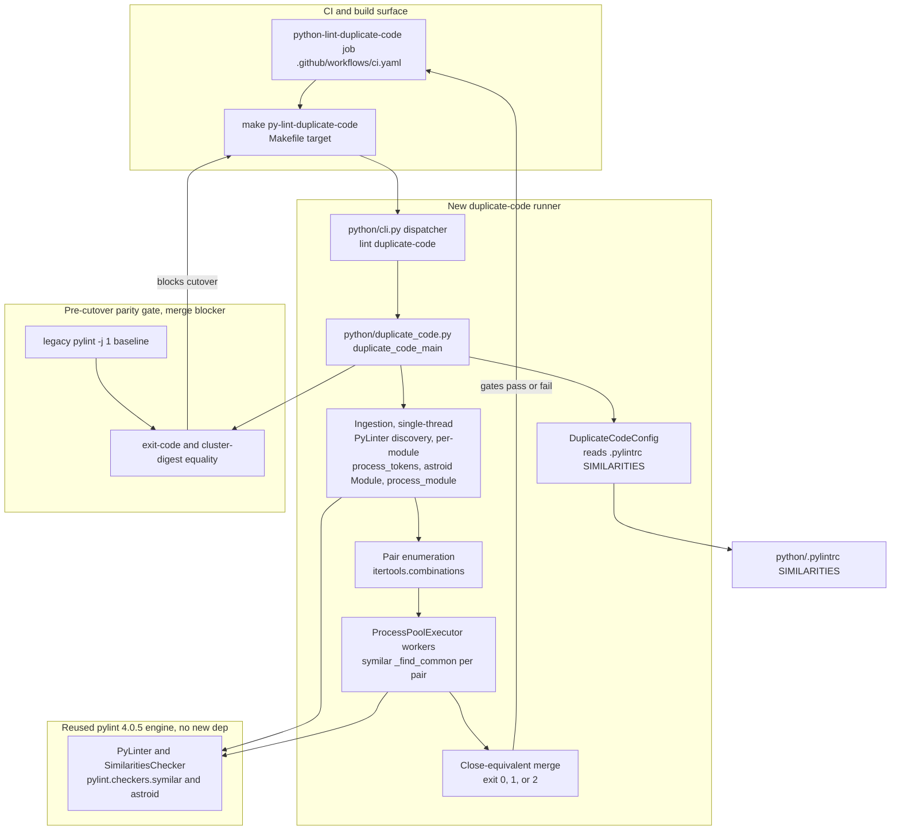

## Architecture Diagram

```mermaid
graph TD
    subgraph CI["CI and build surface"]
        CIJOB["python-lint-duplicate-code job<br/>.github/workflows/ci.yaml"]
        MAKE["make py-lint-duplicate-code<br/>Makefile target"]
    end

    subgraph RUNNER["New duplicate-code runner"]
        CLI["python/cli.py dispatcher<br/>lint duplicate-code"]
        DC["python/duplicate_code.py<br/>duplicate_code_main"]
        CFG["DuplicateCodeConfig<br/>reads .pylintrc SIMILARITIES"]
        INGEST["Ingestion, single-thread<br/>PyLinter discovery, per-module<br/>process_tokens, astroid Module, process_module"]
        PAIRS["Pair enumeration<br/>itertools.combinations"]
        POOL["ProcessPoolExecutor workers<br/>symilar _find_common per pair"]
        GATE["Close-equivalent merge<br/>exit 0, 1, or 2"]
    end

    subgraph PYLINT["Reused pylint 4.0.5 engine, no new dep"]
        ENGINE["PyLinter and SimilaritiesChecker<br/>pylint.checkers.symilar and astroid"]
    end

    RC["python/.pylintrc SIMILARITIES"]

    subgraph PARITY["Pre-cutover parity gate, merge blocker"]
        LEGACY["legacy pylint -j 1 baseline"]
        DIGEST["exit-code and cluster-digest equality"]
    end

    CIJOB --> MAKE
    MAKE --> CLI
    CLI --> DC
    DC --> CFG
    CFG --> RC
    DC --> INGEST
    INGEST --> ENGINE
    INGEST --> PAIRS
    PAIRS --> POOL
    POOL --> ENGINE
    POOL --> GATE
    GATE -->|gates pass or fail| CIJOB
    LEGACY --> DIGEST
    DC --> DIGEST
    DIGEST -->|blocks cutover| MAKE
```
