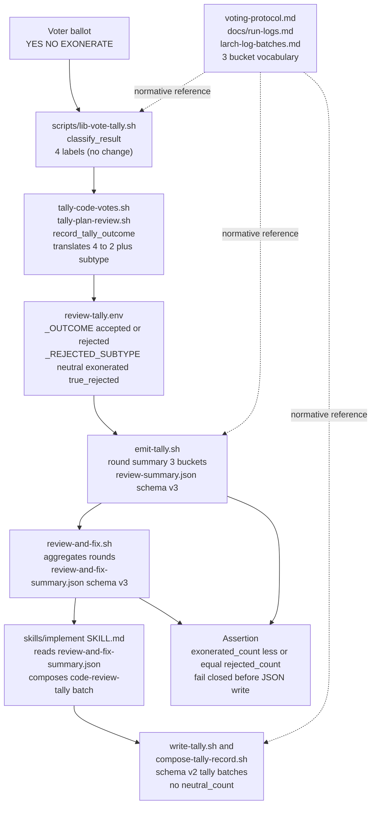

## Goal
Fold voting tally 'neutral' outcome into 'rejected' to reduce operator-facing vocabulary from 4 to 3 buckets

## Implementation Plan
## Plan

Fold operator-facing finding-outcome vocabulary from 4 buckets (`accepted` / `neutral` / `exonerated` / `rejected`) to 3 buckets (`accepted` / `rejected` / `exonerated`), where `exonerated` is reported as an informational sub-classification of `rejected`. Internal classifier and scoring math are preserved.

### Decisions

- **D1 (JSON compat)**: Remove `neutral_count` from JSON outputs and bump `schema_version`:
  - `review-and-fix-summary.json`: 2 → 3
  - `plan-review-tally.json` / `code-review-tally.json` batch records: 1 → 2
  - `review-summary.json`: 2 → 3
- **D2 (KV shape)**: Replace `_OUTCOME=neutral` and `_OUTCOME=exonerated` with `_OUTCOME=rejected` + `_REJECTED_SUBTYPE=neutral|exonerated|true_rejected`. Applies to all non-accepted findings. Internal `NEUTRAL_COUNT` and `TOTAL_NEUTRAL_COUNT` KV emissions stay (scoreboard accounting).

### Approach (5 orthogonal surfaces)

**A. Internal classifier (no change)** — `scripts/lib-vote-tally.sh::classify_result` continues returning one of 4 labels (`accepted` / `rejected` / `neutral` / `exonerated`). All translation to the new 2-label `_OUTCOME` + subtype shape happens at the emission boundary.

**B. KV emission boundary** — In `record_tally_outcome` and OOS-finding emission paths in `skills/review/scripts/tally-code-votes.sh`:
- `accepted` → `FINDING_N_OUTCOME=accepted` (no subtype key).
- `rejected` → `FINDING_N_OUTCOME=rejected` + `FINDING_N_REJECTED_SUBTYPE=true_rejected`.
- `neutral` → `FINDING_N_OUTCOME=rejected` + `FINDING_N_REJECTED_SUBTYPE=neutral`.
- `exonerated` → `FINDING_N_OUTCOME=rejected` + `FINDING_N_REJECTED_SUBTYPE=exonerated`.

The `score_rows` TSV used by the in-file awk scoreboard keeps the 4-label `result` column unchanged (internal to the script).

**C. Operator-facing surfaces (3-bucket vocabulary)**:
- Drop the `Neutral findings: N` bullet from `emit-tally.sh` round summary; render `K accepted, N rejected (P exonerated)` (where `P <= N`).
- Final summary in `skills/implement/scripts/write-final-report.sh` uses the same 3-bucket wording.
- Per-round summary in `skills/review-and-fix/scripts/review-and-fix.sh` uses the same wording.
- Voting tally scoreboard column `Neutral/Exon` → `Exonerated` (in both `tally-code-votes.sh` and `skills/design/scripts/tally-plan-review.sh`).
- Rewrite `skills/shared/voting-protocol.md` outcome-classification section, Reviewer Competition Scoreboard table, and OOS Scoring table; drop all operator-facing mentions of `neutral` as a finding outcome. Threshold rules and scoring-points tables preserved verbatim.

**D. JSON schema bump**:
- `skills/review/scripts/emit-tally.sh` → `review-summary.json`: schema 2→3; remove `neutral_count` (top-level) and `total_neutral` (`finding_counts`). Add `exonerated_count <= rejected_count` assertion before jq write; on violation, write nothing and exit 1.
- `skills/review-and-fix/scripts/review-and-fix.sh` → `review-and-fix-summary.json`: schema 2→3; remove `neutral_count` from top level. Same assertion.
- `scripts/compose-tally-record.sh` → `plan-review-tally.json` / `code-review-tally.json`: schema 1→2; remove `neutral_count` from the JSON shape; keep `--neutral N` argv accepted but ignored (deprecated no-op for back-compat at the CLI boundary). `scripts/write-tally.sh` updated to no longer forward `--neutral`.

**E. Documentation** — `docs/run-logs.md`, `scripts/larch-log-batches.md`, `scripts/compose-tally-record.md`, `skills/review/references/heavy-worker.md`, `skills/implement/SKILL.md` (both the `code-review-tally` source-priority block around line 1249 AND the documented `write-tally.sh` invocation at line ~1253 — drop `--neutral <N>`), `skills/review/scripts/*.md`, and `skills/design/scripts/*.md` updated for new vocabulary, schema versions, and dropped `--neutral` argv.

### Files to modify

`skills/shared/voting-protocol.md`, `skills/review/scripts/tally-code-votes.sh` (+ `.md`), `skills/review/scripts/emit-tally.sh` (+ `.md`), `skills/review/scripts/review-core.sh` (+ `.md`), `skills/review-and-fix/scripts/review-and-fix.sh` (+ `.md`), `skills/design/scripts/tally-plan-review.sh` (+ `.md`), `skills/implement/scripts/write-final-report.sh` (+ `.md`), `skills/implement/SKILL.md`, `scripts/compose-tally-record.sh` (+ `.md`), `scripts/write-tally.sh` (+ `.md`), `docs/run-logs.md`, `scripts/larch-log-batches.md`, `skills/review/references/heavy-worker.md`. Tests: `scripts/test-write-tally.sh`, `skills/review/scripts/test-tally-code-votes.sh`, `skills/review/scripts/test-emit-tally.sh`, `skills/design/scripts/test-tally-plan-review.sh`, `skills/review-and-fix/scripts/test-review-and-fix.sh`.

### Architecture (Mermaid)

## Acceptance

1. `skills/shared/voting-protocol.md` outcome matrix lists exactly 3 finding-outcome terms (`accepted`, `rejected`, `exonerated`), with `exonerated` documented as a sub-classification of `rejected`. No operator-facing mention of `neutral` as a finding outcome.
2. Operator-facing summary lines (`/implement` final report, `/design` plan-review tally, `/review` round summary) use the format `K accepted, N rejected (P exonerated)` (or equivalent prose). Grep `skills/`, `scripts/`, `docs/` for any operator-facing prose that surfaces `neutral` as a finding outcome — none remain.
3. The invariant `P <= N` (exonerated count ≤ rejected count) is asserted before each JSON write in `emit-tally.sh` and `review-and-fix.sh`. A regression test (in `test-emit-tally.sh` or `test-write-tally.sh`) fabricates input with `exonerated_count > rejected_count` and verifies the assertion fires (exit non-zero, no JSON written).
4. Reviewer Competition Scoreboard scoring is preserved: findings previously scoring 0 still score 0; findings previously scoring -1 still score -1. Verified by existing `test-tally-code-votes.sh` and `test-tally-plan-review.sh` assertions.
5. Internal `NEUTRAL_COUNT` / `TOTAL_NEUTRAL_COUNT` KV emissions are retained in `tally-code-votes.sh` and `review-and-fix.sh` outputs (verified by KV-level test assertions); they are not surfaced in JSON outputs or operator-facing round summaries.
6. `_OUTCOME=neutral` and `_OUTCOME=exonerated` literals are absent from KV emissions; replaced with `_OUTCOME=rejected` + `_REJECTED_SUBTYPE=<neutral|exonerated|true_rejected>`. Verified by updated `test-tally-code-votes.sh` and `test-emit-tally.sh` fixtures and assertions.
7. JSON schema bumps land cleanly: `review-summary.json` `schema_version: 3`, `review-and-fix-summary.json` `schema_version: 3`, `plan-review-tally.json` and `code-review-tally.json` `schema_version: 2`. `neutral_count` field absent from all three JSON shapes. `/implement` SKILL.md `code-review-tally` source-priority block updated accordingly; `--neutral <N>` dropped from the documented `write-tally.sh` invocation at line ~1253.
8. `--neutral N` argv on `write-tally.sh` and `compose-tally-record.sh` is accepted but ignored (deprecated no-op); a follow-up could remove it after one release.
9. `make lint` and `bash scripts/relevant-checks.sh` pass cleanly.
10. `grep -rn '\.neutral_count\|"neutral_count":\|--neutral' skills/ scripts/ docs/` returns only matches in test fixtures (`test-write-tally.sh`, etc.) and run-log historical batches under `larch-logs/` — no production source/doc references remain.

diff_lines: 380

## Test plan
(no test plan section in plan-file)
