## /implement run 19564DCD-AAE6-4D21-B1DC-97DA83FC21C6 — bailed

- **Outcome**: bailed
- **Mode**: N/A
- **Duration**: 01:38:49
- **Cost**: 💰 TOTAL ~$50.91 — Claude $3.40, Codex $26.44, Cursor $16.22, Claude (subprocess) $4.85  |  Tokens: 73758k
- **Issue**: #4121 — https://github.com/character-ai/larch/issues/4121
- **Plan review**: N/A
- **Code review**: 5/30 accepted
- **Lines (PR diff)**: N/A
- **OOS filed**: 0
- **Exec issues**: 0
- **Warnings**: 0
- **Run logs**: `larch-logs/implement/19564DCD-AAE6-4D21-B1DC-97DA83FC21C6/`

<!-- larch:run-summary v=1 -->

## Review Phase Detail

| Round | Suggestions | Accepted | OOS proposed | OOS accepted | Time | Cost | Reviewers |
|--:|--:|--:|--:|--:|:--|--:|--:|
| 1 | 28 | 4 | 0 | 0 | 32m 11s | $24.98 | 10 |
| 2 | 35 | 1 | 0 | 0 | 31m 46s | $12.39 | 7 |
| **Total** | **63** | **5** | **0** | **0** | **1h 03m 57s** | **$37.37** | **17** |

### Round 1 reviewer timing

```mermaid
gantt
    title Round 1 reviewer timing
    dateFormat X
    axisFormat %H:%M:%S
    section Reviewers
    unknown/scout-round1-manifest.json.raw :r1_t1, 1, 109
    unknown/scout-round1-manifest.json.raw :r1_t2, 109, 188
    cursor/correctness :r1_t3, 189, 376
    codex/correctness :r1_t4, 189, 430
    cursor/testing :r1_t5, 190, 307
    cursor/edge-cases :r1_t6, 190, 329
    cursor/dyn-risk-integration :r1_t7, 190, 352
    codex/testing :r1_t8, 190, 405
    cursor/dyn-architecture :r1_t9, 190, 405
    codex/dyn-architecture-codex :r1_t10, 190, 452
    codex/edge-cases :r1_t11, 190, 470
    dynamic/risk-integration-codex :r1_t12, 190, 520
    unknown/aggregator :r1_t13, 532, 600
    cursor/vote :r1_t14, 602, 701
    codex/vote :r1_t15, 602, 870
    claude/vote :r1_t16, 602, 1101
    claude/ci.out :r1_t17, 1422, 1423
    claude/ci.out :r1_t18, 1423, 1424
    unknown/out :r1_t19, 1425, 1426
    cursor/ci.out :r1_t20, 1426, 1428
```

### Round 2 reviewer timing

```mermaid
gantt
    title Round 2 reviewer timing
    dateFormat X
    axisFormat %H:%M:%S
    section Reviewers
    unknown/scout-round2-manifest.json.raw :r2_t1, 1, 87
    unknown/scout-round2-manifest.json.raw :r2_t2, 87, 219
    cursor/dyn-emergency-merge-security :r2_t3, 222, 351
    cursor/dyn-required-flag-propagation :r2_t4, 222, 389
    cursor/testing :r2_t5, 222, 390
    cursor/edge-cases :r2_t6, 222, 418
    cursor/dyn-scout-sidecar-pipeline :r2_t7, 222, 439
    cursor/correctness :r2_t8, 222, 447
    codex/codex-generic :r2_t9, 222, 634
    unknown/aggregator :r2_t10, 644, 738
    cursor/vote :r2_t11, 739, 816
    codex/vote :r2_t12, 739, 981
    claude/vote :r2_t13, 739, 1130
    cursor/ci.out :r2_t14, 1465, 1467
```

**Top reviewers** (by suggestions accepted, whole run):
1. codex/dyn-architecture-codex — 1
2. cursor/correctness — 1
3. cursor/dyn-risk-integration — 1
4. cursor/edge-cases — 1
5. cursor/testing — 1

**Reviewer slot failures**: 0

_Cost is the per-round vendor cost (Codex + Cursor + Claude subprocess), attributed by token-ledger timestamp window; it excludes main-agent Claude, so it is less than the run Cost line above. Rendered as an em dash when per-round timing or the token ledger is unavailable._
