## /implement run 1FD5867C-ABA7-4770-92EE-8618381CBB26 — bailed

- **Outcome**: bailed
- **Mode**: N/A
- **Duration**: 00:23:42
- **Cost**: 💰 TOTAL ~$16.19 — Claude $1.77, Codex $8.66, Cursor $4.64, Claude (subprocess) $1.12  |  Tokens: 19668k
- **Issue**: #4178 — https://github.com/character-ai/larch/issues/4178
- **Plan review**: N/A
- **Code review**: 0/12 accepted
- **Lines (PR diff)**: N/A
- **OOS filed**: 0
- **Exec issues**: 1
- **Warnings**: 1
- **Run logs**: `larch-logs/implement/1FD5867C-ABA7-4770-92EE-8618381CBB26/`

<!-- larch:run-summary v=1 -->

## Review Phase Detail

| Round | Suggestions | Accepted | OOS proposed | OOS accepted | Time | Cost | Reviewers |
|--:|--:|--:|--:|--:|:--|--:|--:|
| 1 | 25 | 0 | 0 | 0 | 13m 13s | $9.91 | 10 |
| **Total** | **25** | **0** | **0** | **0** | **13m 13s** | **$9.91** | **10** |

### Round 1 reviewer timing

```mermaid
gantt
    title Round 1 reviewer timing
    dateFormat X
    axisFormat %H:%M:%S
    section Reviewers
    codex/dyn-envelope-contract-codex :r1_t1, 2, 144
    codex/edge-cases :r1_t2, 2, 155
    cursor/testing :r1_t3, 2, 159
    codex/testing :r1_t4, 2, 191
    cursor/dyn-envelope-contract :r1_t5, 2, 245
    cursor/dyn-process-group :r1_t6, 2, 247
    codex/correctness :r1_t7, 2, 282
    cursor/edge-cases :r1_t8, 2, 282
    cursor/correctness :r1_t9, 2, 323
    codex/dyn-process-group-codex :r1_t10, 2, 335
    unknown/aggregator :r1_t11, 352, 417
    cursor/vote :r1_t12, 419, 522
    codex/vote :r1_t13, 419, 716
    claude/vote :r1_t14, 419, 748
```

**Top reviewers** (by suggestions accepted, whole run):
- (no accepted suggestions attributed to a reviewer slot)

**Reviewer slot failures**: 0

_Cost is the per-round vendor cost (Codex + Cursor + Claude subprocess), attributed by token-ledger timestamp window; it excludes main-agent Claude, so it is less than the run Cost line above. Rendered as an em dash when per-round timing or the token ledger is unavailable._
