## /implement run 23C57DEA-D749-46B7-AE52-DE7DC0F74737 — bailed

- **Outcome**: bailed
- **Mode**: N/A
- **Duration**: 01:57:55
- **Cost**: 💰 TOTAL ~$50.52 — Claude $9.31, Codex $27.33, Cursor $10.82, Claude (subprocess) $3.06  |  Tokens: 72673k
- **Issue**: #4192 — https://github.com/character-ai/larch/issues/4192
- **Plan review**: N/A
- **Code review**: 5/7 accepted
- **Lines (PR diff)**: N/A
- **OOS filed**: 0
- **Exec issues**: 0
- **Warnings**: 0
- **Run logs**: `larch-logs/implement/23C57DEA-D749-46B7-AE52-DE7DC0F74737/`

<!-- larch:run-summary v=1 -->

## Review Phase Detail

| Round | Suggestions | Accepted | OOS proposed | OOS accepted | Time | Cost | Reviewers |
|--:|--:|--:|--:|--:|:--|--:|--:|
| 1 | 8 | 4 | 0 | 0 | 25m 53s | $19.78 | 10 |
| 2 | 12 | 2 | 0 | 0 | 19m 52s | $9.66 | 6 |
| **Total** | **20** | **6** | **0** | **0** | **45m 45s** | **$29.44** | **16** |

### Round 1 reviewer timing

```mermaid
gantt
    title Round 1 reviewer timing
    dateFormat X
    axisFormat %H:%M:%S
    section Reviewers
    cursor/testing :r1_t1, 3, 160
    codex/dyn-best-effort-shell-codex :r1_t2, 3, 184
    cursor/edge-cases :r1_t3, 3, 211
    cursor/dyn-best-effort-shell :r1_t4, 3, 219
    codex/testing :r1_t5, 3, 260
    codex/dyn-timing-contract-codex :r1_t6, 3, 263
    cursor/dyn-timing-contract :r1_t7, 3, 302
    cursor/correctness :r1_t8, 3, 316
    codex/edge-cases :r1_t9, 3, 337
    codex/correctness :r1_t10, 3, 413
    unknown/aggregator :r1_t11, 430, 474
    cursor/vote :r1_t12, 477, 563
    codex/vote :r1_t13, 477, 693
    claude/vote :r1_t14, 477, 783
    unknown/codex.log :r1_t15, 1010, 1031
    unknown/claude.out :r1_t16, 1293, 1294
    unknown/out :r1_t17, 1299, 1300
    cursor/ci.out :r1_t18, 1300, 1302
```

### Round 2 reviewer timing

```mermaid
gantt
    title Round 2 reviewer timing
    dateFormat X
    axisFormat %H:%M:%S
    section Reviewers
    cursor/testing :r2_t1, 2, 200
    cursor/dyn-best-effort-shell :r2_t2, 2, 206
    cursor/correctness :r2_t3, 2, 273
    cursor/dyn-timing-contract :r2_t4, 2, 288
    codex/codex-generic :r2_t5, 2, 387
    cursor/edge-cases :r2_t6, 2, 403
    unknown/aggregator :r2_t7, 411, 487
    cursor/vote :r2_t8, 488, 581
    codex/vote :r2_t9, 488, 636
    claude/vote :r2_t10, 488, 729
    claude/ci.out :r2_t11, 967, 968
    unknown/out :r2_t12, 969, 970
    cursor/ci.out :r2_t13, 970, 972
```

**Top reviewers** (by suggestions accepted, whole run):
1. cursor/testing — 2
2. codex/edge-cases — 1
3. codex/testing — 1
4. cursor/dyn-best-effort-shell — 1
5. cursor/edge-cases — 1

**Reviewer slot failures**: 0

_Cost is the per-round vendor cost (Codex + Cursor + Claude subprocess), attributed by token-ledger timestamp window; it excludes main-agent Claude, so it is less than the run Cost line above. Rendered as an em dash when per-round timing or the token ledger is unavailable._
