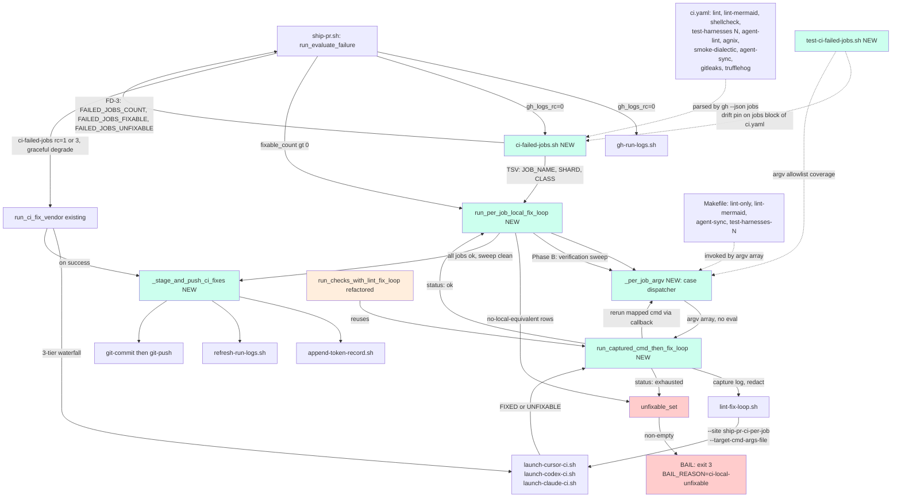

## Goal
Add per-job local CI re-run loop in ship-pr.sh to fix each failed CI job locally before pushing, using a new ci-failed-jobs.sh helper and lint-fix-loop.sh dispatch.

## Implementation Plan
## Plan

# Implementation Plan — Issue #2757: ship-pr iteratively run + fix CI steps locally before re-pushing

## Approach

Today's `run_evaluate_failure` in `scripts/ship-pr.sh` fetches the failed CI run log via `scripts/gh-run-logs.sh`, dispatches a 3-tier launcher waterfall (`launch-{cursor,codex,claude}-ci.sh --role fix --failure-log`) once per attempt, then runs `scripts/relevant-checks.sh` (pre-commit + agent-lint) as the push gate. Remote CI runs ~10 jobs in parallel (`lint`, `lint-mermaid`, `shellcheck`, `test-harnesses`, `agent-lint`, `agnix`, `smoke-dialectic`, `agent-sync`, `gitleaks`, `trufflehog`); the local gate covers only the first two, so the fix-then-push cycle can re-fail remotely on any of the other eight.

This plan adds a **per-job local re-run loop** between `gh-run-logs.sh` and the existing post-vendor checks loop:

1. A new helper `scripts/ci-failed-jobs.sh` parses `gh run view <RUN_ID> --json jobs` and emits, via `emit_kv` on FD-3 (`lib-quiet.sh` contract), a `FAILED_JOBS_FIXABLE` and `FAILED_JOBS_UNFIXABLE` machine-readable summary plus a structured TSV `JOB_NAME\tSHARD\tCLASS` (NO `LOCAL_CMD` strings — see "Security" below). Exit codes mirror `gh-run-logs.sh` (rc 3 in-progress, rc 1 hard failure, rc 0 with `FAILED_JOBS_COUNT=0` when zero failed). The in-progress detection re-uses gh-run-logs's substring `"is still in progress; logs will be available"` (the wrapper script `ci-failed-jobs.sh` greps the captured stderr for that same marker — `gh-run-logs.sh` does not source `lib-net.sh`, so transient-net classification stays a caller-side responsibility per the lib-net contract).
2. A new `--site ship-pr-ci-per-job` value in `scripts/lint-fix-loop.sh` re-shapes the fix prompt body to "make `<mapped local command>` pass" instead of "make `relevant-checks.sh` pass" (per **DECISION_1**, the per-job loop dispatches via `lint-fix-loop.sh`, NOT through `run_ci_fix_vendor`). The mapped command is passed via a new `--target-cmd-args-file <path>` argument that names a file containing one argv token per line — NOT a shell string. lint-fix-loop.sh reads the file and substitutes the joined argv into the prompt body (display-only).
3. A new private helper `run_captured_cmd_then_fix_loop` in `scripts/ship-pr.sh` (per **DECISION_2**) encapsulates the invariant "capture log → redact → dispatch fixer → re-run → count, cap 3" mechanic; both the new per-job loop AND the existing `run_checks_with_lint_fix_loop` invocation site share the primitive. Specialized side-effects (vendor_dirty_paths_file capture, `LAST_LINT_FIX_DELTA_PATHS_FILE`/`ALL_LINT_FIX_DELTA_PATHS_FILE` staging, `record_failure` category coupling, downstream `git add` logic) stay at the call site — the helper exposes status outputs and the call site owns staging.
4. A new orchestration function `run_per_job_local_fix_loop` in `scripts/ship-pr.sh` iterates the fixable jobs from the helper in step 1. For each fixable row, it resolves the argv-array via a **fixed case-statement dispatcher** in ship-pr.sh (NOT via `eval`, NOT via storing executable strings in the TSV) keyed on `(JOB_NAME, SHARD)`. After every fixable job's per-job loop returns `ok`, run a **final verification sweep**: re-run every formerly-failed mapped command once more in a clean pass to catch late regressions (e.g., a `test-harnesses` fix that breaks `lint`). Only when the verification sweep is clean do we push. Jobs that fail the verification sweep are re-entered into the per-job loop subject to the remaining outer `_max_fix=3` budget; if any verification job still fails after the budget is exhausted, it joins the unfixable set.
5. Unfixable set assembly: `CLASS=no-local-equivalent` rows + per-job-cap-exhausted jobs + verification-sweep-cap-exhausted jobs. When the unfixable set is non-empty after processing, `state_set_many BAIL_REASON "ci-local-unfixable:<comma-list>" BAIL_FAILURE_DETAIL_LOG <path>` and `exit 3` so the main agent picks them up. The job-name list written into `BAIL_REASON` is sanitized via `tr -cd '[:alnum:]_-,'` to strip newlines, control bytes, and quote characters before composition (OOS_3 → tracked as `[OOS]` follow-up issue, but the sanitization itself lands inline in this plan since it is part of the BAIL_REASON safety contract).
6. Wiring: `run_evaluate_failure` calls `ci-failed-jobs.sh` immediately after `gh-run-logs.sh` **only when `gh_logs_rc -eq 0`** (skip on rc=3 in-progress, rc=1 hard failure). When the failed-jobs result is non-empty, `run_per_job_local_fix_loop` runs **before** the existing `run_ci_fix_vendor` call. If the per-job loop succeeds AND the verification sweep is clean, the new shared push helper `_stage_and_push_ci_fixes` (factored from the existing `run_ci_fix_vendor` tail per FINDING_15/27/47/55) handles `append-token-record.sh` / `refresh-run-logs.sh` / staging / `git-push.sh` so the per-job-only path preserves token-ledger and run-log continuity. If the per-job loop produces an unfixable set, ship-pr exits 3. The outer `_max_fix=3` cap is unchanged. `ci-failed-jobs.sh` failures (rc 1 / rc 3) record_failure with category `Warnings` and fall through to the existing `run_ci_fix_vendor` path (graceful degrade).

The push gate (Decision Q1c-2) is: every formerly-failed remote job *with a local equivalent* passes locally **AND** survives the final verification sweep. Jobs with no local equivalent route through the unfixable bail (Q1d-1), so they are never silently treated as "pass".

### Security posture (consolidates FINDING_10/18/22/30/40/45/52/58/62/70/71/72/77)

The new code does **not** `eval` any string derived from `gh run view` JSON output. The threat model: a malicious or anomalous CI job name could contain `;`, `|`, `$(...)`, backticks, or shell control characters. Mitigations:

- The helper TSV stores only `JOB_NAME\tSHARD\tCLASS` (job name from `gh`, shard digits, classification token). It does **not** store `LOCAL_CMD` strings.
- The shard column is validated against `^[0-9]+$` before any composition; non-digit shards collapse to the unsharded `LOCAL_CMD`.
- The job-name column is validated against `^[A-Za-z][A-Za-z0-9_-]*$` (matches GitHub Actions job-id grammar); names failing this regex route to `no-local-equivalent` with `Why: malformed job name (gh API integrity check)`.
- `run_per_job_local_fix_loop` consults a **fixed case statement** in `ship-pr.sh` keyed on the validated `JOB_NAME`. Each case branch builds a Bash array of argv tokens directly (no string interpolation) and invokes `"${argv[@]}"`. Example:
  ```
  case "$JOB_NAME" in
    lint)      argv=(env SKIP=agnix,lint-mermaid-fences,shellcheck make lint-only) ;;
    test-harnesses) argv=(make "test-harnesses-${SHARD}") ;;
    ...
  esac
  "${argv[@]}" > "$log" 2>&1
  ```
- The job names echoed into `BAIL_REASON` and `BAIL_FAILURE_DETAIL_LOG` are sanitized via `tr -cd '[:alnum:]_-,'` so any GitHub-API-side anomaly cannot inject newlines or control bytes into downstream bail prose.

## Files to modify/create

### NEW: `scripts/ci-failed-jobs.sh`

`set -euo pipefail`. Args: `--run-id <id>`, `--repo <owner/repo>`, optional `--output-tsv <path>` (default stdout via FD-3 emit). Sources `scripts/lib-quiet.sh` (and initializes via `larch_quiet_init` early — per FINDING_64/67/68 the quiet-active FD-3 routing must be set up before any `emit_kv`).

Behavior:
- Runs `gh run view "$RUN_ID" --repo "$REPO" --json jobs --jq '.jobs[] | select(.conclusion=="failure") | .name'` to enumerate failed job names. Exit codes: rc 0 on success (even when zero failed jobs); rc 3 when stderr contains the same `is still in progress; logs will be available` substring `gh-run-logs.sh` greps for; rc 1 on other `gh` failures. The wrapper does not source `lib-net.sh`; transient-net classification (`with_transient_retry`) stays with the caller (FINDING_50/57).
- For each failed job name, validates against `^[A-Za-z][A-Za-z0-9_-]*$` (FINDING_71). Names failing this regex are tagged `no-local-equivalent` with `Why: malformed job name`. Then normalizes the matrix-shard suffix `(N)` (the only matrix job in `.github/workflows/ci.yaml` is `test-harnesses`): `test-harnesses (7)` → base name `test-harnesses`, shard index `7` (validated `^[0-9]+$` — FINDING_22/70).
- Looks up the base name in a Bash 3.2-compatible mapping (case statement, **not** associative array per `BASH_AUTHORING.md §3`). The case statement here is documentation-only — it emits a `CLASS` token (`fixable` / `no-local-equivalent`) and the actual argv dispatch lives in `ship-pr.sh`. Coverage (FINDING_2/12/19/24/36/42 for `lint`; FINDING_20/33 for `lint-mermaid`; FINDING_9/28/34/60 for `agent-sync`):
  - `lint` → `CLASS=fixable` (argv `env SKIP=agnix,lint-mermaid-fences,shellcheck make lint-only` lives in ship-pr.sh case dispatcher; document this contract in `ci-failed-jobs.md`).
  - `lint-mermaid` → `CLASS=fixable` (argv chain in ship-pr.sh: `npm ci` if `node_modules` missing, then `scripts/lint-mermaid-fences.sh --changed-only`, then `bash scripts/test-pipe-sigpipe-safety.sh` — composed as 3 successive argv invocations within the case branch).
  - `shellcheck` → `CLASS=fixable` (argv `make shellcheck`).
  - `test-harnesses` (sharded) → `CLASS=fixable` (argv `make "test-harnesses-${SHARD}"` when shard regex passes; without shard → `make test-harnesses`).
  - `agent-lint` → `CLASS=fixable` (argv `make agent-lint`).
  - `agnix` → `CLASS=fixable` (argv `make agnix`).
  - `smoke-dialectic` → `CLASS=fixable` (argv `make smoke-dialectic`).
  - `agent-sync` → `CLASS=fixable` (argv chain: `bash scripts/check-generators.sh`, `python3 scripts/check-topology-rule-paths.py`, plus the inline focus-area-enum bash from ci.yaml steps 319+ — composed as 3 successive argv invocations). A new `Makefile` target `agent-sync` is added to consolidate these (see Makefile section below).
  - `gitleaks` → `CLASS=no-local-equivalent` (`Why: history scan`).
  - `trufflehog` → `CLASS=no-local-equivalent` (`Why: history scan`).
  - Unknown job names → `CLASS=no-local-equivalent` with `Why: unknown job name (mapping table drift?)`.
- Emits machine-readable output via `emit_kv` on FD-3:
  - `FAILED_JOBS_COUNT=<N>`
  - `FAILED_JOBS_FIXABLE=<comma-list of <job-name>[:<shard>] tokens, sanitized via tr -cd '[:alnum:]_-,:'>`
  - `FAILED_JOBS_UNFIXABLE=<comma-list of <job-name>[:<shard>]=<reason-token> tuples, sanitized>`
- When `--output-tsv <path>` is set, also writes the TSV `JOB_NAME\tSHARD\tCLASS` (NO `LOCAL_CMD` column — security, FINDING_10/22/45/62/77).
- Honors `LARCH_QUIET_DISABLE=1` per the `lib-quiet.sh` contract.

### NEW: `scripts/ci-failed-jobs.md`

Sibling contract doc per `.claude/rules/script-md-siblings.md`. Documents: usage, FD-3 KV contract (with explicit note that `larch_quiet_init` runs before `emit_kv` — FINDING_64/67/68), exit-code semantics (mirroring `gh-run-logs.md`, with the explicit note that `gh-run-logs.sh` does not source `lib-net.sh` — FINDING_50/57), the documentation-only mapping (with a forward-reference to the `ship-pr.sh` case dispatcher that owns the actual argv arrays for security reasons), matrix-shard normalization rule with shard regex, callers (`scripts/ship-pr.sh:run_per_job_local_fix_loop`), regression harness pointer (`scripts/test-ci-failed-jobs.sh`), and the verify-external-tool-invocations contract for `gh run view --json jobs` (confirmed `jobs` is a valid `--json` field for `gh run view`; `gh run view --help` includes `jobs` in the field list).

### NEW: `scripts/test-ci-failed-jobs.sh` (and sibling `scripts/test-ci-failed-jobs.md`)

Offline harness covering:
- Mock `gh` returning a synthetic `--json jobs` payload with mixed `success`/`failure` conclusions; assert the parser emits only the failed-job names.
- Mapping lookups for each of the 10 CI jobs in `.github/workflows/ci.yaml`; assert each maps to the documented `CLASS` token. Pin: `agent-sync` MUST be `fixable` (FINDING_9/28/34/60).
- Matrix shard normalization: `test-harnesses (7)` → base `test-harnesses`, shard `7`. Shard regex pin: `test-harnesses (abc)` (synthetic malformed shard) → unsharded `make test-harnesses` (shard validation falls back). FINDING_70.
- Job-name regex pin: `test-harnesses (7); echo pwn` (injection attempt) → `no-local-equivalent` with `Why: malformed job name` (FINDING_71/72).
- Exit-code semantics: `gh` returning the "is still in progress" marker → rc 3; `gh` failure → rc 1; success-with-zero-failed-jobs → rc 0 with `FAILED_JOBS_COUNT=0` (FINDING_17/29/50/57).
- FD-3 routing pin: invoke the helper with `larch_quiet_init` active and assert `emit_kv` lines appear on FD-3 (NOT stdout) — and with `LARCH_QUIET_DISABLE=1` assert they appear on stdout (FINDING_64/67/68).
- **Drift pin** (per **Resolved-2** + FINDING_3/14/26/35/46/54): scope the ci.yaml grep to the `jobs:` block ONLY. Use `awk` to extract lines after the `^jobs:$` anchor and before the next top-level YAML key (next `^[a-z]` at column 0). Within that block, grep for `^  [a-z][a-z0-9_-]+:$` job-name lines. Assert every name is either in the fixable mapping or in the `no-local-equivalent` tag set. Fails the test on drift.

Wire `test-ci-failed-jobs` into `Makefile`'s `test-harnesses-12` shard's dependency list (FINDING_11/44/61 — that shard already lists design-related tests like `test-check-plan-size`, `test-emit-plan`, `test-render-final-summary`, so `test-ci-failed-jobs` fits naturally there).

### UPDATED: `scripts/lint-fix-loop.sh`

Extend `--site` enum (case statement at line 195-202) to accept `ship-pr-ci-per-job` with label `"ship-pr CI per-job"`. Add new argv parsing for `--target-cmd-args-file <path>` (non-shell, one argv token per line). When `--site ship-pr-ci-per-job` is set, `--target-cmd-args-file` MUST be non-empty and the file MUST exist; the 5 existing sites MUST NOT pass `--target-cmd-args-file` (mutual exclusion; usage error → exit 2).

Extend `compose_prompt` (function at line 40-76) to branch on the site label:
- For the 5 existing sites: emit today's prompt body that tells the LLM to "fix the repository so `scripts/relevant-checks.sh` passes for $site_label".
- For the new `ship-pr-ci-per-job` site: read `--target-cmd-args-file` (lines stripped of leading/trailing whitespace; control characters rejected with exit 2) and join its lines with single-space separators as a display-only string. Emit a CI-job-shaped prompt body that says "fix the repository so the local command `<joined argv>` passes". The display string in the prompt is purely informational; the actual command is executed by ship-pr.sh's case dispatcher, NOT by lint-fix-loop.sh. The `FIXED:` / `UNFIXABLE:` final-line contract is unchanged.

Update offline fixtures (FINDING_31/53/59): `scripts/test-lint-fix-loop.sh` adds cases for `--site ship-pr-ci-per-job` with a sample argv file; assert the prompt body contains the joined argv display string and that the dispatch path still produces the `FIXED:` / `UNFIXABLE:` contract.

### UPDATED: `scripts/lint-fix-loop.md`

Document the new `ship-pr-ci-per-job` site and the `--target-cmd-args-file` argument (with the file-format spec: one argv token per line, no shell metacharacters interpolated, control chars rejected). Update the "callers" section to add `scripts/ship-pr.sh:run_per_job_local_fix_loop`. Preserve the existing site enum prose verbatim — only append.

### UPDATED: `scripts/ship-pr.sh`

Six surgical changes:

1. **New helper `run_captured_cmd_then_fix_loop`** (near line ~85, alongside `run_lint_fix_loop_capture`). Args via global-bound parameters (Bash 3.2 — no nameref): `_RCC_RERUN_FN` (callback function name), `_RCC_SITE`, `_RCC_TARGET_CMD_ARGS_FILE` (empty for non-per-job sites), `_RCC_MAX_ITER` (default 3). Body: loop up to `_RCC_MAX_ITER`: (a) call `_RCC_RERUN_FN` to run the captured command, (b) on success break with status `ok`, (c) on `no-changes-after-fail` from lint-fix-loop (FINDING_1/13/21/25/32/38/43/74), do NOT treat as ok — re-run the captured command; if still failing without log output for two consecutive iterations, set `_RCC_STATUS=exhausted`, (d) on failure with log output, redact via `redact-secrets.sh`, dispatch `lint-fix-loop.sh` with the captured site and (for per-job sites) `--target-cmd-args-file`. The helper exposes status as `_RCC_STATUS ∈ {ok, exhausted, dispatch-failed, head-changed}` plus `_RCC_LAST_LOG_PATH`, `_RCC_DELTA_PATHS_FILE`. The `head-changed` status maps to lint-fix-loop's `LINT_FIX_STATUS=failed` + `FAILURE_REASON=head-changed-after-dispatch` (FINDING_41/49/56). The helper does NOT call `record_failure`, does NOT touch `LAST_LINT_FIX_DELTA_PATHS_FILE`, does NOT stage files — those side-effects stay at the call site.

2. **Refactor `run_checks_with_lint_fix_loop`** (currently at line ~795-871) to use the new helper. The current body: capture vendor-dirty-paths baseline → loop: run-relevant-checks-captured.sh + lint-fix-loop.sh (cap 3). After the refactor: capture vendor-dirty-paths baseline → set `_RCC_RERUN_FN=run_relevant_checks_capture` → call `run_captured_cmd_then_fix_loop` → on status `ok` perform the delta-path merge + `LAST_LINT_FIX_DELTA_PATHS_FILE` set; on `exhausted` record_failure + return; on `dispatch-failed`/`head-changed` propagate the existing exit_stall semantics. **Behavior must be byte-identical** for the existing `ship-pr-ci-initial`/`ship-pr-ci-merge` sites — verified by `scripts/test-ship-pr.sh` and `scripts/test-ship-pr-fix-loop-2632.inc.sh` continuing to pass without modification beyond the assertion additions in change 6 below.

3. **New case dispatcher `_per_job_argv`** (near line ~1490, scoped to `run_per_job_local_fix_loop`). Given `JOB_NAME` and `SHARD` (both pre-validated), emits a Bash array of argv tokens via stdout or via a global `_PJA_ARGV[]` array (Bash 3.2 compatible). The full case statement covers all 10 CI jobs with the correct CI-equivalent commands (per FINDING_2/12/19/24/36/42 for lint, FINDING_20/33 for lint-mermaid, FINDING_9/28/34/60 for agent-sync). The agent-sync branch chains 3 successive argv invocations via a small inner loop in `run_per_job_local_fix_loop` (NOT via `&&`-in-string).

4. **New function `run_per_job_local_fix_loop`** (near line ~1500, between `run_ci_fix_vendor` and `run_evaluate_failure`). Args: `phase`, `failed_jobs_tsv` (path written by `ci-failed-jobs.sh --output-tsv`). Body:
   - Phase A — first pass: parse the TSV; for each `CLASS=fixable` row, resolve `argv` via `_per_job_argv "$JOB_NAME" "$SHARD"`, set `_RCC_SITE=ship-pr-ci-per-job`, write `_RCC_TARGET_CMD_ARGS_FILE` (one argv token per line — NEVER a shell string), set `_RCC_RERUN_FN` to a wrapper that runs `"${_PJA_ARGV[@]}" > <log> 2>&1` (lib-quiet's `emit_breadcrumb` for liveness), call `run_captured_cmd_then_fix_loop`. On status `ok` for that job, continue to the next fixable job. On `exhausted`/`dispatch-failed`, accumulate the job into `unfixable_set`.
   - Phase B — final verification sweep (FINDING_23): after Phase A completes for all fixable jobs, re-run each formerly-failed mapped command once more (using `_per_job_argv` again) in a clean iteration. Any verification failure goes back into the per-job loop subject to the remaining `_max_fix=3` outer budget; if exhausted, the job joins `unfixable_set`.
   - Tail: also add all `CLASS=no-local-equivalent` rows from the TSV to `unfixable_set`. If `unfixable_set` is non-empty: sanitize each entry via `tr -cd '[:alnum:]_-,'`, write the set to `$IMPLEMENT_TMPDIR/ci-local-unfixable-<phase>.txt`, `state_set_many BAIL_REASON "ci-local-unfixable:<sanitized-comma-list>" BAIL_FAILURE_DETAIL_LOG "$IMPLEMENT_TMPDIR/ci-local-unfixable-<phase>.txt"`, and `exit 3`. Otherwise return 0 (the caller then runs the new shared push helper).

5. **Wire into `run_evaluate_failure`** (line ~1493-1556). After `gh-run-logs.sh` returns rc=0 (and ONLY rc=0 — FINDING_48), insert the `ci-failed-jobs.sh` call to a disjoint sink (`$IMPLEMENT_TMPDIR/ci-failed-jobs-<phase>.out`, separate from `gh_logs_capture` — FINDING_63/65) and parse the FD-3 `FAILED_JOBS_COUNT`. When count > 0, call `run_per_job_local_fix_loop "$phase" "$IMPLEMENT_TMPDIR/ci-failed-jobs-<phase>.tsv"`. If `run_per_job_local_fix_loop` returns 0, skip the existing `run_ci_fix_vendor` call and proceed directly to the new shared push helper. If `ci-failed-jobs.sh` returns rc 1 (gh failure) or rc 3 (in-progress), record_failure with category `Warnings` and fall through to the existing `run_ci_fix_vendor` path (graceful degrade). If `run_per_job_local_fix_loop` exits 3 with the unfixable bail, control flow does not reach the next ship-pr step.

6. **New shared push helper `_stage_and_push_ci_fixes`** (factored from the existing `run_ci_fix_vendor` tail at lines 1437-1490 — FINDING_15/27/37/47/55). Args: `phase`. Body: capture post-fix dirty paths, call `append-token-record.sh --input "${ci_fix_out_base}.${winning_tier}.token-record" --tmpdir "$IMPLEMENT_TMPDIR"` (no-op via best-effort path-existence check on the per-job-only flow where there is no `winning_tier` — pass `--input ""` and let the script's existing empty-input branch run; document the no-op semantics in `append-token-record.md`), call `refresh-run-logs.sh` (Trigger B refresh), stage dirty paths, `git-commit.sh "Fix CI failure"`, `git-push.sh`. The function is called by BOTH the per-job-only path AND the existing vendor-then-checks path (run_ci_fix_vendor calls it at the end instead of inline-staging). On any failure inside the helper, the existing `record_failure` / `exit_stall` semantics from the original tail are preserved verbatim.

### UPDATED: `scripts/ship-pr.md`

Document the new CI-failure recovery contract: (1) `run_evaluate_failure` first attempts per-job local re-runs via `ci-failed-jobs.sh` + `run_per_job_local_fix_loop` when `gh_logs_rc=0`; (2) the `lint-fix-loop.sh --site ship-pr-ci-per-job --target-cmd-args-file <PATH>` dispatch path (no `eval`, fixed case-statement argv in ship-pr.sh); (3) the final verification sweep (Phase B) requirement; (4) the `BAIL_REASON=ci-local-unfixable:<sanitized-comma-list>` bail path; (5) the unchanged outer `_max_fix=3` cap; (6) the new shared `_stage_and_push_ci_fixes` helper as the single source of `append-token-record.sh` + `refresh-run-logs.sh` + push for both CI-recovery paths; (7) the relationship to the existing `run_ci_fix_vendor` 3-tier waterfall (per-job runs first; the broader recovery only runs when the per-job path is unavailable or fails); (8) the new security posture (job-name regex, shard regex, `tr -cd` sanitization).

### UPDATED: `scripts/append-token-record.md`

Document the no-op semantics when `--input ""` (empty input path) is passed — required because the new per-job-only path has no `winning_tier` to source token records from. The script's existing empty-input branch is preserved; this doc update just clarifies the contract for the new caller (FINDING_15/16/27/47/55).

### UPDATED: `scripts/test-ship-pr.sh` (and `scripts/test-ship-pr-fix-loop-2632.inc.sh`)

New test cases:
- T-per-job-happy: mock `gh run view --json jobs` returning `[{"name":"lint","conclusion":"failure"},{"name":"test-harnesses (3)","conclusion":"failure"}]`; assert `ci-failed-jobs.sh` produces the right TSV; assert `run_per_job_local_fix_loop` invokes `env SKIP=… make lint-only` (FINDING_2/12/19/24/36/42) and `make test-harnesses-3`; assert the final verification sweep passes; assert push fires via `_stage_and_push_ci_fixes`.
- T-per-job-unfixable: mock `gh run view --json jobs` returning `[{"name":"gitleaks","conclusion":"failure"},{"name":"lint","conclusion":"failure"}]`; assert lint is fixed and verified; assert ship-pr exits 3 with `BAIL_REASON=ci-local-unfixable:gitleaks` (sanitized).
- T-per-job-cap-exhausted: mock the per-job command to always fail; assert that job ends up in the unfixable set and ship-pr exits 3.
- T-per-job-verification-regression: mock the per-job loop to fix `lint` and `test-harnesses-3`; mock the verification sweep so `lint` now fails again; assert the loop re-enters lint per-job loop subject to remaining outer cap; if outer cap is exhausted, `lint` ends up in unfixable (FINDING_23).
- T-per-job-gh-failure: mock `ci-failed-jobs.sh` returning rc 1; assert graceful degrade to the existing `run_ci_fix_vendor` path with a `Warnings` category entry (FINDING_48).
- T-per-job-eval-not-used: introduce a synthetic ci.yaml job named `lint; echo pwn` (malformed regex) into the mock `gh` response; assert it is routed to `no-local-equivalent`, NOT executed (FINDING_71/72).
- T-per-job-shard-validation: synthetic `test-harnesses (abc)` (non-digit shard); assert fall-back to unsharded `make test-harnesses` (FINDING_70).
- T-refactored-checks-loop-byte-identical: assert that the post-refactor `run_checks_with_lint_fix_loop` produces the same observable behavior on the existing `ship-pr-ci-initial` and `ship-pr-ci-merge` sites — the existing `test-ship-pr-fix-loop-2632.inc.sh` cases should still pass without modification.
- T-per-job-no-changes-after-fail: mock the mapped command to fail with empty output (after redaction); assert lint-fix-loop returns `LINT_FIX_STATUS=no-changes`; assert `run_captured_cmd_then_fix_loop` re-runs the command and on second consecutive empty-output failure sets `_RCC_STATUS=exhausted` (FINDING_1/13/21/25/32/38/43/74).

### UPDATED: `Makefile`

Add new targets where they do not exist (consolidating the multi-step CI jobs into single Make targets so the local-equivalent argv is a clean `make <target>` invocation):

- `lint-mermaid`: depends on a guard that runs `npm ci` if `node_modules/.package-lock.json` is missing, then runs `scripts/lint-mermaid-fences.sh --changed-only` and `bash scripts/test-pipe-sigpipe-safety.sh` (FINDING_8/20/33).
- `agent-sync`: chains `bash scripts/check-generators.sh`, `python3 scripts/check-topology-rule-paths.py`, and the inline focus-area-enum bash from ci.yaml (or factor that into a sibling script `scripts/check-focus-area-enum.sh` for cleanliness — FINDING_9/28/34/60).
- Add `test-ci-failed-jobs` to the `test-harnesses-12` shard dependency line (FINDING_11/44/61).
- Add a `.PHONY` declaration for the new targets.

## Edge cases

- **`gh run view --json jobs` returns empty array**: rc 0, `FAILED_JOBS_COUNT=0`. `run_evaluate_failure` proceeds to the existing `run_ci_fix_vendor` path.
- **Matrix shard target missing**: the case dispatcher's `test-harnesses` branch defaults to `make "test-harnesses-${SHARD}"` when shard is digits; if the target does not exist, `make` exits with `No rule to make target` — captured as a per-job-loop failure and dispatched to the LLM fixer with the captured stderr. This is acceptable because the failure surface is the same as any other ill-mapped target; the fixer sees a clear "no rule" error and surfaces it.
- **HEAD changes between mapped-command runs**: existing `run_evaluate_failure` detached-HEAD guard (line 1523-1528) fires first. `run_captured_cmd_then_fix_loop` re-checks HEAD between iterations; `_RCC_STATUS=head-changed` aborts the per-job loop and surfaces via the same exit_stall path that `lint-fix-loop.sh:head-changed-after-dispatch` produces today (FINDING_41/49/56).
- **Per-job command produces no log output AFTER non-zero exit** (FINDING_1/13/21/25/32/38/43/74): `lint-fix-loop.sh:209-213` returns `LINT_FIX_STATUS=no-changes`; the new helper does NOT treat this as `ok`. Instead, it re-runs the mapped command; if it still fails with empty output, two consecutive empty-output failures escalate to `_RCC_STATUS=exhausted` (matching the existing `run_checks_with_lint_fix_loop` semantics where no-changes + still-failing rerun is treated as exhaustion).
- **Mapping table drift** (ci.yaml renames a job): `ci-failed-jobs.sh` tags the unknown job as `no-local-equivalent` with `Why: unknown job name`, routing to the unfixable bail. The `test-ci-failed-jobs.sh` drift pin (FINDING_3/14/26/35/46/54) catches the rename in CI BEFORE it ships, scoped to the `jobs:` block of ci.yaml via `awk` between `^jobs:$` and the next top-level YAML key.
- **`redact-secrets.sh` failure on a per-job log**: lint-fix-loop.sh `--checks-log` already requires the redaction step; preserve that contract — `run_captured_cmd_then_fix_loop` skips the dispatch (status `dispatch-failed`) when redaction returns rc != 0.
- **Outer `_max_fix=3` interaction**: the per-job loop runs once per outer attempt. If the per-job loop succeeds on the first outer attempt and the push still fails remotely, the second outer attempt fetches the new failed run, identifies the new failed jobs, and re-runs the per-job loop. The final verification sweep (Phase B) within a single outer attempt counts against the `_max_fix=3` budget.
- **Submodule edits via lint-fix-loop**: `lint-fix-loop.sh` already enforces the submodule-prohibition guard; the new `ship-pr-ci-per-job` site inherits this guard unchanged.
- **`make -n` probe contamination** (FINDING_73/76): the case-dispatcher approach replaces the `make -n` probe entirely with a fixed allowlist, so there is no `make -n` invocation in the hot path. If a defensive existence check is ever needed, redirect both streams: `make -n "$target" >/dev/null 2>&1`.

## Failure modes

1. **Mapping-table drift between `ci-failed-jobs.sh` (and ship-pr.sh's case dispatcher) and `.github/workflows/ci.yaml`.** Earliest signal: `test-ci-failed-jobs.sh` drift pin fails in CI on the PR that renames the ci.yaml job. Mitigation: the drift pin is scoped to the `jobs:` block of ci.yaml (FINDING_3/14/26/35/46/54) and is mandatory; failing it fails the `test-harnesses-12` shard. Both `ci-failed-jobs.sh` (the CLASS lookup) and `ship-pr.sh:_per_job_argv` (the argv dispatcher) must stay in sync — the drift pin asserts coverage from both surfaces.

2. **Refactor regression in `run_checks_with_lint_fix_loop`.** Earliest signal: `scripts/test-ship-pr-fix-loop-2632.inc.sh` existing cases T1-T9 fail. Mitigation: refactor preserves staging side-effects at the call site (per DECISION_2); the helper is a pure mechanic. The test suite is the regression net; the refactor is a single PR with a "byte-identical observable behavior" requirement (T-refactored-checks-loop-byte-identical pin).

3. **`run_per_job_local_fix_loop` over-bails on transient gh failures or anomalous job names.** Earliest signal: a PR's ship-pr exits 3 with `ci-local-unfixable:…` when remote CI would have passed on retry. Mitigation: `ci-failed-jobs.sh` rc 1 (gh failure) and rc 3 (in-progress) both fall through to the existing `run_ci_fix_vendor` path with a `Warnings` entry, not the unfixable bail (FINDING_48). Job-name regex routes anomalous names to `no-local-equivalent` instead of executing them (FINDING_71/72). Shard regex prevents injection through matrix suffixes (FINDING_70).

## Testing strategy

- New offline harness `scripts/test-ci-failed-jobs.sh` (described above) covers the parser, mapping, matrix-shard normalization, exit-code semantics, FD-3 routing pin, and drift pin scoped to `jobs:` block.
- New cases in `scripts/test-ship-pr.sh` (and `scripts/test-ship-pr-fix-loop-2632.inc.sh`) cover the per-job happy path, unfixable bail, cap exhaustion, verification-sweep regression, gh failure graceful degrade, eval-not-used pin, shard validation, refactored-checks-loop byte-identical behavior, and no-changes-after-fail semantics.
- Integration coverage via the existing test harnesses for `lint-fix-loop.sh` (`scripts/test-lint-fix-loop.sh`, FINDING_31/53/59) — assert the new `--site ship-pr-ci-per-job` value with `--target-cmd-args-file` produces a valid prompt and dispatches correctly. Also assert the new argv file is rejected with control characters present.
- Manual smoke: stage a synthetic CI failure on a feature branch (e.g., introduce a deliberate lint error in a `.sh` file), let CI fail, then run ship-pr; verify the per-job loop runs `env SKIP=… make lint-only` locally, the LLM fixes the lint, the final verification sweep passes, the push succeeds via `_stage_and_push_ci_fixes`, and CI passes.
- The new `Makefile` targets `lint-mermaid` and `agent-sync` (and any factored `scripts/check-focus-area-enum.sh`) get their own coverage via the existing pre-commit + agent-lint discovery; no separate test target needed beyond `test-ci-failed-jobs.sh` exercising the mapping.

## Diff size estimate

Best-effort estimate based on per-file analysis (refactor moves count as both delete + add; estimates are net new + churn):

- `scripts/ci-failed-jobs.sh` (new): ~200 lines (parser, mapping case, FD-3 emit, exit codes, TSV writer)
- `scripts/ci-failed-jobs.md` (new): ~80 lines
- `scripts/test-ci-failed-jobs.sh` (new): ~190 lines (parser cases, mapping cases, shard cases, drift pin, FD-3 routing pin)
- `scripts/lint-fix-loop.sh` (extension): ~45 lines (argv parsing, file validation, compose_prompt branch)
- `scripts/lint-fix-loop.md` (extension): ~25 lines
- `scripts/ship-pr.sh`: ~180 lines (new helper ~60, new function ~90, case dispatcher ~50, wiring ~15, factored push ~0 net but ~30 churn) — total ~245 churn lines
- `scripts/ship-pr.md` (extension): ~40 lines
- `scripts/append-token-record.md` (extension): ~10 lines
- `Makefile` additions: ~20 lines (lint-mermaid + agent-sync targets, test-harnesses-12 dep)
- `scripts/test-ship-pr.sh` + `scripts/test-ship-pr-fix-loop-2632.inc.sh`: ~180 lines (8 new T-* cases per the testing strategy)
- `scripts/test-lint-fix-loop.sh`: ~35 lines (new --target-cmd-args-file fixtures)

Total: ~1070 lines. Above the 600-line soft threshold (operator already chose to continue at Step 2b.5); well under the 1500-line hard threshold so the hard re-prompt should not fire on the Gate B re-emit. If the actual implementation grows beyond the estimate, the Step 2b.5 re-emit will surface the hard threshold and the operator can choose Split or Cancel at that point.

diff_lines: 1070


## Architecture Diagram



**Legend**: green = new components introduced by this plan; pink = bail / unfixable-set sink; orange = refactored existing component; solid arrows = control flow; dashed arrows = data references / drift pins / config inputs.


## Acceptance

The implementation is complete when:

- `scripts/ci-failed-jobs.sh` (and sibling `.md` + `scripts/test-ci-failed-jobs.sh` + `.md`) exist with the contracts in the Plan and pass `make test-ci-failed-jobs` including the drift pin scoped to the ci.yaml `jobs:` block.
- `scripts/lint-fix-loop.sh` accepts `--site ship-pr-ci-per-job` with `--target-cmd-args-file <path>` (one argv token per line; control-char rejection) and the existing 5 sites continue to work unchanged. `scripts/test-lint-fix-loop.sh` adds coverage for the new site.
- `scripts/ship-pr.sh` exposes `run_per_job_local_fix_loop`, `run_captured_cmd_then_fix_loop`, `_per_job_argv`, `_stage_and_push_ci_fixes`. `run_checks_with_lint_fix_loop` is refactored to use the shared helper with byte-identical observable behavior on `ship-pr-ci-initial` / `ship-pr-ci-merge` sites.
- The per-job loop never invokes `eval` on `gh`-derived strings; the case dispatcher uses argv arrays validated against the job-name and shard regexes (`^[A-Za-z][A-Za-z0-9_-]*$` and `^[0-9]+$`).
- `Makefile` gains `lint-mermaid` and `agent-sync` targets matching the CI step bodies, plus `test-ci-failed-jobs` wired into `test-harnesses-12`.
- `scripts/test-ship-pr.sh` and `scripts/test-ship-pr-fix-loop-2632.inc.sh` add the per-job happy/unfixable/cap-exhausted/verification-regression/gh-failure/eval-not-used/shard-validation/refactored-checks-loop-byte-identical/no-changes-after-fail test cases. Existing T1-T9 still pass without modification.
- When CI fails and at least one failed job has a local equivalent, ship-pr runs the mapped commands locally, dispatches `lint-fix-loop.sh --site ship-pr-ci-per-job` on failures, iterates per-job up to cap 3, runs a final verification sweep, and only re-pushes when every fixable job passes locally. Jobs without a local equivalent or with cap-exhausted failures collect into the unfixable set and ship-pr `exit 3` with `BAIL_REASON=ci-local-unfixable:<sanitized-comma-list>` and `BAIL_FAILURE_DETAIL_LOG` set.
- The new shared push helper `_stage_and_push_ci_fixes` is the single source of `append-token-record.sh` + `refresh-run-logs.sh` + staging + `git-push.sh` for both CI-recovery paths (per-job-only and run_ci_fix_vendor-then-checks).
- All new `.sh` files have sibling `.md` per `.claude/rules/script-md-siblings.md`. All shell scripts honor Bash 3.2 portability (`BASH_AUTHORING.md §3`) and shell strict mode (`.claude/rules/shell-strict-mode.md`).
- `gh run view --json jobs` invocation is validated against `gh run view --help` (the `jobs` field is documented as a valid `--json` field).
- The accepted OOS item #2798 is referenced (and remains open as a follow-up) — but the bulk of its concern is already addressed by the inline `tr -cd` sanitization and the job-name regex in this implementation.

diff_lines: 1070

## Test plan
(no test plan section in plan-file)
