## /implement run 2C6AE1ED-F677-4805-92A7-05639207E54E — bailed

- **Outcome**: bailed
- **Mode**: N/A
- Emergency: true
- **Duration**: 00:13:04
- **Cost**: 💰 TOTAL ~$5.59 — Claude $1.28, Codex $2.13, Cursor $1.23, Claude (subprocess) $0.95  |  Tokens: 6618k
- **Issue**: #4134 — https://github.com/character-ai/larch/issues/4134
- **Plan review**: N/A
- **Code review**: N/A
- **Lines (PR diff)**: N/A
- **OOS filed**: 0
- **Exec issues**: 0
- **Warnings**: 0
- **Run logs**: `larch-logs/implement/2C6AE1ED-F677-4805-92A7-05639207E54E/`

<!-- larch:run-summary v=1 -->

## Review Phase Detail

| Round | Suggestions | Accepted | OOS proposed | OOS accepted | Time | Cost | Reviewers |
|--:|--:|--:|--:|--:|:--|--:|--:|
| 1 | 4 | 0 | 0 | 0 | 6m 34s | $3.18 | 8 |
| **Total** | **4** | **0** | **0** | **0** | **6m 34s** | **$3.18** | **8** |

### Round 1 reviewer timing

```mermaid
gantt
    title Round 1 reviewer timing
    dateFormat X
    axisFormat %H:%M:%S
    section Reviewers
    unknown/scout-round1-manifest.json.raw :r1_t1, 1, 31
    unknown/scout-round1-manifest.json.raw :r1_t2, 31, 76
    codex/edge-cases :r1_t3, 77, 114
    codex/correctness :r1_t4, 77, 122
    cursor/edge-cases :r1_t5, 77, 144
    codex/testing :r1_t6, 77, 147
    cursor/testing :r1_t7, 77, 158
    cursor/dyn-completeness :r1_t8, 77, 175
    cursor/correctness :r1_t9, 77, 179
    codex/dyn-completeness-codex :r1_t10, 77, 202
    unknown/aggregator :r1_t11, 210, 246
    claude/vote :r1_t12, 247, 258
    cursor/vote :r1_t13, 247, 282
    codex/vote :r1_t14, 247, 381
```

**Top reviewers** (by suggestions accepted, whole run):
- (no accepted suggestions attributed to a reviewer slot)

**Reviewer slot failures**: 0

_Cost is the per-round vendor cost (Codex + Cursor + Claude subprocess), attributed by token-ledger timestamp window; it excludes main-agent Claude, so it is less than the run Cost line above. Rendered as an em dash when per-round timing or the token ledger is unavailable._
