## /implement run 2FEC9630-18DA-4A8B-9983-7A464C12CF9E — bailed

- **Outcome**: bailed
- **Mode**: N/A
- **Duration**: 03:37:54
- **Cost**: 💰 TOTAL ~$163.14 — Claude $17.52, Codex $65.77, Cursor $71.42, Claude (subprocess) $8.43  |  Tokens: 274399k
- **Issue**: #3679 — https://github.com/character-ai/larch/issues/3679
- **PR**: #4193 — https://github.com/character-ai/larch/pull/4193
- **Plan review**: N/A
- **Code review**: 57/70 accepted
- **Lines (PR diff)**: code +3951/-6565, larch-logs +3499/-0
- **OOS filed**: 0
- **Exec issues**: 27
- **Warnings**: 3
- **Run logs**: `larch-logs/implement/2FEC9630-18DA-4A8B-9983-7A464C12CF9E/`

<!-- larch:run-summary v=1 -->

## Review Phase Detail

| Round | Suggestions | Accepted | OOS proposed | OOS accepted | Time | Cost | Reviewers |
|--:|--:|--:|--:|--:|:--|--:|--:|
| 1 | 23 | 21 | 0 | 0 | 33m 14s | $26.15 | 10 |
| 2 | 29 | 10 | 0 | 0 | 36m 24s | $22.42 | 6 |
| 3 | 16 | 14 | 6 | 2 | — | — | 6 |
| 4 | 8 | 4 | 6 | 0 | 26m 32s | $17.57 | 6 |
| 5 | 15 | 8 | 0 | 0 | 37m 08s | $15.71 | 6 |
| **Total** | **91** | **57** | **12** | **2** | **2h 13m 18s** | **$81.85** | **34** |

### Round 1 reviewer timing

```mermaid
gantt
    title Round 1 reviewer timing
    dateFormat X
    axisFormat %H:%M:%S
    section Reviewers
    cursor/testing :r1_t1, 3, 170
    cursor/edge-cases :r1_t2, 3, 171
    cursor/correctness :r1_t3, 3, 186
    codex/dyn-design-callsite-cutover-codex :r1_t4, 3, 199
    cursor/dyn-plan-cli-contracts :r1_t5, 3, 220
    cursor/dyn-design-callsite-cutover :r1_t6, 3, 237
    codex/dyn-plan-cli-contracts-codex :r1_t7, 3, 285
    codex/edge-cases :r1_t8, 3, 321
    codex/testing :r1_t9, 3, 380
    codex/correctness :r1_t10, 3, 394
    unknown/aggregator :r1_t11, 404, 513
    cursor/vote :r1_t12, 515, 626
    codex/vote :r1_t13, 515, 704
    claude/vote :r1_t14, 515, 795
    unknown/codex.log :r1_t15, 1354, 1383
    unknown/codex.log :r1_t16, 1452, 1689
    unknown/codex.log :r1_t17, 1760, 1786
    claude/ci.out :r1_t18, 1891, 1892
    unknown/out :r1_t19, 1893, 1894
    cursor/ci.out :r1_t20, 1894, 1895
```

### Round 2 reviewer timing

```mermaid
gantt
    title Round 2 reviewer timing
    dateFormat X
    axisFormat %H:%M:%S
    section Reviewers
    cursor/testing :r2_t1, 2, 168
    cursor/edge-cases :r2_t2, 2, 190
    cursor/dyn-design-callsite-cutover :r2_t3, 2, 241
    codex/codex-generic :r2_t4, 2, 318
    cursor/dyn-plan-cli-contracts :r2_t5, 2, 389
    cursor/correctness :r2_t6, 2, 410
    unknown/aggregator :r2_t7, 417, 511
    cursor/vote :r2_t8, 512, 623
    codex/vote :r2_t9, 512, 785
    claude/vote :r2_t10, 512, 864
    unknown/codex.out :r2_t11, 2042, 2043
    cursor/ci.out :r2_t12, 2046, 2047
```

### Round 4 reviewer timing

```mermaid
gantt
    title Round 4 reviewer timing
    dateFormat X
    axisFormat %H:%M:%S
    section Reviewers
    cursor/testing :r4_t1, 1, 163
    cursor/dyn-plan-cli-contracts :r4_t2, 1, 295
    cursor/edge-cases :r4_t3, 1, 311
    cursor/correctness :r4_t4, 1, 355
    codex/codex-generic :r4_t5, 1, 465
    cursor/dyn-design-callsite-cutover :r4_t6, 1, 559
    unknown/aggregator :r4_t7, 566, 627
    cursor/vote :r4_t8, 629, 733
    codex/vote :r4_t9, 629, 813
    claude/vote :r4_t10, 629, 828
    unknown/codex.log :r4_t11, 1110, 1126
    unknown/codex.log :r4_t12, 1190, 1207
    unknown/codex.log :r4_t13, 1325, 1348
    unknown/out :r4_t14, 1520, 1521
    cursor/ci.out :r4_t15, 1521, 1522
```

### Round 5 reviewer timing

```mermaid
gantt
    title Round 5 reviewer timing
    dateFormat X
    axisFormat %H:%M:%S
    section Reviewers
    cursor/testing :r5_t1, 2, 239
    cursor/correctness :r5_t2, 2, 261
    cursor/dyn-design-callsite-cutover :r5_t3, 2, 270
    cursor/edge-cases :r5_t4, 2, 342
    cursor/dyn-plan-cli-contracts :r5_t5, 2, 416
    codex/codex-generic :r5_t6, 2, 440
    unknown/aggregator :r5_t7, 450, 534
    cursor/vote :r5_t8, 535, 655
    codex/vote :r5_t9, 535, 727
    claude/vote :r5_t10, 535, 860
    unknown/codex.log :r5_t11, 1223, 1239
    unknown/codex.log :r5_t12, 1346, 1379
    claude/ci.out :r5_t13, 1510, 1511
    unknown/out :r5_t14, 1511, 1512
    cursor/ci.out :r5_t15, 1512, 1514
    unknown/codex.log :r5_t16, 1702, 1834
    unknown/out :r5_t17, 1997, 1998
    cursor/ci.out :r5_t18, 1998, 2000
```

**Top reviewers** (by suggestions accepted, whole run):
1. cursor/edge-cases — 17
2. cursor/testing — 17
3. cursor/dyn-design-callsite-cutover — 11
4. codex/codex-generic — 10
5. cursor/correctness — 9
6. cursor/dyn-plan-cli-contracts — 8
7. codex/correctness — 6

**Reviewer slot failures**: 0

_Cost is the per-round vendor cost (Codex + Cursor + Claude subprocess), attributed by token-ledger timestamp window; it excludes main-agent Claude, so it is less than the run Cost line above. Rendered as an em dash when per-round timing or the token ledger is unavailable._
