## /implement run 2FEC9630-18DA-4A8B-9983-7A464C12CF9E — stalled

- **Outcome**: stalled
- **Mode**: N/A
- **Duration**: N/A
- **Cost**: 💰 TOTAL ~$37.41 — Claude $3.33, Codex $29.22, Cursor $3.83, Claude (subprocess) $1.03  |  Tokens: 59877k
- **Issue**: #3679 — https://github.com/character-ai/larch/issues/3679
- **Plan review**: N/A
- **Code review**: 21/22 accepted
- **Lines (PR diff)**: N/A
- **OOS filed**: 0
- **Exec issues**: 1
- **Warnings**: 0
- **Run logs**: `larch-logs/implement/2FEC9630-18DA-4A8B-9983-7A464C12CF9E/`

<!-- larch:run-summary v=1 -->

## Review Phase Detail

| Round | Suggestions | Accepted | OOS proposed | OOS accepted | Time | Cost | Reviewers |
|--:|--:|--:|--:|--:|:--|--:|--:|
| 1 | 23 | 21 | 0 | 0 | 33m 14s | $26.15 | 10 |
| **Total** | **23** | **21** | **0** | **0** | **33m 14s** | **$26.15** | **10** |

### Round 1 reviewer timing

```mermaid
gantt
    title Round 1 reviewer timing
    dateFormat X
    axisFormat %H:%M:%S
    section Reviewers
    cursor/testing :r1_t1, 3, 170
    cursor/edge-cases :r1_t2, 3, 171
    cursor/correctness :r1_t3, 3, 186
    codex/dyn-design-callsite-cutover-codex :r1_t4, 3, 199
    cursor/dyn-plan-cli-contracts :r1_t5, 3, 220
    cursor/dyn-design-callsite-cutover :r1_t6, 3, 237
    codex/dyn-plan-cli-contracts-codex :r1_t7, 3, 285
    codex/edge-cases :r1_t8, 3, 321
    codex/testing :r1_t9, 3, 380
    codex/correctness :r1_t10, 3, 394
    unknown/aggregator :r1_t11, 404, 513
    cursor/vote :r1_t12, 515, 626
    codex/vote :r1_t13, 515, 704
    claude/vote :r1_t14, 515, 795
    unknown/codex.log :r1_t15, 1354, 1383
    unknown/codex.log :r1_t16, 1452, 1689
    unknown/codex.log :r1_t17, 1760, 1786
    claude/ci.out :r1_t18, 1891, 1892
    unknown/out :r1_t19, 1893, 1894
    cursor/ci.out :r1_t20, 1894, 1895
```

**Top reviewers** (by suggestions accepted, whole run):
1. codex/correctness — 6
2. codex/testing — 6
3. cursor/edge-cases — 6
4. codex/edge-cases — 5
5. cursor/dyn-design-callsite-cutover — 5
6. cursor/dyn-plan-cli-contracts — 5
7. cursor/testing — 5

**Reviewer slot failures**: 0

_Cost is the per-round vendor cost (Codex + Cursor + Claude subprocess), attributed by token-ledger timestamp window; it excludes main-agent Claude, so it is less than the run Cost line above. Rendered as an em dash when per-round timing or the token ledger is unavailable._
