## /implement run 32322332-CD23-4C7E-B3FA-171083E46847 — stalled

- **Outcome**: stalled
- **Mode**: N/A
- **Duration**: 04:51:02
- **Cost**: 💰 TOTAL ~$148.77 — Claude $23.78, Codex $55.16, Cursor $64.75, Claude (subprocess) $5.08  |  Tokens: 246127k
- **Issue**: #3682 — https://github.com/character-ai/larch/issues/3682
- **Plan review**: N/A
- **Code review**: 23/46 accepted
- **Lines (PR diff)**: N/A
- **OOS filed**: 3 — https://github.com/character-ai/larch/issues/4205,https://github.com/character-ai/larch/issues/4206,https://github.com/character-ai/larch/issues/4207
- **Exec issues**: 0
- **Warnings**: 5
- **Run logs**: `larch-logs/implement/32322332-CD23-4C7E-B3FA-171083E46847/`

<!-- larch:run-summary v=1 -->

## Review Phase Detail

| Round | Suggestions | Accepted | OOS proposed | OOS accepted | Time | Cost | Reviewers |
|--:|--:|--:|--:|--:|:--|--:|--:|
| 1 | 26 | 14 | 0 | 0 | 41m 23s | $33.75 | 12 |
| 2 | 25 | 6 | 0 | 0 | 46m 06s | $18.71 | 7 |
| 3 | 30 | 8 | 0 | 0 | 39m 33s | $17.40 | 7 |
| **Total** | **81** | **28** | **0** | **0** | **2h 07m 02s** | **$69.86** | **26** |

### Round 1 reviewer timing

```mermaid
gantt
    title Round 1 reviewer timing
    dateFormat X
    axisFormat %H:%M:%S
    section Reviewers
    cursor/dyn-docs-topology :r1_t1, 4, 152
    codex/dyn-docs-topology-codex :r1_t2, 4, 191
    cursor/testing :r1_t3, 4, 208
    codex/dyn-shell-callsite-codex :r1_t4, 4, 233
    cursor/correctness :r1_t5, 4, 294
    codex/testing :r1_t6, 4, 306
    codex/edge-cases :r1_t7, 4, 338
    cursor/edge-cases :r1_t8, 4, 365
    codex/correctness :r1_t9, 4, 376
    codex/dyn-migration-equivalence-codex :r1_t10, 4, 400
    cursor/dyn-migration-equivalence :r1_t11, 4, 452
    cursor/dyn-shell-callsite :r1_t12, 4, 482
    unknown/aggregator :r1_t13, 493, 572
    cursor/vote :r1_t14, 574, 709
    codex/vote :r1_t15, 574, 766
    claude/vote :r1_t16, 574, 914
    unknown/codex.log :r1_t17, 1437, 1462
    claude/ci.out :r1_t18, 1674, 1675
    unknown/out :r1_t19, 1675, 1676
    cursor/ci.out :r1_t20, 1676, 1678
    unknown/claude.out :r1_t21, 2217, 2218
    claude/ci.out :r1_t22, 2220, 2221
    cursor/ci.out :r1_t23, 2223, 2225
```

### Round 2 reviewer timing

```mermaid
gantt
    title Round 2 reviewer timing
    dateFormat X
    axisFormat %H:%M:%S
    section Reviewers
    cursor/testing :r2_t1, 1, 195
    cursor/edge-cases :r2_t2, 1, 306
    cursor/correctness :r2_t3, 1, 746
    cursor/dyn-docs-topology :r2_t4, 2, 174
    cursor/dyn-migration-equivalence :r2_t5, 2, 273
    cursor/dyn-shell-callsite :r2_t6, 2, 283
    codex/codex-generic :r2_t7, 2, 358
    unknown/aggregator :r2_t8, 754, 839
    cursor/vote :r2_t9, 841, 952
    codex/vote :r2_t10, 841, 1124
    claude/vote :r2_t11, 841, 1285
    unknown/codex.log :r2_t12, 1578, 1610
    unknown/codex.log :r2_t13, 1852, 1897
    claude/ci.out :r2_t14, 2038, 2039
    cursor/ci.out :r2_t15, 2040, 2042
    unknown/codex.out :r2_t16, 2502, 2503
    cursor/ci.out :r2_t17, 2505, 2507
```

### Round 3 reviewer timing

```mermaid
gantt
    title Round 3 reviewer timing
    dateFormat X
    axisFormat %H:%M:%S
    section Reviewers
    cursor/dyn-docs-topology :r3_t1, 3, 138
    cursor/testing :r3_t2, 3, 246
    cursor/dyn-shell-callsite :r3_t3, 3, 263
    cursor/correctness :r3_t4, 3, 344
    codex/codex-generic :r3_t5, 3, 373
    cursor/dyn-migration-equivalence :r3_t6, 3, 448
    cursor/edge-cases :r3_t7, 3, 817
    unknown/aggregator :r3_t8, 830, 899
    cursor/vote :r3_t9, 901, 992
    codex/vote :r3_t10, 901, 1122
    claude/vote :r3_t11, 901, 1237
    claude/ci.out :r3_t12, 1538, 1539
    claude/ci.out :r3_t13, 1539, 1540
    unknown/out :r3_t14, 1540, 1541
    cursor/ci.out :r3_t15, 1541, 1543
    claude/ci.out :r3_t16, 2093, 2094
    unknown/out :r3_t17, 2094, 2095
    cursor/ci.out :r3_t18, 2095, 2097
```

**Top reviewers** (by suggestions accepted, whole run):
1. cursor/dyn-docs-topology — 6
2. codex/correctness — 4
3. codex/testing — 3
4. cursor/dyn-migration-equivalence — 3
5. cursor/dyn-shell-callsite — 3
6. cursor/testing — 3
7. codex/edge-cases — 2

**Reviewer slot failures**: 0

_Cost is the per-round vendor cost (Codex + Cursor + Claude subprocess), attributed by token-ledger timestamp window; it excludes main-agent Claude, so it is less than the run Cost line above. Rendered as an em dash when per-round timing or the token ledger is unavailable._
