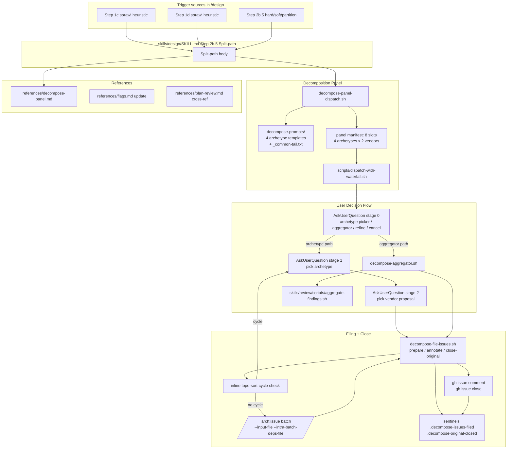

## Goal
Replace the Step 2b.5 Split-path stub in skills/design/SKILL.md with a real decomposition panel (4 archetypes × 2 vendors), an AskUserQuestion flow, optional aggregator, cycle check, /larch:issue batch filing, and original-issue close.

## Implementation Plan
## Plan


## Approach

Replace the existing Step 2b.5 **Split-path** stub body in `skills/design/SKILL.md` with a real decomposition procedure that runs a fixed 4-archetype × 2-vendor (= 8 reviewer slots) panel via existing `scripts/dispatch-with-waterfall.sh` machinery. All three sprawl trigger sources (Step 2b.5 mechanical thresholds / `-p`/`--partition`, Step 1c sprawl heuristic, Step 1d sprawl heuristic) already converge on this Split-path body, so a **single body replacement covers all triggers** — no additional wiring in Step 1c, Step 1d, or `references/discussion-rounds.md` is required (verified by grep against the current tree).

The panel runs **inline** in the orchestrator (no Agent-tool offload — same pattern as the existing `dispatch-plan-review-panel.sh` callsite in Step 3). After collection, the orchestrator (prompt side) presents the 4 archetype proposal bundles to the user via a 3-stage `AskUserQuestion` flow (stage 0 = pick a path; stage 1 = pick an archetype; stage 2 = pick a vendor proposal within the archetype), with explicit fallbacks for aggregator-picked optimal split, refine-plan-manually (return to caller), and cancel.

On user-approved split: run an orchestrator-side topological-sort cycle check on the chosen partition's dependency graph; refuse to file on cycle and re-prompt. File N pieces via the `/larch:issue` Skill in batch mode with `--input-file` + `--intra-batch-deps-file` (dedup remains ENABLED — `--no-dedup` is mutually exclusive with `--intra-batch-deps-file` per `skills/issue/SKILL.md:59`). Close the original issue with a `#2644`-style cross-reference comment (full prose: link + per-piece scope sentence + blocked-by chain). Exit `/design` cleanly; operator runs `/design` on each new piece independently.

Idempotency: write a per-stage sentinel into `$DESIGN_TMPDIR/` (e.g., `.decompose-issues-filed`, `.decompose-original-closed`) so a re-run after partial failure (e.g., GitHub API hiccup mid-close) does not re-create the same partition issues or post the close-comment twice.

## Scope and binding decisions from Round 1

- **Triggers**: all 3 trigger sources (Step 2b.5 hard/soft/`--partition`, Step 1c sprawl, Step 1d sprawl) wired by replacing the single Split-path body — Decision 1.
- **Filing**: `/larch:issue` Skill batch mode with `--intra-batch-deps-file`; dedup ENABLED — Decision 2 (with the `--no-dedup` clarification from Codex sketch).
- **Original-issue fate**: auto-close with #2644-style full-prose cross-reference comment — Decision 3.
- **No-split outcome**: when all 4 archetypes recommend `no-split`, show summary + `AskUserQuestion`(Continue / Force split / Cancel) — Decision 4.
- **Cycle check**: orchestrator-side topological-sort cycle check on chosen partition before filing — Decision 5.
- **Panel tier**: always full 8-slot panel regardless of `/design`'s tier — Decision 6.
- **Reviewer-failure tolerance**: mirror Step 3 plan-review semantics (per-slot Cursor→Codex→Claude waterfall, `DEGRADED_PANEL` flag, `panel-failed` only when 0 usable proposals return) — Decision 7.
- **Auto-chain `/design` on new pieces**: NO — operator runs `/design` per piece independently — Decision 8.

## Files to modify/create

### NEW: `skills/design/scripts/decompose-panel-dispatch.sh`

8-slot panel dispatcher invoked by the Step 2b.5 Split-path body. Mirrors `skills/design/scripts/dispatch-plan-review-panel.sh` shape but simpler (no scout, no dynamic slots, fixed archetype list).

- **CLI**: `--design-tmpdir DIR --codex-present true|false --cursor-present true|false [--plan-file PATH] [--feature-file PATH] [--discussion-round1-file PATH] --mode plan|feature-only [--timeout SEC]`. Exactly one of `--plan-file` (in `plan` mode) or `--feature-file` (in `feature-only` mode) is required. `feature-only` mode is used when Step 1c/1d sprawl triggers the panel before `plan.txt` exists; `plan` mode is used when Step 2b.5 triggers post-plan.
- **Behavior**: for each of the 4 fixed archetypes (`decomposition-specialist`, `dependency-analyst`, `scope-minimalist`, `risk-isolation`), render 2 prompt files (one Cursor variant + one Codex variant). Prompt body is sourced from `skills/design/scripts/decompose-prompts/<archetype>.txt` and concatenated with: the panel input artifact (plan.txt or feature-description.txt+discussion-round1.md), the "Independently mergeable" constraint block, the 2-5 piece cap guidance, and the structured Markdown output schema.
- Build an NDJSON slots manifest (8 rows: `decomp-cursor-<archetype>` / `decomp-codex-<archetype>`) and call `scripts/dispatch-with-waterfall.sh --slots-file <manifest> --mode description --codex-present <…> --cursor-present <…> --feature-file <feature> [--plan-file <plan>] --timeout 1800`. Capture `DISPATCH_OK`, `FALLBACK_COUNT`, `ALL_OUTPUT_FILES_PATH`, `STATIC_DISPATCH_OK`.
- Emit `PANEL_OUTPUTS_FILE=<path>` (NDJSON list of `{archetype, vendor, output, status}` rows), `DEGRADED_PANEL=true|false` (computed as `STATIC_DISPATCH_OK=false OR FALLBACK_COUNT > floor(8/2)`), and `PANEL_STATUS=ok|degraded|panel-failed`. `panel-failed` fires only when zero output files contain a parseable `## Recommendation` block.
- **Failure logging**: on dispatch failure, append capture via `scripts/append-tool-failure.sh` to `$DESIGN_TMPDIR/execution-issues.md` under `External Reviewer Issues`.
- **Length**: ~180 lines. Sibling `.md` (~15 lines) documents purpose, primary caller, CLI, env override `DECOMPOSE_PANEL_WATERFALL_SH`, and harness pointer.

### NEW: `skills/design/scripts/decompose-prompts/decomposition-specialist.txt`

Plain-text prompt body for the decomposition-specialist archetype. Instructs the reviewer to: (1) identify natural fault lines in the proposed work, (2) for each fault line, propose an independently mergeable piece (a self-contained PR that lands on main before its dependents), (3) explicitly verify A→B dependency direction has no cycles, (4) recommend 2-5 pieces (with justification if >5), (5) emit a structured Markdown response matching the schema:

```markdown
## Recommendation
<split | no-split>

## Pieces (if split recommended)

### Piece 1: <title>
- Scope: <files / behaviors covered>
- Dependencies: <none | blocked-by Piece N>
- Diff_lines estimate: <integer>
- Why independently mergeable: <prose>

### Piece 2: ...
```

The trailing portion of the template is shared across archetypes via a substitution placeholder `{COMMON_TAIL}` resolved at render time; the common tail contains the constraint block, cap guidance, and output schema. ~40 lines.

### NEW: `skills/design/scripts/decompose-prompts/dependency-analyst.txt`

Similar shape; archetype-specific focus prose: "build a directed dependency graph of the proposed work; identify cycles or shared infrastructure that would couple pieces." Reuses `{COMMON_TAIL}`. ~35 lines.

### NEW: `skills/design/scripts/decompose-prompts/scope-minimalist.txt`

Archetype-specific focus prose: "what is the minimum viable independent ship? If we had to land ONE piece first, what is it and what does it leave behind?" Reuses `{COMMON_TAIL}`. ~35 lines.

### NEW: `skills/design/scripts/decompose-prompts/risk-isolation.txt`

Archetype-specific focus prose: "which pieces have the largest blast radius? Group changes so each piece's revert/rollback is localized." Reuses `{COMMON_TAIL}`. ~35 lines.

### NEW: `skills/design/scripts/decompose-prompts/_common-tail.txt`

Shared prompt-tail content substituted into each archetype prompt at render time inside `decompose-panel-dispatch.sh`. Contains the "Independently mergeable" constraint block, the 2-5 piece cap guidance, the structured Markdown output schema, and the input-artifact substitution markers (`{PLAN_OR_FEATURE_BLOCK}`, `{DISCUSSION_BLOCK}`). ~50 lines.

### NEW: `skills/design/scripts/decompose-aggregator.sh`

Thin wrapper around `skills/review/scripts/aggregate-findings.sh` for the optimal-split delegation path. Takes the 8 panel outputs as input; emits one canonical partition.

- **CLI**: `--design-tmpdir DIR --panel-outputs-file PATH --codex-present true|false --cursor-present true|false --output PATH [--timeout SEC]`.
- **Behavior**: concatenate the 8 panel outputs into a single `combined-proposals.txt` under `$DESIGN_TMPDIR/decompose/`. Invoke `aggregate-findings.sh` (or build an analog if its interface does not accept partition-style input) with a partition-merge prompt. Parse the aggregator output into the same `## Recommendation` + `## Pieces` schema as a reviewer proposal. Emit `AGGREGATOR_STATUS=ok|failed`, `AGGREGATOR_OUTPUT=<path>`.
- **Fallback**: if `aggregate-findings.sh` cannot be reused as-is (its input contract is finding-list-shaped, not partition-proposal-shaped), the wrapper builds its own one-shot Cursor → Codex → Claude waterfall using `dispatch-with-waterfall.sh` with a single slot containing the merger prompt. This avoids forking `aggregate-findings.sh` itself.
- **Length**: ~100 lines. Sibling `.md` (~15 lines).

### NEW: `skills/design/scripts/decompose-file-issues.sh`

Prepare + annotate helper for partition-issue filing. Mirrors the `prepare`/`annotate` split in `skills/design/scripts/file-design-oos.sh`.

- **CLI (prepare)**: `prepare --design-tmpdir DIR --partition-file PATH [--issue-number N]`. Validates the partition file (`## Pieces` schema), generates `$DESIGN_TMPDIR/decompose/partition-input.txt` (the `/larch:issue` batch input file — one `### <title>` block per piece with body containing original-issue context + per-piece scope + dependencies + draft `larch:plan` block when present or `needs /design` marker when absent), generates `$DESIGN_TMPDIR/decompose/partition-deps.tsv` (the `--intra-batch-deps-file` TSV; columns `<blocker-1based>\t<blocked-1based>`), and runs the **inline topological-sort cycle check** on the dependency graph. On cycle: emit `DECOMPOSE_PARTITION_STATUS=cycle-detected` and stop (caller re-prompts the user for a different proposal).
- **CLI (annotate)**: `annotate --design-tmpdir DIR --issue-stdout-file FILE [--issue-number N]`. Parses the captured `/larch:issue` stdout (`ITEM_<i>_*`, `ISSUE_<i>_URL`, `ISSUES_FAILED`, `ISSUES_CREATED`) and writes:
  - `$DESIGN_TMPDIR/decompose/partition-filed.md` — per-piece block with `Filed URL`, dependency edges actually persisted, and original-issue title.
  - `$DESIGN_TMPDIR/.decompose-issues-filed` — sentinel file (idempotency) containing `OOS_FILE_MAP`-style mapping lines (`PARTITION_FILE_MAP\t<piece-index>\t<URL>`) so a re-run can detect prior success and skip re-filing.
- **CLI (close-original)**: `close-original --design-tmpdir DIR --original-issue N --repo OWNER/REPO`. Composes the #2644-shape close-comment from `partition-filed.md` (link + brief rationale + per-piece bullets with state marker + scope sentence + blocked-by chain). **Security mitigation (Gate B/C Round-2 Decision 9)**: pipe the composed close-comment body through `scripts/redact-secrets.sh` before posting — write the redacted body to `$DESIGN_TMPDIR/decompose/close-comment.redacted.md`, then pass it to `gh issue comment --body-file <path>` rather than `--body <inline>`. This mirrors the outbound redaction that `skills/issue/scripts/create-one.sh` applies to issue bodies (addresses OOS_3 from Cursor-dyn-script-contract). After the comment posts, close the original via `gh issue close`. Writes `$DESIGN_TMPDIR/.decompose-original-closed` sentinel on success. On `gh` failure or `redact-secrets.sh` failure: append capture via `scripts/append-tool-failure.sh`, emit `CLOSE_ORIGINAL_STATUS=failed`, do NOT write sentinel (re-runnable). The test harness (`test-decompose-file-issues.sh`) adds a `close-original` test that asserts the `gh issue comment --body-file` invocation references the redacted output file and that a stubbed `redact-secrets.sh` is actually called in the pipeline.
- **Length**: ~320 lines (includes cycle check + close-comment composer inline). Sibling `.md` (~20 lines).

### NEW: `skills/design/references/decompose-panel.md`

New reference file that absorbs long procedural prose out of `SKILL.md` Step 2b.5. Contains:
- Panel input artifact selection (plan vs feature-only).
- 3-stage `AskUserQuestion` flow (stage 0 path picker / stage 1 archetype picker / stage 2 vendor picker).
- The `no-split` consensus handling (Continue / Force split / Cancel — Round 1 Decision 4).
- The aggregator path mechanics.
- The cycle-check + filing + close-original sequence.
- The degraded panel presentation (option labels include the degraded vendor count where relevant).

The new `references/decompose-panel.md` follows the same load-on-demand pattern as `references/dialectic-execution.md` (MANDATORY load at Step 2b.5 Split-path entry). ~150 lines.

### UPDATED: `skills/design/SKILL.md`

Replace the Step 2b.5 Split-path stub body (`#### Split-path (decomposition panel not yet available)`) with:

```markdown
#### Split-path (decomposition panel)

**MANDATORY — READ ENTIRE FILE**: Read `${CLAUDE_PLUGIN_ROOT}/skills/design/references/decompose-panel.md` completely. It is the single normative source for panel input-artifact selection, the 3-stage AskUserQuestion flow, aggregator path, cycle check, filing, and original-issue close.

Execute the Split-path body in `decompose-panel.md`. On user-approved split that successfully files N issues + closes the original: export `SUMMARY_OUTCOME=approved-partition`, run the **Final summary block** (`### Final summary block`), print `**ℹ /design exited: partition into N pieces filed (see #<original> close-comment).**`, and exit **0**. On user pick "Refine plan myself (return to caller)": return to the calling step (Step 2b.5 returns to Step 3 → Gate B → … as before; Step 1c sprawl returns to Step 1d; Step 1d sprawl returns to Step 1e Gate A). On user pick "Cancel": export `SUMMARY_OUTCOME=cancelled-decompose`, run the Final summary block, print `**ℹ /design cancelled by operator (decomposition panel).**`, and exit **0**. On `PANEL_STATUS=panel-failed`: AskUserQuestion(Retry panel / Cancel); on Retry, re-run the dispatcher once; on second `panel-failed`, exit **1** with a clear error and preserve `$DESIGN_TMPDIR`.
```

This change is ~40 lines added (the new body) minus ~3 lines removed (the stub). Net Step 2b.5 SKILL.md change: ~40 lines. Plus add a one-line cross-reference at the top of the Split-path body for the new reference file.

### UPDATED: `skills/design/references/flags.md`

Add a short paragraph under `## Plan-size thresholds (Step 2b.5)` clarifying that `-p`/`--partition` now triggers a real panel (not the stub) and points readers at `references/decompose-panel.md` for the procedure. ~15 lines.

### UPDATED: `skills/design/references/plan-review.md`

Add a cross-reference under a new "Related: decomposition panel" subsection at the bottom pointing readers at `references/decompose-panel.md` for the dispatch-with-waterfall reuse pattern shared between plan-review and decompose panels. ~20 lines.

### UPDATED: `Makefile`

Register the new harnesses as lint targets following the existing `test-*` pattern. Add 3 targets: `test-decompose-panel-dispatch`, `test-decompose-aggregator`, `test-decompose-file-issues`. Wire each into the existing `lint:` aggregate target. ~12 lines.

### UPDATED: `agent-lint.toml`

Add the new scripts and prompts to the relevant lint sections (mirror the existing `dispatch-plan-review-panel.sh` / `file-design-oos.sh` registrations). Add `decompose-panel-dispatch.sh`, `decompose-aggregator.sh`, `decompose-file-issues.sh`, and the 4 prompt template files. ~10 lines.

### UPDATED: `skills/shared/topology.tsv`

Add rows for the new helpers, the new reference file, and the new harnesses so the topology projection reflects them. ~8 lines.

### NEW: `skills/design/scripts/test-decompose-panel-dispatch.sh`

Offline harness for `decompose-panel-dispatch.sh`. Covers:
- Static 8-slot manifest generation (correct slot names, correct prompt-file paths).
- Prompt template substitution (`{COMMON_TAIL}`, `{PLAN_OR_FEATURE_BLOCK}`, `{DISCUSSION_BLOCK}` resolved correctly in both `plan` and `feature-only` modes).
- `DEGRADED_PANEL=true` when stubbed dispatcher reports `STATIC_DISPATCH_OK=false`.
- `PANEL_STATUS=panel-failed` when all 8 stubbed outputs contain no `## Recommendation` block.
- Uses `DECOMPOSE_PANEL_WATERFALL_SH` env override to stub `dispatch-with-waterfall.sh`.

~130 lines. Sibling `.md` (~12 lines).

### NEW: `skills/design/scripts/test-decompose-aggregator.sh`

Offline harness for `decompose-aggregator.sh`. Covers:
- 8-panel-output concatenation into `combined-proposals.txt`.
- Aggregator stdout parsing produces the expected `## Recommendation` + `## Pieces` schema.
- Fallback path (waterfall single-slot) fires when the `aggregate-findings.sh` interface is incompatible.
- `AGGREGATOR_STATUS=failed` when all 3 waterfall tiers fail.

Uses a stubbed `dispatch-with-waterfall.sh` (env override) to avoid real network calls. ~110 lines. Sibling `.md` (~12 lines).

### NEW: `skills/design/scripts/test-decompose-file-issues.sh`

Offline harness for `decompose-file-issues.sh`. Covers all 3 sub-commands (`prepare`, `annotate`, `close-original`):
- `prepare`: partition file → batch input file + deps TSV (correct format, 1-based indices, no cycles in happy path).
- `prepare`: cycle in partition's dependency graph → `DECOMPOSE_PARTITION_STATUS=cycle-detected` and no batch input written.
- `annotate`: parse `/larch:issue` stdout fixture → write `partition-filed.md` + sentinel.
- `annotate` idempotency: second invocation with the same stdout is a no-op (sentinel detected; partition-filed.md not rewritten).
- `close-original`: compose close-comment from `partition-filed.md` → match #2644-style shape (header + per-piece bullets + blocked-by chain).
- `close-original`: stub `gh` failure → no sentinel written, error appended to execution-issues.md.

~150 lines. Sibling `.md` (~15 lines).

## Edge cases

1. **Step 1c/1d sprawl entry, no plan.txt**: panel dispatcher reads `$DESIGN_TMPDIR/feature-description.txt` + `$DESIGN_TMPDIR/discussion-round1.md` in `feature-only` mode. SKILL.md Step 2b.5 Split-path body detects entry origin by file presence (`test -f $DESIGN_TMPDIR/plan.txt`).
2. **All 4 archetypes recommend `no-split`**: panel emits `PANEL_VERDICT=unanimous-no-split`. Orchestrator prints summary + `AskUserQuestion`(Continue / Force split / Cancel). On `Continue` → return to caller (effectively a noop for this panel invocation). On `Force split`: re-prompt the user to manually compose a 2-piece partition via free-form text input (`Other` channel + 2-piece minimum template); then run cycle check + filing pipeline. On `Cancel` → exit 0 with `SUMMARY_OUTCOME=cancelled-decompose`.
3. **Partial archetype panel — only 1 vendor returns for an archetype**: stage-2 vendor picker is skipped for that archetype; auto-use the surviving vendor's proposal with a `**ℹ archetype <name>: only <vendor> proposal available (other vendor failed after waterfall)**` breadcrumb.
4. **Aggregator path fails**: emit `**⚠ aggregator failed; falling back to manual archetype pick.**`; resume the 3-stage flow at stage 1 (archetype picker).
5. **Cycle check fires after user pick**: print `**⚠ chosen partition has a dependency cycle: <node A> → <node B> → … → <node A>**` + `AskUserQuestion`(Pick a different proposal / Cancel). Do NOT auto-fix; user retains agency.
6. **`/larch:issue` partial failure (`ISSUES_FAILED > 0`)**: `decompose-file-issues.sh annotate` records the partial state; orchestrator prints summary of which pieces filed vs failed; original-issue close is **skipped** (sentinel not written) so the operator can re-run and complete.
7. **`gh issue close` of original fails after partition issues filed**: sentinel `.decompose-issues-filed` exists but `.decompose-original-closed` does not. Re-run skips re-filing (sentinel present) and only retries the close-comment + close. Idempotent.
8. **`--no-dedup` accidentally passed by operator**: not exposed publicly; `decompose-file-issues.sh` constructs the `/larch:issue` invocation with `--input-file` + `--intra-batch-deps-file` only. If someone monkey-patches an outer env var, `/larch:issue` itself enforces the mutual-exclusion check (`skills/issue/SKILL.md:59`).
9. **`partition_requested=true` (`-p`/`--partition` flag) but mechanical thresholds all false**: Step 2b.5 already routes to Split-path under `(PARTITION_REQUESTED=true AND HARD_TRIGGER_FIRED=false)`. The new body runs identically; no orchestration change needed.
10. **Re-entry from a previous failed `/design` run with `$DESIGN_TMPDIR` preserved**: sentinel files detected at panel entry; if `.decompose-original-closed` exists, the orchestrator prints `⏩ 2b.5: decompose — original issue already closed; nothing to do.` and exits 0.

## Failure modes

1. **Panel returns zero usable proposals (`PANEL_STATUS=panel-failed`)** — earliest signal: `collect-agent-results.sh` reports `STATUS != OK` for all 8 outputs OR all 8 outputs lack a parseable `## Recommendation` block. Mitigation: `AskUserQuestion`(Retry panel / Cancel). On second `panel-failed`, exit 1 and preserve `$DESIGN_TMPDIR` for inspection.
2. **`/larch:issue` batch creates a subset of pieces then errors mid-batch** — earliest signal: `ISSUES_CREATED < ISSUES_TOTAL` + `ISSUES_FAILED > 0`. Mitigation: `decompose-file-issues.sh annotate` records the partial state but does NOT close the original; operator inspects `partition-filed.md` for which URLs succeeded and re-runs (sentinel-aware) to complete only the failed pieces. The re-run requires manual intervention (the operator must remove the failed-piece entries from the batch input file).
3. **`gh` rate-limiting on the original-issue close** — earliest signal: `gh issue close` exit code 1 with `API rate limit exceeded` in stderr capture. Mitigation: `decompose-file-issues.sh close-original` appends the capture to `execution-issues.md` under `External Reviewer Issues`, does NOT write the close sentinel, and exits 1. Operator waits + re-runs.

## Testing strategy

- 3 new harness scripts (`test-decompose-panel-dispatch.sh`, `test-decompose-aggregator.sh`, `test-decompose-file-issues.sh`) cover happy path + 2-3 failure modes each (cycle detection, panel-failed, partial filing, idempotent re-run).
- All 3 harnesses use stubbed `dispatch-with-waterfall.sh` (via env override) and stubbed `gh` (via `PATH` prepend in test setup) — fully offline, no network calls.
- Each harness self-cleans its tmpdir.
- Wired into `make lint` aggregate target via the existing `test-*` pattern in `Makefile`.
- Existing `scripts/test-design-structure.sh` will need a small update to assert presence of the new Split-path body anchor (the panel-dispatch invocation line) and absence of the old stub line — ~10 lines.


## Architecture Diagram



## Acceptance

- `skills/design/SKILL.md` Step 2b.5 Split-path body invokes the real decomposition panel (replaces the `**⚠ /design: decomposition panel is in development**` stub). All three trigger sources (Step 2b.5 hard/soft/`--partition`, Step 1c sprawl, Step 1d sprawl) route to the same body — verified by single-grep against the SKILL tree.
- `skills/design/scripts/decompose-panel-dispatch.sh` exists and dispatches 8 reviewer slots (4 archetypes × 2 vendors) via `scripts/dispatch-with-waterfall.sh`. Falls back to Claude per-slot when an external is unavailable. Emits `PANEL_STATUS=ok|degraded|panel-failed`, `DEGRADED_PANEL=true|false`, and `PANEL_OUTPUTS_FILE=<path>` on stdout.
- `skills/design/scripts/decompose-prompts/` directory contains 4 archetype templates (`decomposition-specialist.txt`, `dependency-analyst.txt`, `scope-minimalist.txt`, `risk-isolation.txt`) plus `_common-tail.txt`. Each archetype prompt instructs the reviewer on the "independently mergeable" constraint, the 2-5 piece cap with justification for >5, and the structured `## Recommendation` + `## Pieces` Markdown output schema.
- `skills/design/scripts/decompose-aggregator.sh` exists and provides the optimal-split delegation path. Concatenates the 8 panel outputs and produces one canonical partition via either `aggregate-findings.sh` reuse or a one-shot Cursor → Codex → Claude waterfall fallback.
- `skills/design/scripts/decompose-file-issues.sh` exists with three sub-commands (`prepare`, `annotate`, `close-original`). `prepare` validates the partition file, generates the `/larch:issue` batch input file, generates the `--intra-batch-deps-file` TSV, and runs an inline topological-sort cycle check; on cycle, emits `DECOMPOSE_PARTITION_STATUS=cycle-detected` and stops. `annotate` parses `/larch:issue` stdout and writes `partition-filed.md` plus a `.decompose-issues-filed` sentinel. `close-original` composes the #2644-style close-comment from `partition-filed.md`, pipes it through `scripts/redact-secrets.sh` (Round-2 Decision 9 — OOS_3 security mitigation), and writes the redacted body to `$DESIGN_TMPDIR/decompose/close-comment.redacted.md` before invoking `gh issue comment --body-file <redacted-path>`; then runs `gh issue close` and writes the `.decompose-original-closed` sentinel.
- `skills/design/references/decompose-panel.md` exists and is the normative source for: panel input artifact selection (`plan` mode vs `feature-only` mode); the 3-stage `AskUserQuestion` flow (stage 0 path picker + stage 1 archetype picker + stage 2 vendor picker); the unanimous-no-split handling (Continue / Force split / Cancel); the aggregator path mechanics; the cycle-check, filing, and original-issue close sequence; and degraded-panel presentation conventions.
- `skills/design/references/flags.md` `## Plan-size thresholds (Step 2b.5)` adds a short paragraph clarifying that `-p`/`--partition` now triggers the real decomposition panel (not the stub) and cross-references `references/decompose-panel.md`.
- `skills/design/references/plan-review.md` adds a "Related: decomposition panel" subsection cross-referencing the shared `dispatch-with-waterfall.sh` reuse pattern.
- Harnesses `skills/design/scripts/test-decompose-panel-dispatch.sh`, `test-decompose-aggregator.sh`, and `test-decompose-file-issues.sh` cover happy paths plus 2-3 failure modes each (panel-failed when 0 outputs parse; cycle-detected; partial `/larch:issue` failure; idempotent sentinel re-run; `gh` failure on close; `close-original` redaction path asserts that the `gh issue comment --body-file` invocation references the redacted output file and that the stubbed `redact-secrets.sh` is actually called). All harnesses use stubbed externals (`DISPATCH_WITH_WATERFALL_SH` env override, `PATH`-prepended `gh` stub) and require no network.
- `Makefile` registers `test-decompose-panel-dispatch`, `test-decompose-aggregator`, `test-decompose-file-issues` targets and wires them into the `lint:` aggregate. `agent-lint.toml` lists the new scripts and prompt templates. `skills/shared/topology.tsv` includes rows for the new helpers, reference file, and harnesses.
- `scripts/test-design-structure.sh` asserts presence of the new Step 2b.5 Split-path body anchor (the `decompose-panel-dispatch.sh` invocation line in `decompose-panel.md`) and absence of the stub line "decomposition panel is in development".
- Existing `make lint` (and all existing `test-*` harnesses) continues to pass with the new files registered.

diff_lines: 1492

## Test plan
(no test plan section in plan-file)
