## /implement run 5F53E844-89AF-451D-9475-38087C57D2BE — stalled

- **Outcome**: stalled
- **Mode**: N/A
- **Duration**: 10:38:33
- **Cost**: 💰 TOTAL ~$179.91 — Claude $30.58, Codex $73.76, Cursor $67.77, Claude (subprocess) $7.80  |  Tokens: 281546k
- **Issue**: #3677 — https://github.com/character-ai/larch/issues/3677
- **PR**: #4226 — https://github.com/character-ai/larch/pull/4226
- **Plan review**: N/A
- **Code review**: 39/62 accepted
- **Lines (PR diff)**: code +3518/-7922, larch-logs +3276/-0
- **OOS filed**: 0
- **Exec issues**: 12
- **Warnings**: 2
- **Run logs**: `larch-logs/implement/5F53E844-89AF-451D-9475-38087C57D2BE/`

<!-- larch:run-summary v=1 -->

## Review Phase Detail

| Round | Suggestions | Accepted | OOS proposed | OOS accepted | Time | Cost | Reviewers |
|--:|--:|--:|--:|--:|:--|--:|--:|
| 1 | 17 | 8 | 4 | 2 | 42m 27s | $56.93 | 12 |
| 2 | 11 | 8 | 3 | 1 | 28m 52s | $9.99 | 7 |
| 3 | 14 | 9 | 9 | 1 | 44m 20s | $9.72 | 7 |
| 4 | 23 | 13 | 0 | 0 | 34m 28s | $11.92 | 7 |
| 5 | 17 | 3 | 0 | 0 | 28m 17s | $11.94 | 7 |
| **Total** | **82** | **41** | **16** | **4** | **2h 58m 24s** | **$100.50** | **40** |

### Round 1 reviewer timing

```mermaid
gantt
    title Round 1 reviewer timing
    dateFormat X
    axisFormat %H:%M:%S
    section Reviewers
    cursor/correctness :r1_t1, 5, 166
    cursor/dyn-review-cli-parity :r1_t2, 5, 183
    cursor/testing :r1_t3, 5, 184
    codex/testing :r1_t4, 5, 187
    codex/edge-cases :r1_t5, 5, 205
    codex/correctness :r1_t6, 5, 207
    cursor/edge-cases :r1_t7, 5, 233
    cursor/dyn-retired-reference-sweep :r1_t8, 6, 168
    codex/dyn-review-and-fix-handoff-codex :r1_t9, 6, 176
    codex/dyn-review-cli-parity-codex :r1_t10, 6, 200
    codex/dyn-retired-reference-sweep-codex :r1_t11, 6, 205
    cursor/dyn-review-and-fix-handoff :r1_t12, 6, 211
    unknown/aggregator :r1_t13, 250, 320
    claude/vote :r1_t14, 321, 801
    cursor/vote :r1_t15, 322, 429
    codex/vote :r1_t16, 322, 523
    dynamic/api-contract :r1_t17, 1029, 1203
    cursor/edge-cases :r1_t18, 1029, 1208
    cursor/testing :r1_t19, 1029, 1222
    dynamic/cli-flow :r1_t20, 1029, 1232
    cursor/correctness :r1_t21, 1029, 1235
    cursor/correctness :r1_t22, 1029, 1241
    codex/correctness :r1_t23, 1029, 1249
    codex/testing :r1_t24, 1029, 1261
    cursor/edge-cases :r1_t25, 1029, 1261
```

### Round 2 reviewer timing

```mermaid
gantt
    title Round 2 reviewer timing
    dateFormat X
    axisFormat %H:%M:%S
    section Reviewers
    cursor/testing :r2_t1, 3, 143
    cursor/edge-cases :r2_t2, 3, 182
    codex/codex-generic :r2_t3, 3, 210
    cursor/correctness :r2_t4, 3, 263
    cursor/dyn-retired-reference-sweep :r2_t5, 3, 267
    cursor/dyn-review-and-fix-handoff :r2_t6, 3, 286
    cursor/dyn-review-cli-parity :r2_t7, 3, 395
    unknown/aggregator :r2_t8, 404, 495
    cursor/vote :r2_t9, 497, 581
    codex/vote :r2_t10, 497, 723
    claude/vote :r2_t11, 497, 862
    claude/ci.out :r2_t12, 1105, 1106
    cursor/ci.out :r2_t13, 1107, 1109
    codex/edge-cases :r2_t14, 1182, 1184
    codex/testing :r2_t15, 1182, 1185
    cursor/correctness :r2_t16, 1182, 1185
    dynamic/api-contract-codex :r2_t17, 1182, 1185
    cursor/testing :r2_t18, 1182, 1186
    dynamic/cli-flow :r2_t19, 1182, 1186
    codex/correctness :r2_t20, 1182, 1187
    cursor/edge-cases :r2_t21, 1182, 1187
    dynamic/api-contract :r2_t22, 1182, 1187
    dynamic/cli-flow-codex :r2_t23, 1183, 1186
    codex/correctness :r2_t24, 1193, 1197
    cursor/correctness :r2_t25, 1193, 1197
```

### Round 3 reviewer timing

```mermaid
gantt
    title Round 3 reviewer timing
    dateFormat X
    axisFormat %H:%M:%S
    section Reviewers
    cursor/testing :r3_t1, 2, 156
    codex/codex-generic :r3_t2, 2, 193
    cursor/dyn-review-and-fix-handoff :r3_t3, 2, 225
    cursor/correctness :r3_t4, 2, 227
    cursor/dyn-retired-reference-sweep :r3_t5, 2, 227
    cursor/edge-cases :r3_t6, 2, 227
    cursor/dyn-review-cli-parity :r3_t7, 2, 300
    unknown/aggregator :r3_t8, 307, 392
    cursor/vote :r3_t9, 393, 484
    codex/vote :r3_t10, 393, 595
    claude/vote :r3_t11, 393, 753
    cursor/correctness :r3_t12, 1156, 1163
    codex/edge-cases :r3_t13, 1157, 1159
    codex/correctness :r3_t14, 1157, 1160
    cursor/testing :r3_t15, 1157, 1160
    dynamic/api-contract-codex :r3_t16, 1157, 1160
    dynamic/cli-flow-codex :r3_t17, 1157, 1160
    cursor/edge-cases :r3_t18, 1157, 1161
    dynamic/api-contract :r3_t19, 1157, 1161
    codex/testing :r3_t20, 1157, 1163
    dynamic/cli-flow :r3_t21, 1157, 1163
    codex/correctness :r3_t22, 1249, 1252
    codex/edge-cases :r3_t23, 1249, 1253
    codex/testing :r3_t24, 1249, 1254
    cursor/edge-cases :r3_t25, 1249, 1254
```

### Round 4 reviewer timing

```mermaid
gantt
    title Round 4 reviewer timing
    dateFormat X
    axisFormat %H:%M:%S
    section Reviewers
    cursor/testing :r4_t1, 2, 185
    codex/codex-generic :r4_t2, 2, 198
    cursor/edge-cases :r4_t3, 2, 256
    cursor/dyn-review-cli-parity :r4_t4, 2, 267
    cursor/correctness :r4_t5, 2, 284
    cursor/dyn-review-and-fix-handoff :r4_t6, 2, 289
    cursor/dyn-retired-reference-sweep :r4_t7, 2, 308
    unknown/aggregator :r4_t8, 314, 417
    cursor/vote :r4_t9, 418, 525
    codex/vote :r4_t10, 418, 680
    claude/vote :r4_t11, 418, 774
    codex/edge-cases :r4_t12, 1048, 1052
    dynamic/api-contract-codex :r4_t13, 1048, 1052
    dynamic/cli-flow-codex :r4_t14, 1048, 1052
    codex/testing :r4_t15, 1048, 1053
    dynamic/api-contract :r4_t16, 1048, 1053
    dynamic/cli-flow :r4_t17, 1048, 1053
    codex/correctness :r4_t18, 1048, 1054
    cursor/edge-cases :r4_t19, 1048, 1054
    cursor/correctness :r4_t20, 1048, 1055
    cursor/testing :r4_t21, 1048, 1056
    codex/codex-generic :r4_t22, 1058, 1059
    cursor/correctness :r4_t23, 1058, 1060
    cursor/testing :r4_t24, 1058, 1060
    cursor/edge-cases :r4_t25, 1058, 1061
```

### Round 5 reviewer timing

```mermaid
gantt
    title Round 5 reviewer timing
    dateFormat X
    axisFormat %H:%M:%S
    section Reviewers
    cursor/testing :r5_t1, 2, 133
    cursor/dyn-review-and-fix-handoff :r5_t2, 2, 221
    cursor/correctness :r5_t3, 2, 269
    cursor/edge-cases :r5_t4, 2, 277
    codex/codex-generic :r5_t5, 2, 305
    cursor/dyn-retired-reference-sweep :r5_t6, 2, 306
    cursor/dyn-review-cli-parity :r5_t7, 2, 378
    unknown/aggregator :r5_t8, 384, 482
    cursor/vote :r5_t9, 483, 584
    codex/vote :r5_t10, 483, 729
    claude/vote :r5_t11, 483, 762
    codex/edge-cases :r5_t12, 957, 958
    dynamic/api-contract-codex :r5_t13, 957, 958
    cursor/correctness :r5_t14, 957, 959
    dynamic/api-contract :r5_t15, 957, 959
    dynamic/cli-flow-codex :r5_t16, 957, 959
    codex/correctness :r5_t17, 957, 960
    codex/testing :r5_t18, 957, 960
    cursor/testing :r5_t19, 957, 960
    dynamic/cli-flow :r5_t20, 957, 960
    cursor/edge-cases :r5_t21, 957, 961
    codex/codex-generic :r5_t22, 963, 964
    cursor/edge-cases :r5_t23, 963, 965
    cursor/testing :r5_t24, 963, 965
    cursor/correctness :r5_t25, 963, 966
```

**Top reviewers** (by suggestions accepted, whole run):
1. cursor/testing — 18
2. cursor/correctness — 17
3. cursor/dyn-review-cli-parity — 12
4. cursor/edge-cases — 12
5. cursor/dyn-retired-reference-sweep — 10
6. cursor/dyn-review-and-fix-handoff — 6
7. codex/codex-generic — 3

**Reviewer slot failures**: 0

_Cost is the per-round vendor cost (Codex + Cursor + Claude subprocess), attributed by token-ledger timestamp window; it excludes main-agent Claude, so it is less than the run Cost line above. Rendered as an em dash when per-round timing or the token ledger is unavailable._
