## /implement run 63282C66-8092-474C-8648-8529920BA9EB — bailed

- **Outcome**: bailed
- **Mode**: N/A
- **Duration**: 03:12:06
- **Cost**: 💰 TOTAL ~$64.81 — Claude $23.33, Codex $34.00, Cursor $6.02, Claude (subprocess) $1.46  |  Tokens: 85332k
- **Issue**: #4165 — https://github.com/character-ai/larch/issues/4165
- **PR**: #4203 — https://github.com/character-ai/larch/pull/4203
- **Plan review**: N/A
- **Code review**: 3/9 accepted
- **Lines (PR diff)**: code +990/-1309, larch-logs +1435/-0
- **OOS filed**: 0
- **Exec issues**: 0
- **Warnings**: 2
- **Run logs**: `larch-logs/implement/63282C66-8092-474C-8648-8529920BA9EB/`

<!-- larch:run-summary v=1 -->

## Review Phase Detail

| Round | Suggestions | Accepted | OOS proposed | OOS accepted | Time | Cost | Reviewers |
|--:|--:|--:|--:|--:|:--|--:|--:|
| 1 | 18 | 3 | 0 | 0 | 23m 21s | $19.95 | 10 |
| **Total** | **18** | **3** | **0** | **0** | **23m 21s** | **$19.95** | **10** |

### Round 1 reviewer timing

```mermaid
gantt
    title Round 1 reviewer timing
    dateFormat X
    axisFormat %H:%M:%S
    section Reviewers
    cursor/dyn-caller-cutover :r1_t1, 3, 175
    cursor/testing :r1_t2, 3, 183
    cursor/dyn-parity-contract :r1_t3, 3, 200
    cursor/edge-cases :r1_t4, 3, 212
    cursor/correctness :r1_t5, 3, 236
    codex/correctness :r1_t6, 3, 311
    codex/edge-cases :r1_t7, 3, 313
    codex/testing :r1_t8, 3, 341
    codex/dyn-parity-contract-codex :r1_t9, 3, 383
    codex/dyn-caller-cutover-codex :r1_t10, 3, 386
    unknown/aggregator :r1_t11, 399, 467
    cursor/vote :r1_t12, 468, 573
    claude/vote :r1_t13, 468, 704
    codex/vote :r1_t14, 468, 738
    unknown/codex.log :r1_t15, 967, 997
    claude/ci.out :r1_t16, 1116, 1117
    cursor/ci.out :r1_t17, 1118, 1120
```

**Top reviewers** (by suggestions accepted, whole run):
1. cursor/correctness — 2
2. cursor/edge-cases — 2
3. codex/correctness — 1
4. codex/testing — 1
5. cursor/dyn-parity-contract — 1
6. cursor/testing — 1

**Reviewer slot failures**: 0

_Cost is the per-round vendor cost (Codex + Cursor + Claude subprocess), attributed by token-ledger timestamp window; it excludes main-agent Claude, so it is less than the run Cost line above. Rendered as an em dash when per-round timing or the token ledger is unavailable._
