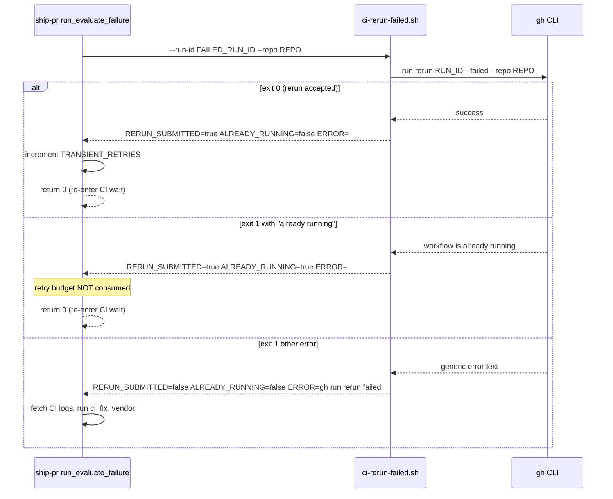

## Code Flow Diagram

```mermaid
sequenceDiagram
    participant SPR as ship-pr run_evaluate_failure
    participant CRF as ci-rerun-failed.sh
    participant GH as gh CLI

    SPR->>CRF: --run-id FAILED_RUN_ID --repo REPO
    CRF->>GH: run rerun RUN_ID --failed --repo REPO
    alt exit 0 (rerun accepted)
        GH-->>CRF: success
        CRF-->>SPR: RERUN_SUBMITTED=true ALREADY_RUNNING=false ERROR=
        SPR->>SPR: increment TRANSIENT_RETRIES
        SPR-->>SPR: return 0 (re-enter CI wait)
    else exit 1 with "already running"
        GH-->>CRF: workflow is already running
        CRF-->>SPR: RERUN_SUBMITTED=true ALREADY_RUNNING=true ERROR=
        note over SPR: retry budget NOT consumed
        SPR-->>SPR: return 0 (re-enter CI wait)
    else exit 1 other error
        GH-->>CRF: generic error text
        CRF-->>SPR: RERUN_SUBMITTED=false ALREADY_RUNNING=false ERROR=gh run rerun failed
        SPR->>SPR: fetch CI logs, run ci_fix_vendor
    end
```
