## /implement run 8375CC9F-E91F-4B05-AA0D-5BD515AA57F8 — bailed

- **Outcome**: bailed
- **Mode**: N/A
- **Duration**: 01:38:06
- **Cost**: 💰 TOTAL ~$54.13 — Claude $8.22, Codex $32.38, Cursor $9.62, Claude (subprocess) $3.91  |  Tokens: 76109k
- **Issue**: #4157 — https://github.com/character-ai/larch/issues/4157
- **PR**: #4183 — https://github.com/character-ai/larch/pull/4183
- **Plan review**: N/A
- **Code review**: 12/20 accepted
- **Lines (PR diff)**: code +986/-28, larch-logs +1821/-0
- **OOS filed**: 0
- **Exec issues**: 0
- **Warnings**: 0
- **Run logs**: `larch-logs/implement/8375CC9F-E91F-4B05-AA0D-5BD515AA57F8/`

<!-- larch:run-summary v=1 -->

## Review Phase Detail

| Round | Suggestions | Accepted | OOS proposed | OOS accepted | Time | Cost | Reviewers |
|--:|--:|--:|--:|--:|:--|--:|--:|
| 1 | 17 | 8 | 5 | 4 | 32m 39s | $13.18 | 10 |
| 2 | 11 | 4 | 0 | 0 | 20m 30s | $7.91 | 6 |
| **Total** | **28** | **12** | **5** | **4** | **53m 09s** | **$21.09** | **16** |

### Round 1 reviewer timing

```mermaid
gantt
    title Round 1 reviewer timing
    dateFormat X
    axisFormat %H:%M:%S
    section Reviewers
    cursor/edge-cases :r1_t1, 2, 133
    codex/dyn-design-wait-contract-codex :r1_t2, 2, 155
    cursor/correctness :r1_t3, 2, 175
    codex/testing :r1_t4, 2, 176
    cursor/dyn-hook-enforcement :r1_t5, 2, 182
    cursor/testing :r1_t6, 2, 182
    codex/edge-cases :r1_t7, 2, 184
    codex/correctness :r1_t8, 2, 195
    codex/dyn-hook-enforcement-codex :r1_t9, 2, 204
    cursor/dyn-design-wait-contract :r1_t10, 2, 218
    unknown/aggregator :r1_t11, 238, 319
    cursor/vote :r1_t12, 320, 390
    codex/vote :r1_t13, 320, 629
    claude/vote :r1_t14, 320, 766
    claude/ci.out :r1_t15, 1191, 1192
    unknown/out :r1_t16, 1192, 1193
    cursor/ci.out :r1_t17, 1193, 1195
    unknown/out :r1_t18, 1665, 1666
    cursor/ci.out :r1_t19, 1666, 1668
```

### Round 2 reviewer timing

```mermaid
gantt
    title Round 2 reviewer timing
    dateFormat X
    axisFormat %H:%M:%S
    section Reviewers
    cursor/edge-cases :r2_t1, 1, 152
    cursor/correctness :r2_t2, 1, 168
    cursor/dyn-hook-enforcement :r2_t3, 1, 175
    cursor/testing :r2_t4, 1, 178
    cursor/dyn-design-wait-contract :r2_t5, 1, 218
    codex/codex-generic :r2_t6, 1, 245
    unknown/aggregator :r2_t7, 252, 343
    cursor/vote :r2_t8, 344, 443
    codex/vote :r2_t9, 344, 539
    claude/vote :r2_t10, 344, 626
    unknown/codex.log :r2_t11, 770, 793
    claude/ci.out :r2_t12, 884, 885
    unknown/out :r2_t13, 886, 887
    cursor/ci.out :r2_t14, 887, 888
```

**Top reviewers** (by suggestions accepted, whole run):
1. cursor/correctness — 6
2. cursor/dyn-design-wait-contract — 6
3. cursor/dyn-hook-enforcement — 6
4. cursor/edge-cases — 3
5. cursor/testing — 3
6. codex/correctness — 2
7. codex/edge-cases — 2

**Reviewer slot failures**: 0

_Cost is the per-round vendor cost (Codex + Cursor + Claude subprocess), attributed by token-ledger timestamp window; it excludes main-agent Claude, so it is less than the run Cost line above. Rendered as an em dash when per-round timing or the token ledger is unavailable._
