## /implement run 875A1ED9-54FF-4BE6-AA87-0F57CED093CA — bailed

- **Outcome**: bailed
- **Mode**: N/A
- **Duration**: 02:15:40
- **Cost**: 💰 TOTAL ~$77.01 — Claude $7.37, Codex $56.40, Cursor $9.79, Claude (subprocess) $3.45  |  Tokens: 107164k
- **Issue**: #4066 — https://github.com/character-ai/larch/issues/4066
- **PR**: #4138 — https://github.com/character-ai/larch/pull/4138
- **Plan review**: N/A
- **Code review**: 3/5 accepted
- **Lines (PR diff)**: code +498/-176, larch-logs +1426/-0
- **OOS filed**: 0
- **Exec issues**: 15
- **Warnings**: 7
- **Run logs**: `larch-logs/implement/875A1ED9-54FF-4BE6-AA87-0F57CED093CA/`

<!-- larch:run-summary v=1 -->

## Review Phase Detail

| Round | Suggestions | Accepted | OOS proposed | OOS accepted | Time | Cost | Reviewers |
|--:|--:|--:|--:|--:|:--|--:|--:|
| 1 | 11 | 2 | 0 | 0 | 49m 56s | $19.89 | 6 |
| 2 | 16 | 1 | 0 | 0 | 48m 27s | $23.51 | 10 |
| **Total** | **27** | **3** | **0** | **0** | **1h 38m 23s** | **$43.40** | **16** |

### Round 1 reviewer timing

```mermaid
gantt
    title Round 1 reviewer timing
    dateFormat X
    axisFormat %H:%M:%S
    section Reviewers
    unknown/scout-round1-manifest.json.raw :r1_t1, 3, 68
    unknown/scout-round1-manifest.json.raw :r1_t2, 68, 248
    cursor/edge-cases :r1_t3, 249, 514
    cursor/correctness :r1_t4, 249, 518
    codex/edge-cases :r1_t5, 249, 522
    cursor/testing :r1_t6, 249, 541
    codex/correctness :r1_t7, 249, 666
    codex/testing :r1_t8, 249, 675
    unknown/aggregator :r1_t9, 701, 766
    cursor/vote :r1_t10, 769, 875
    codex/vote :r1_t11, 769, 994
    claude/vote :r1_t12, 769, 1085
    claude/ci.out :r1_t13, 2635, 2636
    unknown/out :r1_t14, 2637, 2638
    cursor/ci.out :r1_t15, 2638, 2639
```

### Round 2 reviewer timing

```mermaid
gantt
    title Round 2 reviewer timing
    dateFormat X
    axisFormat %H:%M:%S
    section Reviewers
    unknown/scout-round2-manifest.json.raw :r2_t1, 1, 92
    unknown/scout-round2-manifest.json.raw :r2_t2, 92, 205
    cursor/dyn-launcher-atomics :r2_t3, 206, 295
    cursor/dyn-scope-drift :r2_t4, 206, 318
    cursor/edge-cases :r2_t5, 206, 351
    cursor/correctness :r2_t6, 206, 379
    cursor/testing :r2_t7, 206, 408
    codex/dyn-launcher-atomics-codex :r2_t8, 206, 415
    codex/dyn-scope-drift-codex :r2_t9, 206, 425
    codex/testing :r2_t10, 206, 549
    codex/correctness :r2_t11, 206, 560
    codex/edge-cases :r2_t12, 206, 607
    unknown/aggregator :r2_t13, 616, 1269
    cursor/vote :r2_t14, 1271, 1328
    claude/vote :r2_t15, 1271, 1511
    codex/vote :r2_t16, 1271, 1576
    claude/ci.out :r2_t17, 2344, 2345
    claude/ci.out :r2_t18, 2345, 2346
    unknown/out :r2_t19, 2346, 2347
    cursor/ci.out :r2_t20, 2347, 2349
```

**Top reviewers** (by suggestions accepted, whole run):
1. codex/correctness — 2
2. codex/testing — 2
3. cursor/dyn-scope-drift — 1

**Reviewer slot failures**: 0

_Cost is the per-round vendor cost (Codex + Cursor + Claude subprocess), attributed by token-ledger timestamp window; it excludes main-agent Claude, so it is less than the run Cost line above. Rendered as an em dash when per-round timing or the token ledger is unavailable._
