## /implement run 8DD1F329-4D7E-42F2-8ECC-919B5F7BB7EE — bailed

- **Outcome**: bailed
- **Mode**: N/A
- **Duration**: 00:42:53
- **Cost**: 💰 TOTAL ~$24.49 — Claude $2.19, Codex $16.85, Cursor $2.96, Claude (subprocess) $2.49  |  Tokens: 30000k
- **Issue**: #4105 — https://github.com/character-ai/larch/issues/4105
- **Plan review**: N/A
- **Code review**: 1/1 accepted
- **Lines (PR diff)**: N/A
- **OOS filed**: 1
- **Exec issues**: 0
- **Warnings**: 0
- **Run logs**: `larch-logs/implement/8DD1F329-4D7E-42F2-8ECC-919B5F7BB7EE/`

<!-- larch:run-summary v=1 -->

## Review Phase Detail

| Round | Suggestions | Accepted | OOS proposed | OOS accepted | Time | Cost | Reviewers |
|--:|--:|--:|--:|--:|:--|--:|--:|
| 1 | 13 | 2 | 0 | 0 | 22m 18s | $18.30 | 10 |
| **Total** | **13** | **2** | **0** | **0** | **22m 18s** | **$18.30** | **10** |

### Round 1 reviewer timing

```mermaid
gantt
    title Round 1 reviewer timing
    dateFormat X
    axisFormat %H:%M:%S
    section Reviewers
    cursor/dyn-title-parity :r1_t1, 2, 177
    cursor/dyn-lint-scope :r1_t2, 2, 219
    codex/dyn-title-parity-codex :r1_t3, 2, 222
    cursor/correctness :r1_t4, 2, 236
    codex/dyn-lint-scope-codex :r1_t5, 2, 244
    cursor/edge-cases :r1_t6, 2, 252
    cursor/testing :r1_t7, 2, 276
    codex/edge-cases :r1_t8, 2, 279
    codex/testing :r1_t9, 2, 309
    codex/correctness :r1_t10, 2, 366
    unknown/aggregator :r1_t11, 377, 450
    cursor/vote :r1_t12, 458, 652
    codex/vote :r1_t13, 458, 686
    claude/vote :r1_t14, 458, 739
    claude/vote-output-parse-retry :r1_t15, 740, 1044
    claude/ci.out :r1_t16, 1252, 1253
    claude/ci.out :r1_t17, 1253, 1254
    cursor/ci.out :r1_t18, 1255, 1256
```

**Top reviewers** (by suggestions accepted, whole run):
1. cursor/correctness — 1

**Reviewer slot failures**: 0

_Cost is the per-round vendor cost (Codex + Cursor + Claude subprocess), attributed by token-ledger timestamp window; it excludes main-agent Claude, so it is less than the run Cost line above. Rendered as an em dash when per-round timing or the token ledger is unavailable._
