## /implement run 92B45645-A1B2-436E-80BD-8A7D17313A48 — bailed

- **Outcome**: bailed
- **Mode**: N/A
- **Duration**: 00:23:30
- **Cost**: 💰 TOTAL ~$11.00 — Claude $2.03, Codex $4.59, Cursor $3.24, Claude (subprocess) $1.14  |  Tokens: 13774k
- **Issue**: #4114 — https://github.com/character-ai/larch/issues/4114
- **PR**: #4137 — https://github.com/character-ai/larch/pull/4137
- **Plan review**: N/A
- **Code review**: 0/1 accepted
- **Lines (PR diff)**: code +123/-7, larch-logs +483/-0
- **OOS filed**: 0
- **Exec issues**: 0
- **Warnings**: 0
- **Run logs**: `larch-logs/implement/92B45645-A1B2-436E-80BD-8A7D17313A48/`

<!-- larch:run-summary v=1 -->

## Review Phase Detail

| Round | Suggestions | Accepted | OOS proposed | OOS accepted | Time | Cost | Reviewers |
|--:|--:|--:|--:|--:|:--|--:|--:|
| 1 | 10 | 0 | 0 | 0 | 13m 22s | $6.80 | 8 |
| **Total** | **10** | **0** | **0** | **0** | **13m 22s** | **$6.80** | **8** |

### Round 1 reviewer timing

```mermaid
gantt
    title Round 1 reviewer timing
    dateFormat X
    axisFormat %H:%M:%S
    section Reviewers
    unknown/scout-round1-manifest.json.raw :r1_t1, 3, 46
    unknown/scout-round1-manifest.json.raw :r1_t2, 46, 117
    cursor/dyn-risk-integration :r1_t3, 119, 216
    cursor/testing :r1_t4, 119, 227
    cursor/correctness :r1_t5, 119, 234
    dynamic/risk-integration-codex :r1_t6, 119, 245
    cursor/edge-cases :r1_t7, 119, 254
    codex/correctness :r1_t8, 119, 293
    codex/testing :r1_t9, 119, 341
    codex/edge-cases :r1_t10, 119, 465
    unknown/aggregator :r1_t11, 475, 549
    cursor/vote :r1_t12, 551, 640
    codex/vote :r1_t13, 551, 692
    claude/vote :r1_t14, 551, 794
```

**Top reviewers** (by suggestions accepted, whole run):
- (no accepted suggestions attributed to a reviewer slot)

**Reviewer slot failures**: 0

_Cost is the per-round vendor cost (Codex + Cursor + Claude subprocess), attributed by token-ledger timestamp window; it excludes main-agent Claude, so it is less than the run Cost line above. Rendered as an em dash when per-round timing or the token ledger is unavailable._
