## /implement run 96A09278-69A2-40B4-B124-50C9B3716624 — bailed

- **Outcome**: bailed
- **Mode**: N/A
- **Duration**: 00:16:18
- **Cost**: 💰 TOTAL ~$8.54 — Claude $1.56, Codex $3.92, Cursor $2.03, Claude (subprocess) $1.03  |  Tokens: 9747k
- **Issue**: #4095 — https://github.com/character-ai/larch/issues/4095
- **Plan review**: N/A
- **Code review**: N/A
- **Lines (PR diff)**: N/A
- **OOS filed**: 1
- **Exec issues**: 0
- **Warnings**: 0
- **Run logs**: `larch-logs/implement/96A09278-69A2-40B4-B124-50C9B3716624/`

<!-- larch:run-summary v=1 -->

## Review Phase Detail

| Round | Suggestions | Accepted | OOS proposed | OOS accepted | Time | Cost | Reviewers |
|--:|--:|--:|--:|--:|:--|--:|--:|
| 1 | 5 | 1 | 0 | 0 | 7m 27s | $5.55 | 8 |
| **Total** | **5** | **1** | **0** | **0** | **7m 27s** | **$5.55** | **8** |

### Round 1 reviewer timing

```mermaid
gantt
    title Round 1 reviewer timing
    dateFormat X
    axisFormat %H:%M:%S
    section Reviewers
    unknown/scout-round1-manifest.json.raw :r1_t1, 3, 31
    unknown/scout-round1-manifest.json.raw :r1_t2, 31, 80
    cursor/dyn-risk-integration :r1_t3, 82, 151
    cursor/correctness :r1_t4, 82, 172
    cursor/testing :r1_t5, 82, 186
    codex/correctness :r1_t6, 82, 189
    cursor/edge-cases :r1_t7, 82, 193
    dynamic/risk-integration-codex :r1_t8, 82, 204
    codex/testing :r1_t9, 82, 214
    codex/edge-cases :r1_t10, 82, 270
    unknown/aggregator :r1_t11, 284, 312
    cursor/vote :r1_t12, 314, 366
    claude/vote :r1_t13, 314, 390
    codex/vote :r1_t14, 314, 439
```

**Top reviewers** (by suggestions accepted, whole run):
- (no accepted suggestions attributed to a reviewer slot)

**Reviewer slot failures**: 0

_Cost is the per-round vendor cost (Codex + Cursor + Claude subprocess), attributed by token-ledger timestamp window; it excludes main-agent Claude, so it is less than the run Cost line above. Rendered as an em dash when per-round timing or the token ledger is unavailable._
